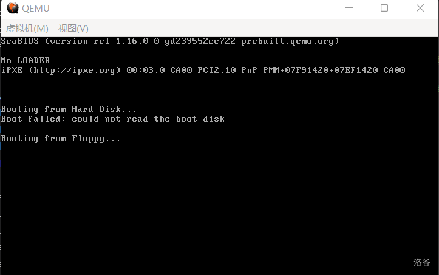

总是困在小小的引导扇区之中，也不是长久之计，毕竟只有 446 个字节能给我们自由支配，而保护模式的栈动不动就 512 字节，一个引导扇区完全盛不下。所以我们有必要进入一个跳板模块，并在其中进行初始化工作，再进入内核。

这时候又该有人问了：

> 啊所以为什么不直接进内核呢？

emmm，事实上也有这种系统（比如 `haribote`），但这样的一个缺点就是你的内核文件结构必须很简单甚至根本没有结构才行。

所以我们还是老老实实地跳入 `Loader` 再进内核吧，不过话说回来，我们现在连一个正经八百的 `Loader` 都还没有，不着急，我们马上创建一个：

**代码 3-1 极简 `Loader`（loader.asm）**
```asm
    org 0100h

    mov ax, 0B800h
    mov gs, ax ; 将gs设置为0xB800，即文本模式下的显存地址
    mov ah, 0Fh ; 显示属性，此处指白色
    mov al, 'L' ; 待显示的字符
    mov [gs:((80 * 0 + 39) * 2)], ax ; 直接写入显存
    
    jmp $ ; 卡死在此处
```

这个 `Loader` 的作用很简单，只是在屏幕第一行的正中央显示一个白色的 “L”。不过，它还是需要一些解释的。

首先第一行想必不用解释，不管它加载到了什么段，都把它加载到 `0x100` 的偏移处。接下来两行让 `gs = 0xB800`，由第一节的知识可知，这个 `gs` 管的是从 `0xB8000` 开始的 64KB，而这个位置恰好（虽然没那么大）是文本模式下的显存，这里但凡有风吹草动，都会被立即显示在屏幕上。

0Fh 代表白色，'L' 代表字符。把它们分别放在 `ah` 和 `al`，组成的 `ax` 就是一个可以被显示的字符了。对于任意一个字符而言，都需要用高 8 位放颜色，低 8 位放字符本身，然后再进行显示。

最后一行出现了我们没见过的 `[]`，它是什么意思？我们先把这个 `[]` 去掉看看。`gs:((80 * 0 + 39) * 2)`，这像是一个坐标。确实如此，文本模式的显存横向为 80 字符，纵向为 25 字符。前面的 `80 * 0`，代表第 0 行，同样，`80 * k` 就代表第 $k$ 行（第 0 到 $k-1$ 行一共有 $80k$ 个字符）。后面的 `+ 39`，自然就表示第 $39$ 列。由于这一行前面 $k$ 行一共有 $80k$ 个字符，这一列前面 $n$ 列又有 $n$ 个字符，那么 $(k, n)$ 这个坐标，自然就对应 $80k+n$ 这个位置（由此可见下标从 0 开始的好处）。

那么为什么这个坐标要乘 $2$ 呢？这个问题的回答则更为简单，由上面的说明就知道，每一个字符在显存中占据 $2$ 个字节，所以自然要乘 $2$ 才能定位到显存中的偏移。

最后加上前面的 `gs:`，我们就得到了这个字符将要被显示的**内存地址**。而加上这个中括号，就意味着往这个地址对应的内存里写入东西，这里是 `ax`。至此，只要它被执行到，就可以在屏幕上显示一个白色 L。

想要执行 `Loader`，自然需要先把它读取到内存，然后跳转过去；而想要读取 `Loader`，自然需要先找到它。

于是现在最主要的问题就变成了：我们应该怎样寻找 `Loader` 呢？

这个很简单，在根目录区中是一个一个一个 32 字节的文件结构，其中就包含文件名，我们在根目录区中查找即可。

依照 FAT12 文件系统的结构规定，根目录区排在 FAT 表和引导扇区后面，因此它的起始扇区是 BPB_RsvdSecCnt + BPB_NumFATs * BPB_FATSz16 = 19 号扇区；它的结束位置则是 19 + BPB_RootEntCnt * 32 / BPB_BytsPerSec = 33 号扇区。在第一节也曾提到，扇区是一个长度为 512 字节的结构，大多数时候位于磁盘中。不过它还有一个地位，那就是**磁盘读写的最小单位**。当我们说第某某扇区或者是某某号扇区时，默认它从 0 开始，也就是说引导扇区是第 0 个而非第 1 个扇区。

于是我们的思路便有了：从第 19 号扇区开始，依次读取每一个扇区，并在读到的扇区中查找 `LOADER  BIN`（loader.bin写入之后的文件名）。如果已经读到第 34 扇区而仍然没有找到 `LOADER  BIN`，那么就默认该磁盘内不存在 `loader` 。至于怎么找 `LOADER  BIN`，现在没有实现那么多高级算法的条件，只有一个小窍门：根目录区是从某某扇区开始的，而某某扇区的开始位置，一定是 512 的倍数，从而一定是 32 的倍数。那么，我们就只需要遍历开头 11 字节，若不等于 `LOADER  BIN`，则先指回开头，然后加 32，就来到了下一个文件结构。由于某某扇区的开始位置是 32 的倍数，所有文件信息的开始位置也都是 32 的倍数，从而指回开头可以通过位运算实现：`32=0b100000`，所以只需要与上 $0\text{xffff} - (32 - 1) = 0\text{xffe}0$，我们就回到了开头。

那么我们该怎么读取磁盘呢？事实上，BIOS 也给我们提供了这个功能：

> 向下列寄存器中依次存入：
>
> AH=02h，表示读取磁盘
>
> AL：待读取扇区数
>
> CH：起始扇区所在的柱面
>
> DH：起始扇区所在的磁头
>
> CL：起始扇区在柱面内的编号
>
> DL：驱动器号
>
> ES:BX：读入缓冲区的地址
>
> 然后执行 `int 13h`。
>
> 返回值：
> >
> > FLAGS.CF=0：操作成功，AH=0，AL=成功读入的扇区总数
> >
> > FLAGS.CF=1：操作失败，AH 存放错误编码

这里又出现了一堆新名词，柱面、磁头，这又是什么？这是在物理上磁盘的存储结构，具体的结构不需要知道，你只需要知道，每一个磁盘有两面，分别对应上下两个磁头，编号为 $0$ 和 $1$，而每一面上又被细细分为 $80$ 个柱面（柱面也称**磁道**），而这里的扇区编号，则是把柱面再一次细分的结果，每一个柱面又被分为 $18$ 个扇区。这一个柱面的 18 个扇区结束后，下一个扇区并不是紧邻着的相邻扇区，而是磁盘对面的那个柱面的第一个扇区。可能有些难理解，说白了，其实就是 0 磁头、0 柱面、18 扇区（第 17 扇区，牢记我们说第某某扇区时是从 0 开始的）的下一个扇区，并不是 0 磁头、1 柱面、1 扇区（第 36 扇区），而是 1 磁头、0 柱面、1 扇区（第 18 扇区）；而 1 磁头、0 柱面、18 扇区的下一个扇区（第 35 扇区），才是 0 磁头、1 柱面、1 扇区（第 36 扇区）。

由于这种寻址方法太过具体，要给的参数太多，现在已经普遍弃用这种指定扇区的方法；由于用到柱面 **C**ylinder、磁头 **H**ead 和磁头内的扇区编号 **S**ector，这种方法被称为 CHS 方式。现在一般采用直接指定总的扇区编号的方法，这个扇区编号又有一个名字叫做**逻辑区块地址**（**L**ogical **B**lock **A**ddress），所以这种方法又被称为 LBA 方式。之所以现在突然提到这个，是为了给后面一个方便，以后就可以叫 CHS、LBA 了，更何况 LBA 这个概念我们后面还要用到。从上面的描述也可以大致猜出，为什么 CHS 里 C 排在 H 前面，实话说不查资料谁能想到啊。

还有一个更坑的点，CHS 方式下的第一个扇区是 $0$ 磁头、$0$ 柱面的第 **1** 扇区，但 LBA 方式下的第一个扇区编号是 **0**。处理差一问题的痛苦回忆又开始回荡……（笑）

总之，我们现在最大的需求，又变成了把 LBA 方式下的扇区转换成 CHS 的形式。我们先从扇区找到柱面，然后从柱面找到磁头，这一流程大概是这样的：

首先，用 LBA 方式的扇区去除每磁道扇区数，这个东西写在了 BPB 里。前面定义 BPB 用的都是 `db`、`dw`、`dd`，也就是存了一堆数组。其中，`BPB_SecPerTrk` 表示每个磁道（其实就是柱面）有多少个扇区，它大概长这样：`short BPB_SecPerTrk[] = {18};`。所以，读取的时候也要读内存地址，也就是类似 `*BPB_SecPerTrk` 的东西。如果您有一定 C 语言储备，就知道它相当于 `BPB_SecPerTrk[0]`。这样，商就对应柱面，余数就是这个扇区在柱面内的位置，CHS 的 S 就已经到手了。由于 CHS 方式与 LBA 方式起始扇区的不同，这里需要给余数加 1。

再然后，从柱面找磁头，由上面的描述可以推知，给柱面除以 2，余数就是磁头，商就是对应的那个柱面。举个例子看看，第 36 扇区除以 18，可以知道是第 2 个柱面（这个玩意也是从 0 开始），而它对应的磁头则在正面，隶属 0 磁头；第 35 扇区除以 18，是第 1 个柱面，而它则在背面，隶属 1 磁头。这是因为沿着扇区号走下去时，磁头整体上呈一个 0、1、0、1 交替的态势（具体地说，是一段 0、一段 1 这么交替下去的）。

这样，就可以从 LBA 中一个单独的扇区号，完整地推出 CHS 三个分量的值。那么，我们也就只需要一个 LBA 扇区号就行了，上面的 BIOS 调用中，`CH`、`DH`、`CL` 可以归一。而驱动器号，则明明白白地写在 `BS_DrvNum` 这个数组里（它也是由 `db` 定义的），到时候从这个数组取值就行了，`DL` 也可以不要。这样，就只剩下三个必要的参数：缓冲区 `ES:BX`、读取扇区数 `AL` 以及起始扇区号。由于起始扇区号可能很大，我们把它分配给 `AX`，原先读取扇区数的位置就随便挑个东西给了，就 `CL` 吧。

返回值中，错误编码我们并不需要，只需要保证 `FLAGS.CF` 的值为 `0` 就可以了。对此，我们可以执行一个 `jc` 跳转命令，它的作用是当 `FLAGS.CF` 为 `1` 时跳转。在这个案例里，我们让它多试几遍，不要因失败而放弃，每次让它在出错的时候跳转回读取循环的开头重新读入。

思路有了，读盘功能也有了，我们就开始写程序吧。首先在 `DispStr` 函数的后面加入一个读取扇区的函数 `ReadSector`，它的作用上面已经讲过，从第 `ax` 号扇区开始，连续读取 `cl` 个扇区到 `es:bx`。

**代码 3-2 读取软盘的函数（boot.asm）**
```asm
ReadSector:
    push bp
    mov bp, sp
    sub esp, 2 ; 空出两个字节存放待读扇区数（因为cl在调用BIOS时要用）

    mov byte [bp-2], cl
    push bx ; 这里临时用一下bx
    mov bl, [BPB_SecPerTrk]
    div bl ; 执行完后，ax将被除以bl（每磁道扇区数），运算结束后商位于al，余数位于ah，那么al代表的就是总磁道个数（下取整），ah代表的是剩余没除开的扇区数
    inc ah ; +1表示起始扇区（这个才和BIOS中的起始扇区一个意思，是读入开始的第一个扇区）
    mov cl, ah ; 按照BIOS标准置入cl
    mov dh, al ; 用dh暂存位于哪个磁道
    shr al, 1 ; 每个磁道两个磁头，除以2可得真正的柱面编号
    mov ch, al ; 按照BIOS标准置入ch
    and dh, 1 ; 对磁道模2取余，可得位于哪个磁头，结果已经置入dh
    pop bx ; 将bx还原
    mov dl, [BS_DrvNum] ; 将驱动器号存入dl
.GoOnReading: ; 万事俱备，只欠读取！
    mov ah, 2 ; 读盘
    mov al, byte [bp-2] ; 将之前存入的待读扇区数取出来
    int 13h ; 执行读盘操作
    jc .GoOnReading ; 如发生错误就继续读，否则进入下面的流程

    add esp, 2
    pop bp ; 恢复堆栈

    ret
```

这里出现了很多没有见过的东西，鉴于实在是有点多，所以我这里把它转写为类似 C 的程序：

**代码 3-2 的转写（主体部分）**
```c
void ReadSector(short ax, short cl, short *es:bx)
{
    save(cl); // 在栈里保存cl，但这个和存 bx 有很大不同，待会再说
    push_to_stack(bx); // 暂存bx
    bl = BPB_SecPerTrk[0]; // 18
    short quot = ax / bl, remain = ax % bl; // quot -> 商，是从0开始位于第几个柱面；remain -> 余数，是柱面内第几个扇区
    ah = remain, al = quot; // div bl的效果就是这样
    ah++; // inc ah
    cl = ah; // cl：起始扇区在柱面内编号，已获得
    dh = al; // dh：从0开始的柱面号
    al >>= 1; // shr al, 1，此时的al为柱面号
    ch = al; // ch：柱面号，已获得
    dh &= 1; // dh：磁头号，已获得
    // 至此 LBA 格式的 ax 已经成功转换为 CHS 格式的 cl、ch 和 dh
    pop_from_stack(bx); // 还原bx
    dl = BS_DrvNum[0]; // 获取驱动器号
    do {
        ah = 2; // ah = 0x02，读盘
        al = load(); // 读取先前保存的cl
        INT(0x13, ah, al, ch, dh, cl, dl, es:bx);
    } while (flags.cf);
}
```

什么 `inc` 啦，`shr` 啦，`and` 啦，到底什么意思都已经讲明白了。下面那个 `jc`，我们也把它表示成了 `do-while` 的形式。

那么现在，需要解释清楚的就是几点：1、开头结尾的 `push bp`、`mov bp, sp` 和结尾的 `pop bp` 是在干什么；2、这个 `cl` 到底存哪去了；3、这个 `.GoOnReading` 带 `.` 是在干什么 ~~（虽然我觉得有这个问题的不会多）~~。

我们从易到难吧。先说最后一点，这实际上是 `nasm` 的私货，这种东西不能单独存在，必须长成类似这样：

```asm
xxx:
.xxx:
aaa:
```

才行。只要现在的代码还在最上面那个 `xxx:` 之下，访问下面那个 `.xxx` 就可以直接用 `.xxx` 的形式，比如 `mov`、`jmp`、`call` 都行；但一旦到了下面那个 `aaa:` 的下面，就不能再这么做了，如果还想访问上面那个 `.xxx`，必须通过 `xxx.xxx` 的方式。或许有人会有疑问：

> 如果我在 `aaa` 下面再定义一个 `.xxx` 呢？

那自然是毫无问题，`aaa` 下面的代码访问 `.xxx`，访问的就是 `aaa` 下面定义的那个，而非 `xxx` 下面定义的那个。这个东西就类似在别的什么高级编程语言里的私有属性，因此有个名字叫**本地标签**。不过目前知道就行了，具体用处没有体现。

接下来来解决 1 和 2，这俩其实是同一个问题。`push bp` 和 `mov bp, sp` 是 C 语言函数默认带有的两条指令，表示函数开始，所谓的栈帧也就是这个东西。而最后的 `pop bp`，自然是反过来的操作，表示函数结束，退出栈帧。

接下来的 `mov byte [bp - 2], cl`，`bp - 2` 处此时是个什么地方呢？注意在存完栈帧以后，立刻执行了 `sub esp, 2`（`esp -= 2`）的操作，而 `bp` 则相当于还没减时候的 `sp`，`bp - 2` 自然就是现在的 `sp`。

说白了，这一番操作其实就相当于：`push cl`，而已。只不过为了对称，一般有 `push` 必有 `pop`，除非返回，而这个位置后面还要用到多次，不能 `pop`，因此最开头为了对称起见（笑）也就没有用 `push`。这样一来，`cl` 和 `bx` 其实类似，都是被暂存在栈上了，只是 `bx` 只被用到一次，很快就 `pop` 掉了，但 `cl` 被用到多次，一直到最后的 `add esp, 2` 才相当于把它 `pop` 了出去。

好了，`ReadSector` 就解释完了，不知道大家明白没有（笑），我们继续吧。

下一步，我们定义几个常量，它们的作用是增加可读性，毕竟满篇写死的根目录大小14之类的，很难让人看懂。

**代码 3-3 放在开头的常量定义（boot.asm）**
```asm
BaseOfStack             equ 07c00h ; 栈的基址
BaseOfLoader            equ 09000h ; Loader的基址
OffsetOfLoader          equ 0100h  ; Loader的偏移
RootDirSectors          equ 14     ; 根目录大小
SectorNoOfRootDirectory equ 19     ; 根目录起始扇区
```

常量过后还有变量，我们在这个程序中将要用到的变量也不少，它们将被放置在 `DispStr` 函数的前面。

**代码 3-4 放在中间的变量定义（boot.asm）**
```asm
wRootDirSizeForLoop dw RootDirSectors ; 查找loader的循环中将会用到
wSectorNo           dw 0              ; 用于保存当前扇区数
bOdd                db 0              ; 这个其实是下一节的东西，不过先放在这也不是不行

LoaderFileName      db "LOADER  BIN", 0 ; loader的文件名

MessageLength       equ 9 ; 下面是三条小消息，此变量用于保存其长度，事实上在内存中它们的排序类似于二维数组
BootMessage:        db "Booting  " ; 此处定义之后就可以删除原先定义的BootMessage字符串了
Message1            db "Ready.   " ; 显示已准备好
Message2            db "No LOADER" ; 显示没有Loader
```

`BootMessage` 改过之后，`DispStr` 也做了微调，现在可以用 `dh` 传递消息编号来打印了：

**代码 3-5 改进后的 `DispStr`（boot.asm）**
```asm
DispStr:
    mov ax, MessageLength
    mul dh ; 将ax乘以dh后，结果仍置入ax（事实上远比此复杂，此处先解释到这里）
    add ax, BootMessage ; 找到给定的消息
    mov bp, ax ; 先给定偏移
    mov ax, ds
    mov es, ax ; 以防万一，重新设置es
    mov cx, MessageLength ; 字符串长度
    mov ax, 01301h ; ah=13h, 显示字符的同时光标移位
    mov bx, 0007h ; 黑底灰字
    mov dl, 0 ; 第0行，前面指定的dh不变，所以给定第几条消息就打印到第几行
    int 10h ; 显示字符
    ret
```

或许有人看不懂这个 `DispStr` 最开头的三行代码在干什么，把它和那一堆变量转写成 C 会更好理解一点：

**代码 3-5 的转写**
```c
#define MessageLength 9
char BootMessage[MessageLength][3] = {
    "Booting  ",
    "Ready.   ",
    "No LOADER"
};

void DispStr()
{
    bp = BootMessage[dh];
    // ...下略
}
```

也就是说，上面的三个 `Message` 在内存中的排布实际上就是一个二维数组，而 `mov ax, MessageLength` 和 `mul dh` 的操作相当于在找它的第 `dh` 行。

为什么用 `dh` 当参数呢？重新翻阅第一节可以知道，这样还顺便指定了行数，确实是一条妙计。

一切准备工作均已办妥，下面我们开始主循环吧……且慢，我们还有一点点预备知识要补充，下面是 `int 13h` 的另一种用途。

> 向下列寄存器中依次存入：
>
> AH=00h：复位磁盘驱动器
>
> DL=驱动器号
>
> 然后执行 `int 13h`。
>
> 返回值：
> >
> > FLAGS.CF=0：操作成功
> >
> > FLAGS.CF=1：操作失败，AH=错误代码

这里我们直接假定 `FLAGS.CF` 为0，不做任何判断了。下面便是主体代码：

**代码 3-6 查找 `Loader` 的代码主体（boot.asm）**
```asm
LABEL_START:
    mov ax, cs
    mov ds, ax
    mov es, ax ; 将ds es设置为cs的值（因为此时字符串和变量等存在代码段内）
    mov ss, ax ; 将堆栈段也初始化至cs
    mov sp, BaseOfStack ; 设置栈顶

    xor ah, ah ; 复位
    xor dl, dl
    int 13h ; 执行软驱复位

    mov word [wSectorNo], SectorNoOfRootDirectory ; 开始查找，将当前读到的扇区数记为根目录区的开始扇区（19）
LABEL_SEARCH_IN_ROOT_DIR_BEGIN:
    cmp word [wRootDirSizeForLoop], 0 ; 将剩余的根目录区扇区数与0比较
    jz LABEL_NO_LOADERBIN ; 相等，不存在Loader，进行善后
    dec word [wRootDirSizeForLoop] ; 减去一个扇区
    mov ax, BaseOfLoader
    mov es, ax
    mov bx, OffsetOfLoader ; 将es:bx设置为BaseOfLoader:OffsetOfLoader，暂且使用Loader所占的内存空间存放根目录区
    mov ax, [wSectorNo] ; 起始扇区：当前读到的扇区数（废话）
    mov cl, 1 ; 读取一个扇区
    call ReadSector ; 读入

    mov si, LoaderFileName ; 为比对做准备，此处是将ds:si设为Loader文件名
    mov di, OffsetOfLoader ; 为比对做准备，此处是将es:di设为Loader偏移量（即根目录区中的首个文件块）
    cld ; FLAGS.DF=0，即执行lodsb/lodsw/lodsd后，si自动增加
    mov dx, 10h ; 共16个文件块（代表一个扇区，因为一个文件块32字节，16个文件块正好一个扇区）
LABEL_SEARCH_FOR_LOADERBIN:
    cmp dx, 0 ; 将dx与0比较
    jz LABEL_GOTO_NEXT_SECTOR_IN_ROOT_DIR ; 继续前进一个扇区
    dec dx ; 否则将dx减1
    mov cx, 11 ; 文件名共11字节
LABEL_CMP_FILENAME: ; 比对文件名
    cmp cx, 0 ; 将cx与0比较
    jz LABEL_FILENAME_FOUND ; 若相等，说明文件名完全一致，表示找到，进行找到后的处理
    dec cx ; cx减1，表示读取1个字符
    lodsb ; 将ds:si的内容置入al，si加1
    cmp al, byte [es:di] ; 此字符与LOADER  BIN中的当前字符相等吗？
    jz LABEL_GO_ON ; 下一个文件名字符
    jmp LABEL_DIFFERENT ; 下一个文件块
LABEL_GO_ON:
    inc di ; di加1，即下一个字符
    jmp LABEL_CMP_FILENAME ; 继续比较

LABEL_DIFFERENT:
    and di, 0FFE0h ; 指向该文件块开头
    add di, 20h ; 跳过32字节，即指向下一个文件块开头
    mov si, LoaderFileName ; 重置ds:si
    jmp LABEL_SEARCH_FOR_LOADERBIN ; 由于要重新设置一些东西，所以回到查找Loader循环的开头

LABEL_GOTO_NEXT_SECTOR_IN_ROOT_DIR:
    add word [wSectorNo], 1 ; 下一个扇区
    jmp LABEL_SEARCH_IN_ROOT_DIR_BEGIN ; 重新执行主循环

LABEL_NO_LOADERBIN: ; 若找不到loader.bin则到这里
    mov dh, 2
    call DispStr; 显示No LOADER
    jmp $

LABEL_FILENAME_FOUND: ; 找到了则到这里
    jmp $ ; 什么都不做，直接死循环
```

这一段代码实在是太长了，所以在注释里做了解读。其中还有相当多我们还没有提到的东西，比如 `lodsb`，比如 `dec`（这个其实就是 `--`），以及 `jz`。鉴于实在太长，也就不提供转写了，感兴趣的读者可以自行当作习题来做（？）

后面的代码讲的就不会再像第一节和这一节这么详细了，大部分的解读都在注释，所以一定要善用哦。

如果直接按照上文的方法，先 `nasm` 后 `dd`，一顿操作猛如虎的话，那么运行结果应该是这样的：



（图 3-1 直接运行的效果）

第三行将会出现一个 `No LOADER` 的标识，虽然不符合预期（应该没有任何输出才对），但这也正好说明了我们的主循环在工作。

那么下面我们的工作就是把 `Loader` 写入磁盘了，不过您可能会发现，我们甚至都没有编译 `Loader`，没事，马上编译一下：
```plain
nasm loader.asm -o loader.bin
```

虽然得到了 `loader.bin`，但我们的写入工作在此处就有分支了。如果您使用的是 `Linux`，请使用下列命令将 `loader.bin` 写入磁盘：
```plain
mkdir floppy
sudo mount -o loop a.img ./floppy/
cp loader.bin ./floppy/ -v
sudo umount ./floppy/
rmdir floppy
```

在 `Windows` 下我们则需要这样：
```plain
edimg imgin:a.img copy from:loader.bin to:@: imgout:a.img
```

无论用什么方式，只要您成功把 `Loader` 写入了磁盘，便无大碍。总之，写入之后的运行结果是这样的：


（图 3-2 写入后再运行，第 3 行已经没有了 `No LOADER`）

如果您的运行结果与之相符，那么您就可以进入下一节的学习，我们将要加载我们的 `Loader`，并跳入其中，这样，我们的可支配空间就从 `0.5KB` 扩张到了 `63KB`，足有 `126` 倍的提升。`64KB` 是一个段的大小，我们的 `Loader` 就活在一个段里；至于还有 `1KB` 则是被 `org 0100h` 给吃了。