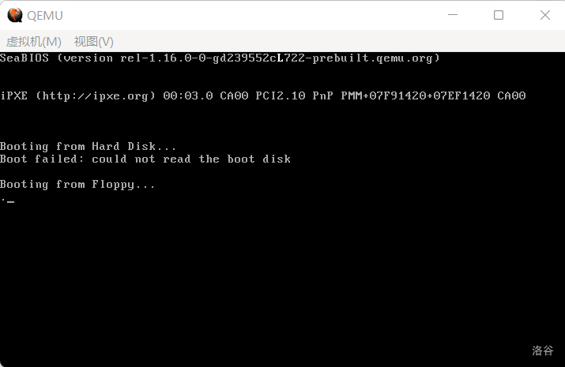

在执行流到达 `LABEL_FILENAME_FOUND` 时，此时的 `di` 应当正好位于 `Loader` 所在的文件块中。因此，我们可以通过这个方法获得 `Loader` 的起始扇区。

至于怎么获得，这就与那个 32 字节文件块的结构有关。

```c
typedef struct FILEINFO {
    uint8_t name[8], ext[3];
    uint8_t type, reserved[10];
    uint16_t time, date, clustno;
    uint32_t size;
}  __attribute__((packed)) fileinfo_t;
```

这个结构体就是对文件块的描述，后面我们还会见到它的。其中的 `clustno` 是它起始的簇，一个簇对应一个扇区。

从簇号转化到扇区号要怎么办呢？这就不得不提到 FAT12 文件系统的结构了。以下叙述默认下标从 0 开始。

FAT12 文件系统在磁盘中是这样的：第 0 个扇区，是引导扇区，接下来是两块大小为 9 扇区的 FAT 表，再往下是 14 个扇区的根目录区，剩下的部分都是数据区。

数据区的每一个扇区，都叫做一个簇。数据区的第 0 个扇区，是第 2 个簇。这个时候或许有人要问了：

> 那么第 0 个簇和第 1 个簇去哪里了？

它们被 FAT 表给暴力强占了。

> FAT 表和数据区不是彼此独立的吗，怎么会发生这种事情？

是这样的，我来解释一下。FAT 表的每一项，都和数据区的簇息息相关，具体而言，FAT 表每一项的索引，都代表着它的索引对应的簇的**下一个簇**是第几个；如果这个数字 $\ge 0\text{xFF}8$，则表示这个簇链到此为止，没有下一个簇。一般的实现都把 $0\text{xFFF}$ 作为结束标记。

然而，不知道因为什么，前两个本该对应 0 号簇和 1 号簇的项，分别存储的是坏簇标记 FF0 和结束标记 FFF。因此，可以使用的第一个簇也就变成了第 2 个。这两个簇不能使用，又不能真空出两个扇区来啥也不干，所以干脆把数据区的第 0 个扇区（也就是第 33 扇区）当成第 2 号簇。

既然这堆簇排成了一个链表，自然需要知道第一个簇在什么地方，而这个值就保存在文件信息块 `fileinfo_t` 的 `clustno` 成员中，偏移量为 $26$。

获得第一个簇以后之后我们便可以做几件事：读取第一个扇区，查找 `FAT`，读入下一个扇区，直至所有扇区都被读完。

不难发现我们需要多次查找 `FAT`，所以我们干脆把查找 `FAT` 的过程也包装一下，我们将使用 `ax` 存储待查询的簇号，查询结果也放入 `ax` 中。

请把下面的代码放到 `ReadSector` 之后：

**代码 4-1 读取 `FAT` 项的函数（boot.asm）**
```asm
GetFATEntry:
    push es
    push bx
    push ax ; 都会用到，push一下
    mov ax, BaseOfLoader ; 获取Loader的基址
    sub ax, 0100h ; 留出4KB空间
    mov es, ax ; 此处就是缓冲区的基址
    pop ax ; ax我们就用不到了
    mov byte [bOdd], 0 ; 设置bOdd的初值
    mov bx, 3
    mul bx ; dx:ax=ax * 3（mul的第二重用法：如有进位，高位将放入dx）
    mov bx, 2
    div bx ; dx:ax / 2 -> dx：余数 ax：商
; 此处* 1.5的原因是，每个FAT项实际占用的是1.5扇区，所以要把表项 * 1.5
    cmp dx, 0 ; 没有余数
    jz LABEL_EVEN
    mov byte [bOdd], 1 ; 那就是奇数了
LABEL_EVEN:
    ; 此时ax中应当已经存储了待查找FAT相对于FAT表的偏移，下面我们借此来查找它的扇区号
    xor dx, dx ; dx置0
    mov bx, [BPB_BytsPerSec]
    div bx ; dx:ax / 512 -> ax：商（扇区号）dx：余数（扇区内偏移）
    push dx ; 暂存dx，后面要用
    mov bx, 0 ; es:bx：(BaseOfLoader - 4KB):0
    add ax, SectorNoOfFAT1 ; 实际扇区号
    mov cl, 2
    call ReadSector ; 直接读2个扇区，避免出现跨扇区FAT项出现bug
    pop dx ; 由于ReadSector未保存dx的值所以这里保存一下
    add bx, dx ; 现在扇区内容在内存中，bx+=dx，即是真正的FAT项
    mov ax, [es:bx] ; 读取之

    cmp byte [bOdd], 1
    jnz LABEL_EVEN_2 ; 是偶数，则进入LABEL_EVEN_2
    shr ax, 4 ; 高12位为真正的FAT项
LABEL_EVEN_2:
    and ax, 0FFFh ; 只保留低4位

LABEL_GET_FAT_ENRY_OK: ; 胜利执行
    pop bx
    pop es ; 恢复堆栈
    ret
```

这一段代码恐怕也需要解释一下。FAT12 文件系统的 $12$ 来源于它的 FAT 项大小，每一个 FAT 项占 $12$ 位；同理，FAT16、FAT32 的 FAT 项分别占 $16$、$32$ 位。后两者由于比较整，所以是直接写在磁盘里；但是前者是一个字节半，直接写的话有整整四位空出来没用，这可不好。

??于是缺德微软就脑子短路没有选择跳过 FAT12 直接发明 FAT16??

于是微软就搞出了一套“压缩”方法（说是压缩，每一个 FAT 项还是占一个字节半，其实没有任何优化），把两个 FAT 项硬挤在三个字节里，具体而言是长这样的：

| FAT 项 | 磁盘中的表示 |
| ---------- | ------------ |
| `FF0 FFF` | `F0 FF FF` | 
| `abc def` | `bc fa de` |

这样就搞得很恶心，FAT12 要考虑的细节有一半都来自这个破算法。比如，由于每两个 FAT 项占三个字节，所以极端情况下会出现某个 FAT 项的低八位在扇区 $a$，高四位在扇区 $a+1$，所以读取磁盘时，一次要读两个扇区，读到之后还得费尽心思转换。

不过，上面的代码中，使用了非常巧妙的方法辗转腾挪，最终只用了五行代码就完成了转换，我们到时候再说。

说的有点远，我们从第一行开始看。开局存了三个寄存器 `es`、`bx` 和 `ax`，这是因为读取磁盘要用 `es` 和 `bx`，而设置新缓冲区要用 `ax`，所以都得存一下。

接下来这几行，把 Loader 前面 4KB（0x100 * 16 = 4096 = 4KB）的位置当做缓冲区，然后还原 `ax`。其实选什么地方当缓冲区并没有什么特别的规定，基本上是想放哪放哪，这里使用 Loader 的开头作为基准只是为了方便。

还原 `ax` 以后，由于每两个 FAT 项占三个字节，所以先给它乘 3 找到对应的两个 FAT 项。由于 `ax` 可能过大，再乘一个 `bx` 有爆掉 16 位的危险（其实算一算就知道根本不可能），因此 CPU 会把乘积的低 16 位放在 `ax`，高 16 位放在 `dx`。注释里使用 `dx:ax`，算是一种惯用法，表示高 16 位和低 16 位是这两个寄存器，与 `es:bx` 这种寻址意义不同，需要注意一下。

那么问题来了，你现在找到了两个一共占三字节的 FAT 项，它们可是缠在一起的，你怎么知道你要找的那个项被塞在了哪两个字节里呢？

这与 intel 对数据的存储策略密切相关。事实上，那种压缩看似很恶心，也和这种数据存储策略有千丝万缕的联系。这是怎么回事呢？

我们能直接使用的变量，都是以字节（`char`）为最小单位。想要访问它的第几位，就需要用位运算来处理。同理，内存处理的最小单位也是字节，低于一个字节的都要用位运算来提取。由此就引发了一个问题：高于一个字节的东西怎么在内存里储存呢？比如这有个两字节的东西：`0xAA55`，它放在内存里长什么样呢？

对此，不同的 CPU 有不同的方法，其中最流行的，是**小端**（intel 采用这种模式）和**大端**。还有一些更为复杂的，什么网络序之类的，在此不提。把数按从高字节到低字节的顺序排列，一般的十六进制数都是天然按这种方法排列的，比如：0x12345678，它的高字节就是 `0x12`，低字节就是 `0x78`；如果按字节从高到低的顺序顺次写入内存，就叫**大端**，反之就是**小端**。

比如我要把 0x12345678 存储到 0x100 开头的四个字节。先把数按照从高到低字节顺序排列：0x12、0x34、0x56、0x78。大端按字节从高到低顺序写入内存，也就是 0x100 处存 0x12，0x101 处存 0x34，0x102 处存 0x56，0x103 处存 0x78。小端则反过来，0x100 处存 0x78，0x101 处存 0x56，以此类推。

这两种排列方式孰优孰劣，我们还真不好判断。不过，用这种视角重新回看上面提到的 FAT 的“压缩”，或许你瞬间就能发现其不对劲之处：按照小端来解释，`bc fa de` 不仅不抽象，反而刚好是 `defabc` 的表示！也就是说，微软的这种编码反而很自然，FAT 表变成了一个项正好 1.5 字节的数组。

这样一来，我要找第 $k$ 个 FAT 项，只需给 $k$ 乘 1.5 即可，这一过程又要被拆成乘 3 再除以 2。如果想要找奇数项，和找偶数项实现上略有差别，因此用了 `cmp dx, 0` 的判断（总算说回到代码了）。顺便一提，`div` 指令如果发现你在试图除以一个 16 位数，将会把 `dx:ax` 当作被除数，商仍放在 `ax`，余数放在 `dx`。

这一下可扯得太太太太太远了，我们说回来。在判断奇偶的时候，使用了一个 `bOdd` 变量，它是在上一节被定义的。最终，执行流都会进入 `LABEL_EVEN`。

`LABEL_EVEN` 一上来把 `dx` 清零，这是为了避免已经没有用的余数影响接下来的除法。然后，把此时的 `ax` 再除以 512，和刚才一样，商放在 `ax` 中表示距离 FAT 开头多少个扇区，余数放在 `dx` 中表示距离扇区开头的偏移。接下来要读取磁盘，由于 `dx` 被改变，需要暂存一下。接下来把 `ax` 加上第一个 FAT 起始位置的扇区号，得到它在磁盘中的真正位置，把 `cl` 设成 2 表示要读两个扇区。从上面的说明中可以知道这是为什么，如果这么快就忘了罚你从头再看一遍。

读完两个扇区以后把 `dx` 弹出来，然后加到 `bx` 上，此时的 `bx` 和原本一样，应该是 0，所以此时 `add bx, dx` 就相当于 `mov bx, dx`。至于为什么要挪到 `bx` 上，是因为 `bx` 可以用来访问内存而 `dx` 不可以。接着，从 `es:bx`，也就是读到的数据里拿到两个字节的 FAT 项，我们只需要其中的 1.5 字节，所以需要进行一些小小的处理。

接下来的五行，堪称是这一整段程序最巧妙的五行，充分利用了 intel 是小端的特性。

我们来手动模拟一下。我想要取第 $2k+1$ 个 FAT 项，则要把它乘 1.5，变成第 $3k + 1$ 字节（小数部分已舍去）开头的两个字节。同理，若要读取第 $2k$ 个 FAT 项，则最终会搞到第 $3k$ 个字节开头的两个字节。`abc` 放在低位，是第 $2k$ 个项，对应第 $3k$ 个字节开头；`def` 放在高位，是第 $2k + 1$ 个项，对应第 $3k + 1$ 个字节开头。我们来读两个字节看看，`abc` 变成了 `fabc`，`def` 变成了 `defc`。那么，对于奇数项而言，首先要右移四位；之后是奇偶项统一的操作，取低 12 位，这样就搞到了我们想要的 FAT 项。

代码里的五行，也正是这个逻辑。先判断是不是奇数，是奇数就右移四位，随后统一取低 12 位。

最后返回的时候，按照 C 调用约定默认 `ax` 是返回值，这里虽然写的是汇编无所谓，但是 `ax` 是参数，考虑到频繁调用，把 `ax` 当返回值自有其方便之处在。

这样一来，总算就把上面那个鬼函数讲完了。

从代码中也能看到，我们的常量喜加一，把下面的代码放到 `SectorNoOfRootDirectory` 后面：

**代码 4-2 新常量的定义（boot.asm）**
```asm
SectorNoOfFAT1          equ 1 ; 第一个FAT表的开始扇区
DeltaSectorNo           equ 17 ; 由于前两个簇不用，所以SectorNoOfRootDirectory要-2再加上根目录区大小和簇号才能得到真正的扇区号，故把SectorNoOfRootDirectory-2封装成一个常量（17）
```

可以看到，除了上文已经出现的常量以外，还定义了一个 `DeltaSectorNo`，其作用已经在注释中阐明。

现在是时候加载并跳入 `Loader` 了：

**代码 4-3 加载并跳入 `Loader`（boot.asm）**
```asm
LABEL_FILENAME_FOUND:
    mov ax, RootDirSectors ; 将ax置为根目录首扇区（19）
    and di, 0FFE0h ; 将di设置到此文件块开头
    add di, 01Ah ; 此时的di指向Loader的FAT号
    mov cx, word [es:di] ; 获得该扇区的FAT号
    push cx ; 将FAT号暂存
    add cx, ax ; +根目录首扇区
    add cx, DeltaSectorNo ; 获得真正的地址
    mov ax, BaseOfLoader
    mov es, ax
    mov bx, OffsetOfLoader ; es:bx：读取扇区的缓冲区地址
    mov ax, cx ; ax：起始扇区号

LABEL_GOON_LOADING_FILE: ; 加载文件
    push ax
    push bx
    mov ah, 0Eh ; AH=0Eh：显示单个字符
    mov al, '.' ; AL：字符内容
    mov bl, 0Fh ; BL：显示属性
; 还有BH：页码，此处不管
    int 10h ; 显示此字符
    pop bx
    pop ax ; 上面几行的整体作用：在屏幕上打印一个点

    mov cl, 1
    call ReadSector ; 读取Loader第一个扇区
    pop ax ; 加载FAT号
    call GetFATEntry ; 加载FAT项
    cmp ax, 0FFFh
    jz LABEL_FILE_LOADED ; 若此项=0FFF，代表文件结束，直接跳入Loader
    push ax ; 重新存储FAT号，但此时的FAT号已经是下一个FAT了
    mov dx, RootDirSectors
    add ax, dx ; +根目录首扇区
    add ax, DeltaSectorNo ; 获取真实地址
    add bx, [BPB_BytsPerSec] ; 将bx指向下一个扇区开头
    jmp LABEL_GOON_LOADING_FILE ; 加载下一个扇区

LABEL_FILE_LOADED:
    jmp BaseOfLoader:OffsetOfLoader ; 跳入Loader！
```

这里的逻辑就比较简单了。首先让 `di` 指向首簇号，然后让 `cx` 读取之。然后给 `cx` 加上一个 `DeltaSectorNo`，再加 `SectorNoOfRootDirectory`，把簇号转换成扇区号，再然后就是设置 `es` 和 `bx`，并按照 `ReadSector` 的要求，把扇区号倒腾到 `ax`。每加载一个扇区就输出一个 `.`，可以看作一种提示和装饰，由于改变了 `ax` 和 `bx` 所以用栈暂存。

接下来先读取扇区，然后从栈里弹出之前存的首簇号，用它来查找 FAT 项。如果是 `0xfff`，则说明文件结束，进入 `LABEL_FILE_LOADED` 文件加载成功的分支；否则，存储现在的 FAT 项（待会接着查），这个 FAT 项同时也是当前簇，所以把它也转换成扇区号，准备进行下一轮读取；`bx` 也向后移动一个扇区，然后开始读取下一个扇区的内容。

加载成功以后，自然是直接 `jmp` 进去。这里用的 `jmp xxx:xxx`，同时修改代码段和下一条要执行的指令，就相当于进入了 Loader 里去了。前一个 `xxx` 是代码段的值，后一个 `xxx` 是下一条要执行的指令，它实际上也是一个寄存器，叫做 **`EIP`**，平时不能直接读取，且只通过 `jmp`、`ret`、`call` 之类的语句修改。

下面就是编译运行了，如果成功的话，就会执行 Loader 的指令，在屏幕第一行正中央显示一个白色的 `L`。运行结果如下：



（图 4-1 成功进入 `Loader`）

屏幕第一行正中间出现了一个白色的 `L`，我们成功了！这意味着我们摆脱了引导扇区的束缚，进入了 `Loader` 的广阔天地！

在进入保护模式之前，我们最后休整一下。首先用下列代码清屏，它位于 `mov sp, BaseOfStack` 和 `xor ah, ah` 之间：

**代码 4-4 清屏（boot.asm）**
```asm
    mov ax, 0600h ; AH=06h：向上滚屏，AL=00h：清空窗口
    mov bx, 0700h ; 空白区域缺省属性
    mov cx, 0 ; 左上：(0, 0)
    mov dx, 0184fh ; 右下：(80, 25)
    int 10h ; 执行

    mov dh, 0
    call DispStr ; Booting
```

下面的代码用于在加载 `Loader` 之前打印 `Ready.`

**代码 4-5 打印 `Ready.`（boot.asm）**
```asm
LABEL_FILE_LOADED:
    mov dh, 1 ; 打印第 1 条消息（Ready.）
    call DispStr
    jmp BaseOfLoader:OffsetOfLoader ; 跳入Loader！
```

下图是运行结果：


（图 4-2 整理屏幕）

那么最后我们贴一下现在引导扇区的完整代码：

**代码 4-6 完整的引导扇区（boot.asm）**
```asm
    org 07c00h ; 告诉编译器程序将装载至0x7c00处

BaseOfStack             equ 07c00h ; 栈的基址
BaseOfLoader            equ 09000h ; Loader的基址
OffsetOfLoader          equ 0100h  ; Loader的偏移
RootDirSectors          equ 14     ; 根目录大小
SectorNoOfRootDirectory equ 19     ; 根目录起始扇区
SectorNoOfFAT1          equ 1 ; 第一个FAT表的开始扇区
DeltaSectorNo           equ 17 ; 由于第一个簇不用，所以RootDirSectors要-2再加上根目录区首扇区和偏移才能得到真正的地址，故把RootDirSectors-2封装成一个常量（17）

    jmp short LABEL_START
    nop ; BS_JMPBoot 由于要三个字节而jmp到LABEL_START只有两个字节 所以加一个nop

    BS_OEMName     db 'tutorial'    ; 固定的8个字节
    BPB_BytsPerSec dw 512           ; 每扇区固定512个字节
    BPB_SecPerClus db 1             ; 每簇固定1个扇区
    BPB_RsvdSecCnt dw 1             ; MBR固定占用1个扇区
    BPB_NumFATs    db 2             ; FAT12 文件系统固定2个 FAT 表
    BPB_RootEntCnt dw 224           ; FAT12 文件系统中根目录最大224个文件
    BPB_TotSec16   dw 2880          ; 1.44MB磁盘固定2880个扇区
    BPB_Media      db 0xF0          ; 介质描述符，固定为0xF0
    BPB_FATSz16    dw 9             ; 一个FAT表所占的扇区数，FAT12 文件系统固定为9个扇区
    BPB_SecPerTrk  dw 18            ; 每磁道扇区数，固定为18
    BPB_NumHeads   dw 2             ; 磁头数，bximage 的输出告诉我们是2个
    BPB_HiddSec    dd 0             ; 隐藏扇区数，没有
    BPB_TotSec32   dd 0             ; 若之前的 BPB_TotSec16 处没有记录扇区数，则由此记录，如果记录了，这里直接置0即可
    BS_DrvNum      db 0             ; int 13h 调用时所读取的驱动器号，由于只挂在一个软盘所以是0 
    BS_Reserved1   db 0             ; 未使用，预留
    BS_BootSig     db 29h           ; 扩展引导标记
    BS_VolID       dd 0             ; 卷序列号，由于只挂载一个软盘所以为0
    BS_VolLab      db 'OS-tutorial' ; 卷标，11个字节
    BS_FileSysType db 'FAT12   '    ; 由于是 FAT12 文件系统，所以写入 FAT12 后补齐8个字节

LABEL_START:
    mov ax, cs
    mov ds, ax
    mov es, ax ; 将ds es设置为cs的值（因为此时字符串和变量等存在代码段内）
    mov ss, ax ; 将堆栈段也初始化至cs
    mov sp, BaseOfStack ; 设置栈顶

    mov ax, 0600h ; AH=06h：向上滚屏，AL=00h：清空窗口
    mov bx, 0700h ; 空白区域缺省属性
    mov cx, 0 ; 左上：(0, 0)
    mov dx, 0184fh ; 右下：(80, 25)
    int 10h ; 执行

    mov dh, 0
    call DispStr ; Booting

    xor ah, ah ; 复位
    xor dl, dl
    int 13h ; 执行软驱复位

    mov word [wSectorNo], SectorNoOfRootDirectory ; 开始查找，将当前读到的扇区数记为根目录区的开始扇区（19）
LABEL_SEARCH_IN_ROOT_DIR_BEGIN:
    cmp word [wRootDirSizeForLoop], 0 ; 将剩余的根目录区扇区数与0比较
    jz LABEL_NO_LOADERBIN ; 相等，不存在Loader，进行善后
    dec word [wRootDirSizeForLoop] ; 减去一个扇区
    mov ax, BaseOfLoader
    mov es, ax
    mov bx, OffsetOfLoader ; 将es:bx设置为BaseOfLoader:OffsetOfLoader，暂且使用Loader所占的内存空间存放根目录区
    mov ax, [wSectorNo] ; 起始扇区：当前读到的扇区数（废话）
    mov cl, 1 ; 读取一个扇区
    call ReadSector ; 读入

    mov si, LoaderFileName ; 为比对做准备，此处是将ds:si设为Loader文件名
    mov di, OffsetOfLoader ; 为比对做准备，此处是将es:di设为Loader偏移量（即根目录区中的首个文件块）
    cld ; FLAGS.DF=0，即执行lodsb/lodsw/lodsd后，si自动增加
    mov dx, 10h ; 共16个文件块（代表一个扇区，因为一个文件块32字节，16个文件块正好一个扇区）
LABEL_SEARCH_FOR_LOADERBIN:
    cmp dx, 0 ; 将dx与0比较
    jz LABEL_GOTO_NEXT_SECTOR_IN_ROOT_DIR ; 继续前进一个扇区
    dec dx ; 否则将dx减1
    mov cx, 11 ; 文件名共11字节
LABEL_CMP_FILENAME: ; 比对文件名
    cmp cx, 0 ; 将cx与0比较
    jz LABEL_FILENAME_FOUND ; 若相等，说明文件名完全一致，表示找到，进行找到后的处理
    dec cx ; cx减1，表示读取1个字符
    lodsb ; 将ds:si的内容置入al，si加1
    cmp al, byte [es:di] ; 此字符与LOADER  BIN中的当前字符相等吗？
    jz LABEL_GO_ON ; 下一个文件名字符
    jmp LABEL_DIFFERENT ; 下一个文件块
LABEL_GO_ON:
    inc di ; di加1，即下一个字符
    jmp LABEL_CMP_FILENAME ; 继续比较

LABEL_DIFFERENT:
    and di, 0FFE0h ; 指向该文件块开头
    add di, 20h ; 跳过32字节，即指向下一个文件块开头
    mov si, LoaderFileName ; 重置ds:si
    jmp LABEL_SEARCH_FOR_LOADERBIN ; 由于要重新设置一些东西，所以回到查找Loader循环的开头

LABEL_GOTO_NEXT_SECTOR_IN_ROOT_DIR:
    add word [wSectorNo], 1 ; 下一个扇区
    jmp LABEL_SEARCH_IN_ROOT_DIR_BEGIN ; 重新执行主循环

LABEL_NO_LOADERBIN: ; 若找不到loader.bin则到这里
    mov dh, 2
    call DispStr; 显示No LOADER
    jmp $

LABEL_FILENAME_FOUND:
    mov ax, RootDirSectors ; 将ax置为根目录首扇区（19）
    and di, 0FFE0h ; 将di设置到此文件块开头
    add di, 01Ah ; 此时的di指向Loader的FAT号
    mov cx, word [es:di] ; 获得该扇区的FAT号
    push cx ; 将FAT号暂存
    add cx, ax ; +根目录首扇区
    add cx, DeltaSectorNo ; 获得真正的地址
    mov ax, BaseOfLoader
    mov es, ax
    mov bx, OffsetOfLoader ; es:bx：读取扇区的缓冲区地址
    mov ax, cx ; ax：起始扇区号

LABEL_GOON_LOADING_FILE: ; 加载文件
    push ax
    push bx
    mov ah, 0Eh ; AH=0Eh：显示单个字符
    mov al, '.' ; AL：字符内容
    mov bl, 0Fh ; BL：显示属性
; 还有BH：页码，此处不管
    int 10h ; 显示此字符
    pop bx
    pop ax ; 上面几行的整体作用：在屏幕上打印一个点

    mov cl, 1
    call ReadSector ; 读取Loader第一个扇区
    pop ax ; 加载FAT号
    call GetFATEntry ; 加载FAT项
    cmp ax, 0FFFh
    jz LABEL_FILE_LOADED ; 若此项=0FFF，代表文件结束，直接跳入Loader
    push ax ; 重新存储FAT号，但此时的FAT号已经是下一个FAT了
    mov dx, RootDirSectors
    add ax, dx ; +根目录首扇区
    add ax, DeltaSectorNo ; 获取真实地址
    add bx, [BPB_BytsPerSec] ; 将bx指向下一个扇区开头
    jmp LABEL_GOON_LOADING_FILE ; 加载下一个扇区

LABEL_FILE_LOADED:
    mov dh, 1 ; 打印第 1 条消息（Ready.）
    call DispStr
    jmp BaseOfLoader:OffsetOfLoader ; 跳入Loader！

wRootDirSizeForLoop dw RootDirSectors ; 查找loader的循环中将会用到
wSectorNo           dw 0              ; 用于保存当前扇区数
bOdd                db 0              ; 这个其实是下一节的东西，不过先放在这也不是不行

LoaderFileName      db "LOADER  BIN", 0 ; loader的文件名

MessageLength       equ 9 ; 下面是三条小消息，此变量用于保存其长度，事实上在内存中它们的排序类似于二维数组
BootMessage:        db "Booting  " ; 此处定义之后就可以删除原先定义的BootMessage字符串了
Message1            db "Ready.   " ; 显示已准备好
Message2            db "No LOADER" ; 显示没有Loader

DispStr:
    mov ax, MessageLength
    mul dh ; 将ax乘以dh后，结果仍置入ax（事实上远比此复杂，此处先解释到这里）
    add ax, BootMessage ; 找到给定的消息
    mov bp, ax ; 先给定偏移
    mov ax, ds
    mov es, ax ; 以防万一，重新设置es
    mov cx, MessageLength ; 字符串长度
    mov ax, 01301h ; ah=13h, 显示字符的同时光标移位
    mov bx, 0007h ; 黑底白字
    mov dl, 0 ; 第0行，前面指定的dh不变，所以给定第几条消息就打印到第几行
    int 10h ; 显示字符
    ret

ReadSector:
    push bp
    mov bp, sp
    sub esp, 2 ; 空出两个字节存放待读扇区数（因为cl在调用BIOS时要用）

    mov byte [bp-2], cl
    push bx ; 这里临时用一下bx
    mov bl, [BPB_SecPerTrk]
    div bl ; 执行完后，ax将被除以bl（每磁道扇区数），运算结束后商位于al，余数位于ah，那么al代表的就是总磁道个数（下取整），ah代表的是剩余没除开的扇区数
    inc ah ; +1表示起始扇区（这个才和BIOS中的起始扇区一个意思，是读入开始的第一个扇区）
    mov cl, ah ; 按照BIOS标准置入cl
    mov dh, al ; 用dh暂存位于哪个磁道
    shr al, 1 ; 每个磁道两个磁头，除以2可得真正的柱面编号
    mov ch, al ; 按照BIOS标准置入ch
    and dh, 1 ; 对磁道模2取余，可得位于哪个磁头，结果已经置入dh
    pop bx ; 将bx弹出
    mov dl, [BS_DrvNum] ; 将驱动器号存入dl
.GoOnReading: ; 万事俱备，只欠读取！
    mov ah, 2 ; 读盘
    mov al, byte [bp-2] ; 将之前存入的待读扇区数取出来
    int 13h ; 执行读盘操作
    jc .GoOnReading ; 如发生错误就继续读，否则进入下面的流程

    add esp, 2
    pop bp ; 恢复堆栈

    ret

GetFATEntry:
    push es
    push bx
    push ax ; 都会用到，push一下
    mov ax, BaseOfLoader ; 获取Loader的基址
    sub ax, 0100h ; 留出4KB空间
    mov es, ax ; 此处就是缓冲区的基址
    pop ax ; ax我们就用不到了
    mov byte [bOdd], 0 ; 设置bOdd的初值
    mov bx, 3
    mul bx ; dx:ax=ax * 3（mul的第二重用法：如有进位，高位将放入dx）
    mov bx, 2
    div bx ; dx:ax / 2 -> dx：余数 ax：商
; 此处* 1.5的原因是，每个FAT项实际占用的是1.5扇区，所以要把表项 * 1.5
    cmp dx, 0 ; 没有余数
    jz LABEL_EVEN
    mov byte [bOdd], 1 ; 那就是奇数了
LABEL_EVEN:
    ; 此时ax中应当已经存储了待查找FAT相对于FAT表的偏移，下面我们借此来查找它的扇区号
    xor dx, dx ; dx置0
    mov bx, [BPB_BytsPerSec]
    div bx ; dx:ax / 512 -> ax：商（扇区号）dx：余数（扇区内偏移）
    push dx ; 暂存dx，后面要用
    mov bx, 0 ; es:bx：(BaseOfLoader - 4KB):0
    add ax, SectorNoOfFAT1 ; 实际扇区号
    mov cl, 2
    call ReadSector ; 直接读2个扇区，避免出现跨扇区FAT项出现bug
    pop dx ; 由于ReadSector未保存dx的值所以这里保存一下
    add bx, dx ; 现在扇区内容在内存中，bx+=dx，即是真正的FAT项
    mov ax, [es:bx] ; 读取之

    cmp byte [bOdd], 1
    jnz LABEL_EVEN_2 ; 是偶数，则进入LABEL_EVEN_2
    shr ax, 4 ; 高4位为真正的FAT项
LABEL_EVEN_2:
    and ax, 0FFFh ; 只保留低4位

LABEL_GET_FAT_ENRY_OK: ; 胜利执行
    pop bx
    pop es ; 恢复堆栈
    ret

times 510 - ($ - $$) db 0
db 0x55, 0xaa ; 确保最后两个字节是0x55AA
```