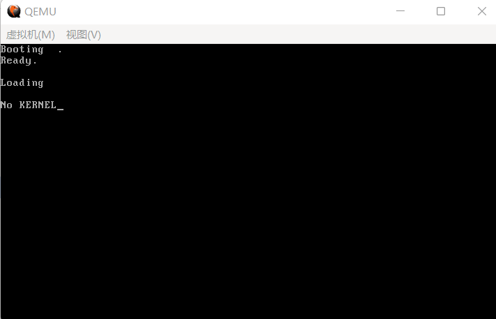
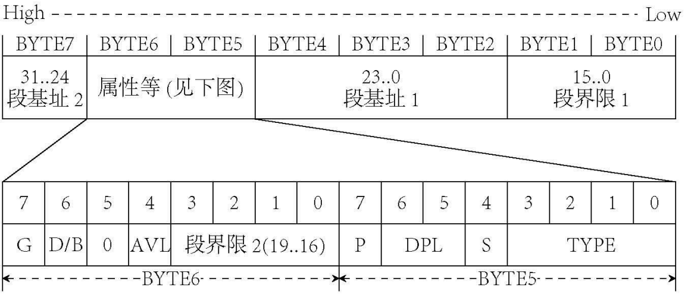
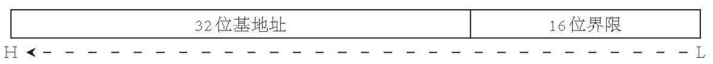
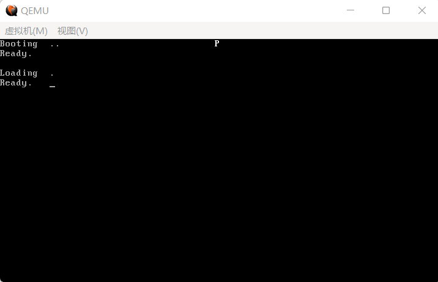

事实上，读入内核的方法与读入 `Loader` 完全一致，因此为了可读性着想，我们只需要更改几个变量名，再改几条字符串，便可告成。事实上我们完全可以把这个过程写成函数，但鉴于引导扇区 446 字节的限制过于恶心和做成函数后的堆栈操作占据的空间，我们还是直接复制粘贴吧。

在此之前，我们先把 `FAT12` 相关的东西放到一起：

**代码 5-1 `FAT12` 文件系统相关（fat12hdr.inc）**
```asm
    BS_OEMName     db 'tutorial'    ; 固定的8个字节
    BPB_BytsPerSec dw 512           ; 每扇区固定512个字节
    BPB_SecPerClus db 1             ; 每簇固定1个扇区
    BPB_RsvdSecCnt dw 1             ; MBR固定占用1个扇区
    BPB_NumFATs    db 2             ; FAT12 文件系统固定2个 FAT 表
    BPB_RootEntCnt dw 224           ; FAT12 文件系统中根目录最大224个文件
    BPB_TotSec16   dw 2880          ; 1.44MB磁盘固定2880个扇区
    BPB_Media      db 0xF0          ; 介质描述符，固定为0xF0
    BPB_FATSz16    dw 9             ; 一个FAT表所占的扇区数，FAT12 文件系统固定为9个扇区
    BPB_SecPerTrk  dw 18            ; 每磁道扇区数，固定为18
    BPB_NumHeads   dw 2             ; 磁头数，bximage 的输出告诉我们是2个
    BPB_HiddSec    dd 0             ; 隐藏扇区数，没有
    BPB_TotSec32   dd 0             ; 若之前的 BPB_TotSec16 处没有记录扇区数，则由此记录，如果记录了，这里直接置0即可
    BS_DrvNum      db 0             ; int 13h 调用时所读取的驱动器号，由于只挂在一个软盘所以是0 
    BS_Reserved1   db 0             ; 未使用，预留
    BS_BootSig     db 29h           ; 扩展引导标记
    BS_VolID       dd 0             ; 卷序列号，由于只挂载一个软盘所以为0
    BS_VolLab      db 'OS-tutorial' ; 卷标，11个字节
    BS_FileSysType db 'FAT12   '    ; 由于是 FAT12 文件系统，所以写入 FAT12 后补齐8个字节

FATSz                   equ 9      ; BPB_FATSz16
RootDirSectors          equ 14     ; 根目录大小
SectorNoOfRootDirectory equ 19     ; 根目录起始扇区
SectorNoOfFAT1          equ 1 ; 第一个FAT表的开始扇区
DeltaSectorNo           equ 17 ; 由于第一个簇不用，所以RootDirSectors要-2再加上根目录区首扇区和偏移才能得到真正的地址，故把RootDirSectors-2封装成一个常量（17）
```

下面是我们更改过后的 `Loader` 代码：

**代码 5-2 新版 `Loader` （loader.asm）**
```asm
    org 0100h ; 告诉编译器程序将装载至0x100处

BaseOfStack                 equ 0100h ; 栈的基址
BaseOfKernelFile            equ 08000h ; Kernel的基址
OffsetOfKernelFile          equ 0h  ; Kernel的偏移

    jmp LABEL_START

%include "fat12hdr.inc"

LABEL_START:
    mov ax, cs
    mov ds, ax
    mov es, ax ; 将ds es设置为cs的值（因为此时字符串和变量等存在代码段内）
    mov ss, ax ; 将堆栈段也初始化至cs
    mov sp, BaseOfStack ; 设置栈顶
    
    mov dh, 0
    call DispStr ; Loading

    mov word [wSectorNo], SectorNoOfRootDirectory ; 开始查找，将当前读到的扇区数记为根目录区的开始扇区（19）
    xor ah, ah ; 复位
    xor dl, dl
    int 13h ; 执行软驱复位
LABEL_SEARCH_IN_ROOT_DIR_BEGIN:
    cmp word [wRootDirSizeForLoop], 0 ; 将剩余的根目录区扇区数与0比较
    jz LABEL_NO_KERNELBIN ; 相等，不存在Kernel，进行善后
    dec word [wRootDirSizeForLoop] ; 减去一个扇区
    mov ax, BaseOfKernelFile
    mov es, ax
    mov bx, OffsetOfKernelFile ; 将es:bx设置为BaseOfKernel:OffsetOfKernel，暂且使用Kernel所占的内存空间存放根目录区
    mov ax, [wSectorNo] ; 起始扇区：当前读到的扇区数（废话）
    mov cl, 1 ; 读取一个扇区
    call ReadSector ; 读入

    mov si, KernelFileName ; 为比对做准备，此处是将ds:si设为Kernel文件名
    mov di, OffsetOfKernelFile ; 为比对做准备，此处是将es:di设为Kernel偏移量（即根目录区中的首个文件块）
    cld ; FLAGS.DF=0，即执行lodsb/lodsw/lodsd后，si自动增加
    mov dx, 10h ; 共16个文件块（代表一个扇区，因为一个文件块32字节，16个文件块正好一个扇区）
LABEL_SEARCH_FOR_KERNELBIN:
    cmp dx, 0 ; 将dx与0比较
    jz LABEL_GOTO_NEXT_SECTOR_IN_ROOT_DIR ; 继续前进一个扇区
    dec dx ; 否则将dx减1
    mov cx, 11 ; 文件名共11字节
LABEL_CMP_FILENAME: ; 比对文件名
    cmp cx, 0 ; 将cx与0比较
    jz LABEL_FILENAME_FOUND ; 若相等，说明文件名完全一致，表示找到，进行找到后的处理
    dec cx ; cx减1，表示读取1个字符
    lodsb ; 将ds:si的内容置入al，si加1
    cmp al, byte [es:di] ; 此字符与LOADER  BIN中的当前字符相等吗？
    jz LABEL_GO_ON ; 下一个文件名字符
    jmp LABEL_DIFFERENT ; 下一个文件块
LABEL_GO_ON:
    inc di ; di加1，即下一个字符
    jmp LABEL_CMP_FILENAME ; 继续比较

LABEL_DIFFERENT:
    and di, 0FFE0h ; 指向该文件块开头
    add di, 20h ; 跳过32字节，即指向下一个文件块开头
    mov si, KernelFileName ; 重置ds:si
    jmp LABEL_SEARCH_FOR_KERNELBIN ; 由于要重新设置一些东西，所以回到查找Kernel循环的开头

LABEL_GOTO_NEXT_SECTOR_IN_ROOT_DIR:
    add word [wSectorNo], 1 ; 下一个扇区
    jmp LABEL_SEARCH_IN_ROOT_DIR_BEGIN ; 重新执行主循环

LABEL_NO_KERNELBIN: ; 若找不到kernel.bin则到这里
    mov dh, 2
    call DispStr ; 显示No KERNEL
    jmp $

LABEL_FILENAME_FOUND:
    mov ax, RootDirSectors ; 将ax置为根目录首扇区（19）
    and di, 0FFF0h ; 将di设置到此文件块开头

    push eax
    mov eax, [es:di + 01Ch]
    mov dword [dwKernelSize], eax
    pop eax

    add di, 01Ah ; 此时的di指向Kernel的FAT号
    mov cx, word [es:di] ; 获得该扇区的FAT号
    push cx ; 将FAT号暂存
    add cx, ax ; +根目录首扇区
    add cx, DeltaSectorNo ; 获得真正的地址
    mov ax, BaseOfKernelFile
    mov es, ax
    mov bx, OffsetOfKernelFile ; es:bx：读取扇区的缓冲区地址
    mov ax, cx ; ax：起始扇区号

LABEL_GOON_LOADING_FILE: ; 加载文件
    push ax
    push bx
    mov ah, 0Eh ; AH=0Eh：显示单个字符
    mov al, '.' ; AL：字符内容
    mov bl, 0Fh ; BL：显示属性
; 还有BH：页码，此处不管
    int 10h ; 显示此字符
    pop bx
    pop ax ; 上面几行的整体作用：在屏幕上打印一个点

    mov cl, 1
    call ReadSector ; 读取Kernel第一个扇区
    pop ax ; 加载FAT号
    call GetFATEntry ; 加载FAT项
    cmp ax, 0FFFh
    jz LABEL_FILE_LOADED ; 若此项=0FFF，代表文件结束，直接跳入Kernel
    push ax ; 重新存储FAT号，但此时的FAT号已经是下一个FAT了
    mov dx, RootDirSectors
    add ax, dx ; +根目录首扇区
    add ax, DeltaSectorNo ; 获取真实地址
    add bx, [BPB_BytsPerSec] ; 将bx指向下一个扇区开头
    jmp LABEL_GOON_LOADING_FILE ; 加载下一个扇区

LABEL_FILE_LOADED:
    call KillMotor ; 关闭软驱马达

    mov dh, 1 ; "Ready."
    call DispStr

    jmp $ ; 暂时停在此处

dwKernelSize        dd 0              ; Kernel大小
wRootDirSizeForLoop dw RootDirSectors ; 查找Kernel的循环中将会用到
wSectorNo           dw 0              ; 用于保存当前扇区数
bOdd                db 0              ; 这个其实是下一节的东西，不过先放在这也不是不行

KernelFileName      db "KERNEL  BIN", 0 ; Kernel的文件名

MessageLength       equ 9 ; 下面是三条小消息，此变量用于保存其长度，事实上在内存中它们的排序类似于二维数组
BootMessage:        db "Loading  " ; 此处定义之后就可以删除原先定义的BootMessage字符串了
Message1            db "Ready.   " ; 显示已准备好
Message2            db "No KERNEL" ; 显示没有Kernel

DispStr:
    mov ax, MessageLength
    mul dh ; 将ax乘以dh后，结果仍置入ax（事实上远比此复杂，此处先解释到这里）
    add ax, BootMessage ; 找到给定的消息
    mov bp, ax ; 先给定偏移
    mov ax, ds
    mov es, ax ; 以防万一，重新设置es
    mov cx, MessageLength ; 字符串长度
    mov ax, 01301h ; ah=13h, 显示字符的同时光标移位
    mov bx, 0007h ; 黑底白字
    mov dl, 0 ; 第0行，前面指定的dh不变，所以给定第几条消息就打印到第几行
    add dh, 3
    int 10h ; 显示字符
    ret

ReadSector:
    push bp
    mov bp, sp
    sub esp, 2 ; 空出两个字节存放待读扇区数（因为cl在调用BIOS时要用）

    mov byte [bp-2], cl
    push bx ; 这里临时用一下bx
    mov bl, [BPB_SecPerTrk]
    div bl ; 执行完后，ax将被除以bl（每磁道扇区数），运算结束后商位于al，余数位于ah，那么al代表的就是总磁道个数（下取整），ah代表的是剩余没除开的扇区数
    inc ah ; +1表示起始扇区（这个才和BIOS中的起始扇区一个意思，是读入开始的第一个扇区）
    mov cl, ah ; 按照BIOS标准置入cl
    mov dh, al ; 用dh暂存位于哪个磁道
    shr al, 1 ; 每个磁道两个磁头，除以2可得真正的柱面编号
    mov ch, al ; 按照BIOS标准置入ch
    and dh, 1 ; 对磁道模2取余，可得位于哪个磁头，结果已经置入dh
    pop bx ; 将bx弹出
    mov dl, [BS_DrvNum] ; 将驱动器号存入dl
.GoOnReading: ; 万事俱备，只欠读取！
    mov ah, 2 ; 读盘
    mov al, byte [bp-2] ; 将之前存入的待读扇区数取出来
    int 13h ; 执行读盘操作
    jc .GoOnReading ; 如发生错误就继续读，否则进入下面的流程

    add esp, 2
    pop bp ; 恢复堆栈

    ret

GetFATEntry:
    push es
    push bx
    push ax ; 都会用到，push一下
    mov ax, BaseOfKernelFile ; 获取Kernel的基址
    sub ax, 0100h ; 留出4KB空间
    mov es, ax ; 此处就是缓冲区的基址
    pop ax ; ax我们就用不到了
    mov byte [bOdd], 0 ; 设置bOdd的初值
    mov bx, 3
    mul bx ; dx:ax=ax * 3（mul的第二重用法：如有进位，高位将放入dx）
    mov bx, 2
    div bx ; dx:ax / 2 -> dx：余数 ax：商
; 此处* 1.5的原因是，每个FAT项实际占用的是1.5扇区，所以要把表项 * 1.5
    cmp dx, 0 ; 没有余数
    jz LABEL_EVEN
    mov byte [bOdd], 1 ; 那就是奇数了
LABEL_EVEN:
    ; 此时ax中应当已经存储了待查找FAT相对于FAT表的偏移，下面我们借此来查找它的扇区号
    xor dx, dx ; dx置0
    mov bx, [BPB_BytsPerSec]
    div bx ; dx:ax / 512 -> ax：商（扇区号）dx：余数（扇区内偏移）
    push dx ; 暂存dx，后面要用
    mov bx, 0 ; es:bx：(BaseOfKernelFile - 4KB):0
    add ax, SectorNoOfFAT1 ; 实际扇区号
    mov cl, 2
    call ReadSector ; 直接读2个扇区，避免出现跨扇区FAT项出现bug
    pop dx ; 由于ReadSector未保存dx的值所以这里保存一下
    add bx, dx ; 现在扇区内容在内存中，bx+=dx，即是真正的FAT项
    mov ax, [es:bx] ; 读取之

    cmp byte [bOdd], 1
    jnz LABEL_EVEN_2 ; 是偶数，则进入LABEL_EVEN_2
    shr ax, 4 ; 高4位为真正的FAT项
LABEL_EVEN_2:
    and ax, 0FFFh ; 只保留低4位

LABEL_GET_FAT_ENRY_OK: ; 胜利执行
    pop bx
    pop es ; 恢复堆栈
    ret

KillMotor: ; 关闭软驱马达
    push dx
    mov dx, 03F2h ; 软驱端口
    mov al, 0 ; 软盘驱动器：0，复位软盘驱动器，禁止DMA中断，关闭软驱马达
    out dx, al ; 执行
    pop dx
    ret
```

之所以在此处关闭软驱马达是因为后面我们用不到软盘了。

引导扇区开头的部分也做了一点修改，因为 `FAT12` 的部分已经抽离出来了：

**代码 5-3 引导扇区开头部分（boot.asm）**
```asm
    jmp short LABEL_START
    nop ; BS_JMPBoot 由于要三个字节而jmp到LABEL_START只有两个字节 所以加一个nop

%include "fat12hdr.inc"

LABEL_START:
```

运行结果如下：



（图 5-1 不存在Kernel时的运行情况）

屏幕中出现了一行 `No KERNEL`，这是理所应当的，因为我们甚至连一个最简单的内核都没有写，马上来写一个：

**代码 5-4 极简内核程序（kernel.asm）**
```asm
[section .text]

global _start

_start: ; 此处假设gs仍指向显存
    mov ah, 0Fh
    mov al, 'K'
    mov [gs:((80 * 1 + 39) * 2)], ax ; 第1行正中央，白色K
    jmp $ ; 死循环
```

这里好像出现了很多我们之前的极简 Loader 没有的东西，这个 `global` 是什么，`section .text` 又是什么东西，为什么一上来还要定义一个 `_start`？

说实话，其实这些都和现在无关，完全是为了以后的考虑。前四节（包括这一节）我们一直在使用汇编，但更多的时候，我们为了方便理解甚至会使用 C 语言转写。如果未来能使用 C 语言，会不会方便得多？只是可惜，如果为了方便，继续使用纯二进制的话，写 C 恐怕会十分复杂，而且不一定能够成功（说多了都是泪.jpg）。

因此，我们为内核引入了一种可执行文件格式（当然不是我自己写的，我还没那个本事），叫做 **ELF**，全称不想写，目前广泛应用于 Linux 以及自制操作系统中（题外话：现在的自制操作系统可执行文件基本都是 ELF，少数使用 PE，也就是微软家 exe 文件的格式，自创格式的几乎没有）。

既然有 Linux 撑腰，想要用它自然十分容易，在一开头就下载了 `i686-elf-tools-windows.zip`（或者 `i386-elf-gcc` for mac，Linux 自己的 `gcc` 编译出来就是 ELF），用它包办编译和链接即可。使用下面的命令，即可轻松编译出一个 ELF 来（mac 用户把 `i686` 改成 `i386`，linux 用户去掉 `i686-elf`，链接选项加上 `-m elf_i386`）。

```plain
nasm -f elf -o kernel.o kernel.asm
i686-elf-ld -s -o kernel.bin kernel.o
```

写入的命令也要改一下：
```plain
edimg imgin:a.img copy from:loader.bin to:@: copy from:kernel.bin to:@: imgout:a.img
```

这样就把 `kernel.bin` 也给写入到磁盘里来了。

> 唉唉唉，别想避重就轻，你还没解释那堆东西到底是什么玩意呢。

uhh，好吧。`global _start` 和 `_start:` 是给链接器看的，以这种方式告诉链接器，ELF 程序从这里开始执行（ELF 程序的默认入口点都是 `_start`，这是一个约定。或许有人会问：“那 `main` 是什么？难道不重要吗？”其实还真的不重要，看看第 23 节没准就能获得解答）。`section .text` 是给 `ld` 看的，这样 `ld` 就会知道“哦，下面的部分都是代码而不是数据”，从而正确设置 ELF。至于为什么能把 `section` 放进中括号这种取址用的东西里，据说是一部分伪指令的特性，带与不带中括号有一些奇妙的不同；不过在这篇教程的语境下，可以认为它们是一样的。

再次运行，结果应如下图所示：

（图 5-2 写入内核之后）

屏幕第四行出现了 `Ready.`，意味着我们的内核已经被成功读入了，下面我们进入保护模式吧。在保护模式中我们只做两件事：重新放置内核并进入内核，也就是下一节的内容。

首先来说一下，什么是保护模式？一般而言，我们认为只要有 GDT、 `cs` 是 GDT 选择子、`cr0` 寄存器的 PE 位是 1 的时候，当前 CPU 就处于保护模式。至于 GDT 和 `cr0` 是什么，将在接下来阐明。保护模式分为 16 位和 32 位两种，不过 16 位保护模式非常少见（也不是不可以，只要设置 16 位代码段和数据段就可以了，一个 flag 的事），后文除非特别指明，默认保护模式是 32 位的。

进入保护模式总共分为 `6` 步：

> 1.准备 `GDT`

> 2.加载 `GDT`（`lgdt`）

> 3.关中断

> 4.打开 `A20` 地址线

> 5.将 `cr0` 的第 `0` 位置 `1`（`PE` 位）

> 6.通过一个 `jmp` 指令进入 `32` 位代码段

这其中又出现了很多生词， `A20` 是啥，中断又是什么？再加上上面挖的坑，接下来我们一块填了。

首先是 `A20`，它是一个什么东西呢？在曾经的 CPU 里，一共有 20 条地址线，编号为 `A0`~`A19`，这样就可以访问到共计 2^20=1MB 的内存。但是，后来内存大了，20 根地址线不够用了，到了 80286 时期，又涨到 24 根，这就衍生出了兼容性的问题（你看，又是兼容）：早期的 CPU 对于超过 1MB 的内存会重新指回 0x00，比如访问 `FFFF:FFFF` 并不会访问到预想中的 `0x10FFEF`，而是会指回 `0xFFEF` 去。这又来了五根地址线，不就麻烦了么？

intel 遂采取一种笨办法，既然多出来这一点会带来问题，那我找个地方，把新来的 `A20` 一关，不就行了么？你设置的地址是 `0x100000`，但 A20 一关，实际上相当于不管你第 20 位是多少，通通把它当成 0，于是 1MB 又变回了 `0x000000`，这就暴力地兼容了以往把内存指回去的方案。80286 还是 16 位，最大还是 `0x10FFEF` 的内存，所以关一个 A20 就够了；但 80386 以后加了 32 位，从而可以访问 4GB 内存，A21~A31 根本没人管，但 A20 却还是默认关着，只有第 20 位受伤的世界达成了。如果直接进入 32 位模式而不去打开 A20，那就相当于 1-2MB、3-4MB、5-6MB 等内存空间完全无法访问，因为这一位 CPU 不管，所以为了访问到全部内存，必须把 A20 打开。

唯一的问题就是把 A20 放在哪呢？请欣赏：兼容性问题的终极解决方案，键盘控制器——这里可谓人杰地灵，既要管理键盘，又要管理鼠标，甚至可以用键盘重启电脑，总之不差你一个 A20。于是，intel 就随便扒了一个键盘的空余引脚，用来控制 A20。这么搞唯一的问题就是它实在太慢了，于是又衍生出更多打开 A20 的方案，包括但不限于使用 `int 15h` 的扩展，以及访问其他端口等。我们使用的是 `0x92` 端口法，这个端口内的数值，第二位是 1，则表示开启 A20。

然后是 `GDT`（全局描述符表），它与 32 位保护模式下的内存寻址密切相关。32 位保护模式最大有 `32` 位的变量，因此可以指向 `4GB` 的内存空间，相比原先的 `1MB` 已有了很大提升。而原先段:偏移的寻址方案仍然适用，但此时的段寄存器值已经不再是地址的一部分，而是一种名叫选择子的鬼东西，后面再谈。

`GDT` 的表项就没有这么简单了，它被称为**描述符**。下图是一个描述符结构的简图（节选自《Orange'S：一个操作系统的实现》）：



（图 5-3 `GDT` 描述符结构）

粗看一眼就知道，第 5、6 字节的这些属性也好，段基址和段界限的存放位置也罢，都是需要单独存放的。下面是它们的声明：

**代码 5-5 保护模式下段属性之类的声明（pm.inc）**
```asm
DA_32       EQU 4000h
DA_LIMIT_4K EQU 8000h

DA_DPL0     EQU 00h
DA_DPL1     EQU 20h
DA_DPL2     EQU 40h
DA_DPL3     EQU 60h

DA_DR       EQU 90h
DA_DRW      EQU 92h
DA_DRWA     EQU 93h
DA_C        EQU 98h
DA_CR       EQU 9Ah
DA_CCO      EQU 9Ch
DA_CCOR     EQU 9Eh

DA_LDT      EQU 82h
DA_TaskGate EQU 85h
DA_386TSS   EQU 89h
DA_386CGate EQU 8Ch
DA_386IGate EQU 8Eh
DA_386TGate EQU 8Fh

SA_RPL0     EQU 0
SA_RPL1     EQU 1
SA_RPL2     EQU 2
SA_RPL3     EQU 3

SA_TIG      EQU 0
SA_TIL      EQU 4

PG_P        EQU 1
PG_RWR      EQU 0
PG_RWW      EQU 2
PG_USS      EQU 0
PG_USU      EQU 4

%macro Descriptor 3
    dw %2 & 0FFFFh
    dw %1 & 0FFFFh
    db (%1 >> 16) & 0FFh
    dw ((%2 >> 8) & 0F00h) | (%3 & 0F0FFh)
    db (%1 >> 24) & 0FFh
%endmacro

%macro Gate 4
    dw (%2 & 0FFFFh)
    dw %1
    dw (%3 & 1Fh) | ((%4 << 8) & 0FF00h)
    dw ((%2 >> 16) & 0FFFFh)
%endmacro
```

上面用了一堆 `equ` 的语法的部分都是硬件规程。`equ` 本质上相当于 C++ 里的 `#define`，即：`#define DA_32 0x4000` 之类的。（`nasm` 里也有 `%define`，但是用得好像很少，都被 `equ` 和 `%macro` 给包了）除此之外，唯一需要解释的可能就是 `Descriptor` 这一块了（`Gate` 宏根本没有用到，所以也就不管它）。

从下面的代码可知，`Descriptor` 的用法是：`Descriptor xxx, xxx, xxx`。再由前文可以知道，文本模式显存基址是 `0xb8000`，与显存段一对比，显然第一个参数是段基址。第三个参数全是各种 `DA_` 混合在一块，显然是段属性，也就是 GDT 描述符结构那个图里，BYTE6 和 BYTE5 去掉段界限的那一部分。而剩下的第二个参数，也就只能是段界限了。用这个宏最大的好处，无疑是简化了描述符的定义，看看其他的教程和书里是怎么定义描述符的就知道了，他们还在硬凹数位的时候，我们已经用上如此方便的宏了……（笑）不过这个宏也不是笔者的劳动成果，如此自夸怕是不太好。 **（前六节内容均基于《Orange'S：一个操作系统的实现》，有能力支持原作喵。至少就前六节而言，相当于这本书的二创了。）**

这个宏怎么就能定义出一个描述符呢？先得解释这个奇怪的语法。这个东西是汇编里的宏，和 C 语言中的 `#define` 非常相似。第一行的 `%macro` 表示宏开始，`Descriptor` 为宏名，`4` 为接收参数数量，接收的参数从 `%1` 开始逐渐递增表示。

接下来这一部分，一直到 `%endmacro` 为止，就是宏的本体了，里面是纯粹的位运算。最后是一个 `%endmacro`，表示宏结束。这里的宏就是纯粹的文本替换，也就是说，`Descriptor 0, 0, 0` 会被替换为：

```asm
    dw 0 & 0FFFFh
    dw 0 & 0FFFFh
    db (0 >> 16) & 0FFh
    dw ((0 >> 8) & 0F00h) | (0 & 0F0FFh)
    db (0 >> 24) & 0FFh
```

> 什么，汇编居然有这么方便的位运算？那第四节 `shr`、`and` 半天在干什么呢？

事实上，只有**在编译期间可以被计算的量**，才能够用上这么方便的东西，具体而言，有且只有常数和标签对应的地址是可以在编译期立即知道的。你要是想对一个寄存器做这些，没门，用 x86 指令去；对内存，更没门，这块地方都不知道是不是归内存管（有的外设会在内存里开辟一段空间来，驱动程序通过读写这段内存与外设交互），哪能随便让你算了。

好了，话说回来，我们来看看这五行都在干什么。

首先写入两个字节的段界限低 16 位（`%2` 是第二个参数表段界限），然后是两个字节的段基址低 16 位（`%1` 是第一个参数表段基址），再往下是一个字节的段基址第 16-23 位。与上面的图对照，正好是 BYTE0~BYTE4 的内容。

接下来的 BYTE5 到 BYTE6，用了一个 `dw` 来写入。首先把段界限右移 8 位，把原来第 16~19 位的位置变成第 8~11 位，也就是在 BYTE5~BYTE6 中它实际在的位置，然后用与运算把除了这四位以外的部分都设置成 0。后面则是把第三个参数里，把段界限占领的部分变成 0，最后把两个部分或在一起，拼成一个完整的 BYTE5~BYTE6。最后是段基址的高 8 位，写在 BYTE7。于是，这些位运算就这样把原来的三个参数拼成了内存里 8 字节的描述符。

下一步就是具体解释一下这个段寄存器里的值与 `GDT` 描述符之间的关系。事实上，这个段值也被称为**选择子**，下面是选择子的结构简图（同样节选自《Orange'S》）：


（图 5-4 选择子结构）

当 `TI` 和 `RPL` 均为0时，不难发现，此时的整个选择子就是它对应的描述符的偏移（一个 GDT 占 8 字节。事实上也正是因为一个 GDT 占 8 字节，intel 才敢在低三位塞点私货）。这两个小部分的作用后面还会提及，到第 22 节我们再揭晓。

那么下一个部分自然就是 `lgdt` 了，我们需要把下面的结构写入 `gdtr` 寄存器：



（图 5-5 `gdtr` 结构）

这个也不难理解，我们只需要按照上图中的结构写入就可以了。唯一需要注意的是这一段内存会在保护模式下被访问，所以写汇编时有 16 位意义下段的相对地址，要被转化为原来的段基址乘以 16 再加上相对地址的绝对地址。

下一步就是关中断了。中断的具体内容我们放到后面第 9、10 节解释，此处我们只需要知道对于这个东西的处理保护模式另有安排，因此为了以后的重新设置，此处暂时关闭。

最后便是 `cr0`，它属于控制寄存器（Control Register），共有四个（cr0+cr2~4）。下面是 `cr0` 的结构：


（图 5-6 `cr0` 结构）

可以看到，`cr0` 的最低位就是 `PE` 位，它的含义是：当它为 `1` 时，进入保护模式，当它为 `0` 时，为实模式。

最后一步，是一个跳转，跳转完后进入 `32` 位代码段，真正进入保护模式。这一段听起来很简单，但是实现上它却必须放在 `16` 位的代码段内，必然需要有一种方法来声明它要跳入 `32` 位代码段。我们的 `nasm` 编译器提供了 `jmp dword` 的方案，其作用正是如此。

那么以上部分我们就阐述清楚了，如果您不明白的话，看下面的代码大致就能明白了，它们在实际开发中位于 `LABEL_START` 之前：

**代码 5-6 `GDT` 表结构（loader.asm）**
```asm
LABEL_GDT:          Descriptor 0,            0, 0                            ; 占位用描述符
LABEL_DESC_FLAT_C:  Descriptor 0,      0fffffh, DA_C | DA_32 | DA_LIMIT_4K   ; 32位代码段，平坦内存
LABEL_DESC_FLAT_RW: Descriptor 0,      0fffffh, DA_DRW | DA_32 | DA_LIMIT_4K ; 32位数据段，平坦内存
LABEL_DESC_VIDEO:   Descriptor 0B8000h, 0ffffh, DA_DRW | DA_DPL3             ; 文本模式显存，后面用不到了

GdtLen equ $ - LABEL_GDT                                                    ; GDT的长度
GdtPtr dw GdtLen - 1                                                        ; gdtr寄存器，先放置长度
       dd BaseOfLoaderPhyAddr + LABEL_GDT                                   ; 保护模式使用线性地址，因此需要加上程序装载位置的物理地址（BaseOfLoaderPhyAddr）

SelectorFlatC       equ LABEL_DESC_FLAT_C  - LABEL_GDT                      ; 代码段选择子
SelectorFlatRW      equ LABEL_DESC_FLAT_RW - LABEL_GDT                      ; 数据段选择子
SelectorVideo       equ LABEL_DESC_VIDEO   - LABEL_GDT + SA_RPL3            ; 文本模式显存选择子
```

上述代码定义了 `gdt` 的同时，也定义了 `gdtr` 和选择子。不过需要注意的是，这其中我们用到了 `BaseOfLoaderPhyAddr`，它的定义如下：

**代码 5-7 新常量（load.inc）**
```asm
BaseOfLoader            equ 09000h ; Loader的基址
OffsetOfLoader          equ 0100h  ; Loader的偏移

BaseOfLoaderPhyAddr     equ BaseOfLoader * 10h ; Loader被装载到的物理地址

BaseOfKernelFile            equ 08000h ; Kernel的基址
OffsetOfKernelFile          equ 0h  ; Kernel的偏移
```

由于把 `BaseOfLoader` 和 `OffsetOfLoader` 也给搬进来了，`boot.asm` 中的这一部分就可以删除了。因此，引导扇区和 `loader` 的前面几行也应当相应做出更改：

**代码 5-8 引导扇区头部（boot.asm）**
```asm
    org 07c00h ; 告诉编译器程序将装载至0x7c00处

BaseOfStack             equ 07c00h ; 栈的基址

    jmp short LABEL_START
    nop ; BS_JMPBoot 由于要三个字节而jmp到LABEL_START只有两个字节 所以加一个nop

%include "fat12hdr.inc"
%include "load.inc"
```

**代码 5-9 Loader头部（loader.asm）**
```asm
    org 0100h ; 告诉编译器程序将装载至0x100处

BaseOfStack                 equ 0100h ; 栈的基址

    jmp LABEL_START

%include "fat12hdr.inc"
%include "load.inc"
%include "pm.inc"
```

经过一番整理，虽然简化了一点代码，但别忘了我们最原始的目标仍没达成。下面我们首先创建 `32` 位代码段，它位于 `KillMotor` 之后。

**代码 5-10 `32` 位代码段（loader.asm）**
```asm
[section .s32]
align 32
[bits 32]
LABEL_PM_START:
    mov ax, SelectorVideo ; 按照保护模式的规矩来
    mov gs, ax            ; 把选择子装入gs

    mov ah, 0Fh
    mov al, 'P'
    mov [gs:((80 * 0 + 39) * 2)], ax ; 这一部分写入显存是通用的
    jmp $
```

开头又是之前没有解释，糊弄过去的 `section`。除了 `.text`、`.data` 这种有特殊意义的名字以外，剩下的名字都只是一种分割的表示，并没有实际的意义。下面的 `align 32` 和 `bits 32`，则是先设置内存按 32 位模式对齐，然后告知 nasm “已进入 32 位模式，以下指令请按照 32 位进行解读”。接下来在第 0 行正中央显示一个 `P`，并没有什么太大的改变，只是 `gs` 由实模式的 `0B800h` 变成了保护模式的 `SelectorVideo`。时刻记住，这样 CPU 会去查找 GDT 的段，并使用 GDT 的段基址来进行相对地址的访问。

下列代码用于进入保护模式。

**代码 5-11 进入保护模式（loader.asm）**
```asm
LABEL_FILE_LOADED:
    call KillMotor ; 关闭软驱马达

    mov dh, 1 ; "Ready."
    call DispStr

    lgdt [GdtPtr] ; 下面开始进入保护模式

    cli ; 关中断

    in al, 92h ; 使用A20快速门开启A20
    or al, 00000010b
    out 92h, al

    mov eax, cr0
    or eax, 1 ; 置位PE位
    mov cr0, eax

    jmp dword SelectorFlatC:(BaseOfLoaderPhyAddr + LABEL_PM_START) ; 真正进入保护模式
```

无非是按照上文的流程完整地做了一遍。重复一下，**若一段内存在保护模式下被访问，则原来 16 位意义下段的相对地址，要被转化为原来的段基址乘以 16 再加上相对地址的绝对地址。** 所以，这里要给 `LABEL_PM_START` 加上 `BaseOfLoaderPhyAddr`，后者是 `BaseOfLoader` 乘 16 的封装。

编译运行后，如果一切正常的话，运行结果应如下图：


（图 5-7 运行结果）

我们看到了白色的字母 `P`，这说明我们已经进入了保护模式。如果您还是不放心，可以把 `jmp $` 换成 `int 0`，如果您的 `QEMU` 窗口中的文字开始无限变换，那么就说明我们成功进入了保护模式。
