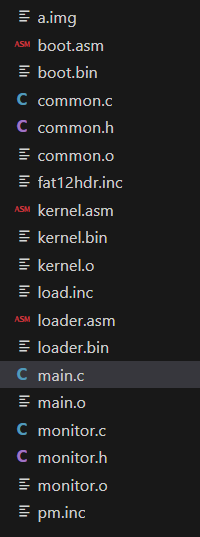
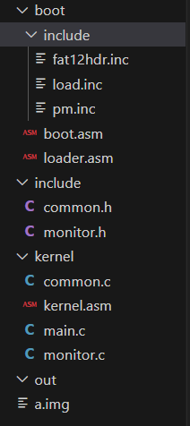
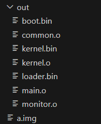

本来想继续写代码的，但上一节的 9 条编译命令还是有些让人发怵：以后文件还会越来越多，难道就任由它这么发展下去？

况且，现在我们的根目录长这样：



（图 8-1 根目录的惨状）

各个部分堆在一起，杂乱无章，我们还是应该先整理一下根目录再说。

按照不同功能和部分的划分，我们把它这样分割：



（图 8-2 分割以后）

这样一分就很舒服了，但是编译命令也由此变成了彻底的地狱。下面就让我们引入在 Linux 下十分常见的自动编译工具——Makefile。

经常在 Linux 下装软件的朋友应该都知道，有的时候部分app只提供源代码，大部分这样的程序都是按下面的三部曲安装：

```plain
./configure
make
sudo make install
```

这三步是什么意思呢？第一步 `./configure`，生成 Makefile；第二步 `make`，用 `make` 工具调用 Makefile 编译；第三步 `sudo make install`，用 `make` 工具调用 Makefile 安装。

有三分之二的步骤都和 Makefile 相关，看来 Makefile 还真是个好工具呢。

Makefile 的实际应用比较复杂，我们这里只讲最简单的部分。一个 Makefile 是由多个块组成的，每个块的结构如下：

```plain
result : what you need
[TAB]command
```

需要注意的是，每个块的 command 部分**必须以TAB开头**，而在cnblogs编辑器里打不出TAB（会被自动替换为空格），因此只能用[TAB]来提示一下了，望大家谅解。

举个例子，如果我们想要把 `kernel/monitor.c` 编译为 `out/monitor.o`，我们应该怎样写出一个块呢？答案是这样：

```makefile
out/monitor.o : kernel/monitor.c
[TAB]i686-elf-gcc -I include -c -O0 -fno-builtin -fno-stack-protector -o out/monitor.o kernel/monitor.c
```

新出现了 `-I include` 的选项，这是因为所有的头文件都在 `include` 文件夹下，需要这样才能被 gcc 识别。

诶诶且慢，要是每个文件都要这么来一下，那不还是没有解决问题么？

GNU 那帮人其实早就替我们想好啦，我们只需要先写好这么一个模板，然后进行一个替换：

```makefile
out/%.o : kernel/%.c
[TAB]i686-elf-gcc -I include -c -O0 -fno-builtin -fno-stack-protector -o out/$*.o kernel/$*.c
```

这段代码与上面的 Makefile 并没有什么不同，只是把 command 中的 `monitor` 变成了 `$*`，把第一行的 `monitor` 变成了 `%` 而已。但这样一改，Makefile 就会对所有你要求编译的程序进行编译啦。

好，下面我们就继续进行对汇编的操作，其实和处理 C 几乎完全相同：

```makefile
out/%.o : kernel/%.asm
[TAB]nasm -f elf -o out/$*.o kernel/$*.asm

out/%.bin : boot/%.asm
[TAB]nasm -I boot/include -o out/$*.bin boot/$*.asm
```

注意到 boot.bin 和 loader.bin 由汇编直接编译，所以我们也把它放在这了。添加 `-I boot/include` 的原因和添加 `-I include` 的原因相同，这里不多说了。

下面还剩下最后几步。首先，眼尖的读者可能已经发现了，在几段之前有这样一句话：

> 但这样一改，Makefile 就会对所有你要求编译的程序进行编译啦。

那 Makefile 怎么知道我们要编译哪些程序呢？分两种方案：

第一种，命令行指定。通过 `make xxx.o` 或 `make xxx.bin`，即可编译对应的文件。但如果这样，就又回到之前的问题了。

第二种，可以在一个块的 `what you need` 部分指定，然后 `make result`。这样，在 `make result` 的时候，`make` 会发现 `what you need` 还不存在，于是就会自动编译了。

看来第二种比较适合我们。不过，我们还没有链接 `kernel.bin`，所以可以先拿它试试手：

```makefile
out/kernel.bin : $(OBJS)
[TAB]i686-elf-ld -s -Ttext 0x100000 -o out/kernel.bin $(OBJS)
```

这里新出现了 `$(OBJS)`，它实际上就是 Makefile 里的变量。在 Makefile 的开头添加一行：

```makefile
OBJS = out/kernel.o out/common.o out/monitor.o out/main.o
```

以后我们再增加新文件，就只需要在这里加一个 `out/xxx.o`，比之前可方便多了。

下面我们来进行测试，在命令行里输入 `make out/kernel.bin`：


（图 8-3 命令行输出）


（图 8-4 `out` 目录）

只一下，`kernel.bin` 便编译完成了。Makefile 的确方便哪（笑）。

但下面就是难点了：写盘操作在 Windows 和 Linux 下完全不一致。而想要判断当前操作系统是什么，并不简单，这正是 Makefile 的局限性。
（网上方法大都依赖 `uname`，但 Windows 没有 `uname`，所以会报错退出；所有依赖报错的方法会直接导致 `make` 终止，因此只能用其他语言的其他方法，如 `Python` 的 `os.name`。）

没办法，由于笔者是 Windows 机，所以我只好用 Windows 的方法写盘了。

```makefile
a.img : out/boot.bin out/loader.bin out/kernel.bin
[TAB]dd if=out/boot.bin of=a.img bs=512 count=1
[TAB]edimg imgin:a.img copy from:out/loader.bin to:@: copy from:out/kernel.bin to:@: imgout:a.img
```

或许之前没提，command 部分可以有多条命令哦。

现在，`make a.img`，效果如下：



（图 8-5 完全胜利）

我们最后再加一条命令，`make run`，用于一步到位运行操作系统。

```makefile
run : a.img
[TAB]qemu-system-i386 -fda a.img
```

执行 `make run`，效果如图：


（图 8-6 改造完成）

呼，经过一整节的整理，我们总算是有了一个可靠的自动编译系统。下面，我们就继续回到coding之中。