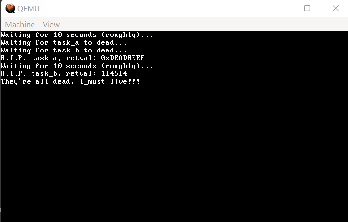
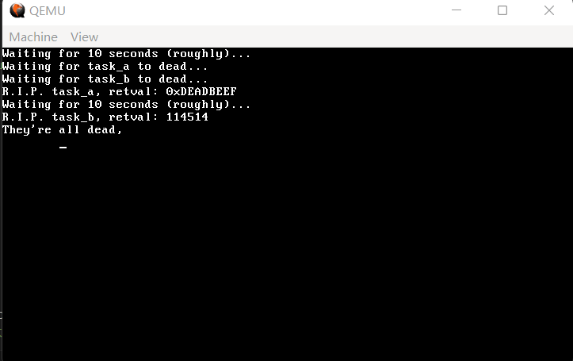
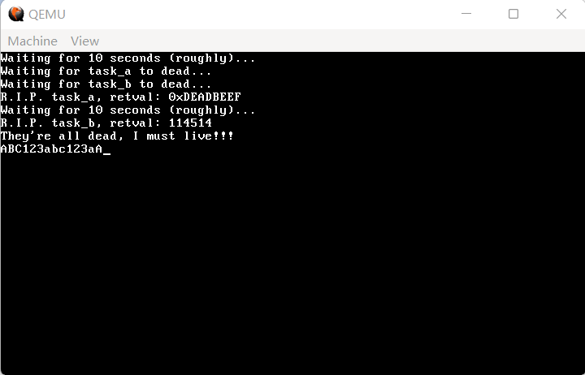
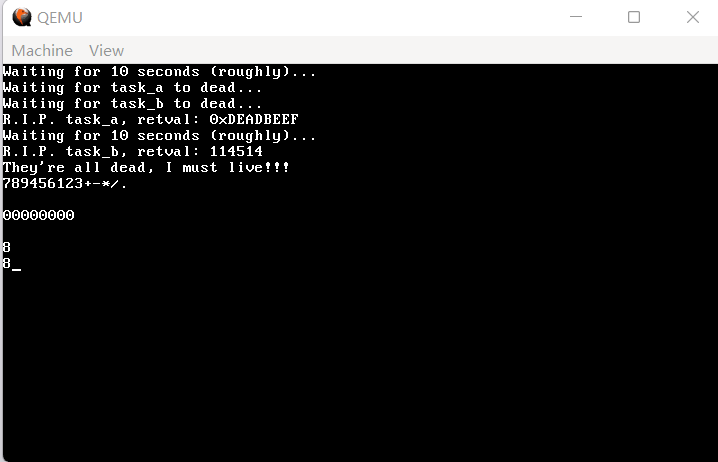
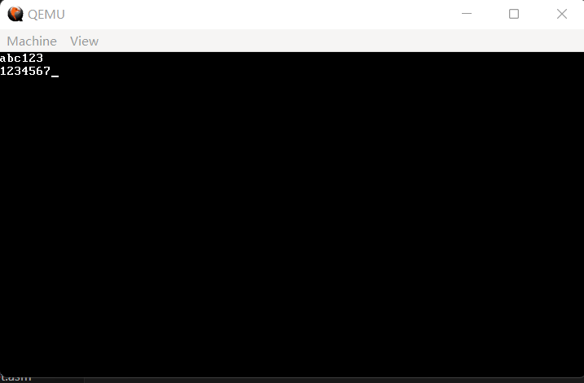

### 14.终于可以打字了——键盘驱动（下）

欢迎回来，我们继续键盘驱动的旅途。

首先，是三个最基本的东西：shift、alt 和 ctrl。这三个东西我们完全没有处理，特别是 shift，导致我们现在任何一个大写字母都打不出来。

修改一下 `keyboard.c`，先在最开头写下这几个全局变量，记录 shift、alt、ctrl 的状态：

**代码 14-1 shift、alt、ctrl 的状态（drivers/keyboard.c）**
```c
static int code_with_E0 = 0;
static int shift_l;
static int shift_r;
static int alt_l;
static int alt_r;
static int ctrl_l;
static int ctrl_r;
static int caps_lock;
static int num_lock;
static int scroll_lock;
static int column;
```

然后是现在的 `keyboard_read`：

**代码 14-2 带 `shift` 的扫描码解析（drivers/keyboard.c）**
```c
static void keyboard_read()
{
    uint8_t scancode;
    int make;
    uint32_t key = 0;
    uint32_t *keyrow;
    if (fifo_status(&keyfifo) > 0) {
        scancode = get_scancode();
        if (scancode == 0xE1) {
            // 特殊开头，暂不做处理
        } else if (scancode == 0xE0) {
            code_with_E0 = 1;
        } else {
            make = scancode & FLAG_BREAK ? false : true;
            keyrow = &keymap[(scancode & 0x7f) * MAP_COLS];
            column = 0;
            if (shift_l || shift_r) {
                column = 1;
            }
            if (code_with_E0) {
                column = 2;
                code_with_E0 = 0;
            }
            key = keyrow[column];
            switch (key) {
                case SHIFT_L:
                    shift_l = make;
                    key = 0;
                    break;
                case SHIFT_R:
                    shift_r = make;
                    key = 0;
                    break;
                case CTRL_L:
                    ctrl_l = make;
                    key = 0;
                    break;
                case CTRL_R:
                    ctrl_r = make;
                    key = 0;
                    break;
                case ALT_L:
                    alt_l = make;
                    key = 0;
                    break;
                case ALT_R:
                    alt_r = make;
                    key = 0;
                    break;
                default:
                    if (!make) key = 0;
                    break;
            }
            if (key) monitor_put(key);
        }
    }
}
```

在实现 `shift` 的同时，我们过滤了 `ctrl` 和 `alt`，判断是否释放也改为了判断是否按下，同时会在适当的时候忽略 `key` 的值。

编译，运行，按下 shift 和不按 shift 分别输入 `abc123`，效果如图所示：


（图 14-1 实现 shift）

现在的 `keyboard_read` 对按键的处理仅限于打印，为了匹配以后更加复杂的需求，我们单独创建一个 `in_process` 用来处理不同的按键。

把 `if (key) monitor_put(key)` 替换为：

**代码 14-3 对按键进行编码（drivers/keyboard.c）**
```c
            if (make) {
                key |= shift_l ? FLAG_SHIFT_L : 0;
                key |= shift_r ? FLAG_SHIFT_R : 0;
                key |= alt_l ? FLAG_ALT_L : 0;
                key |= alt_r ? FLAG_ALT_R : 0;
                key |= ctrl_l ? FLAG_CTRL_L : 0;
                key |= ctrl_r ? FLAG_CTRL_R : 0;
                in_process(key);
            }
```

这里相当于对 `key` 进行了编码，同时将当时所有的按键状态编码了进去。

然后是 `in_process`，把它放在 `keyboard_read` 之前。

**代码 14-4 `in_process`（drivers/keyboard.c）**
```c
static void in_process(uint32_t key)
{
    if (!(key & FLAG_EXT)) {
        monitor_put(key & 0xFF);
    }
}
```

编译，运行，效果仍应如**图 14-1**所示。

下面是对回车、退格和 `tab` 行为的单独处理，我们只需要找出 `ENTER`、 `BACKSPACE` 以及 `TAB` 这两种情况，改为打印 `\n`、 `\b` 以及 `\t`。

**代码 14-5 回车、退格与 `TAB`（drivers/keyboard.c）**
```c
static void in_process(uint32_t key)
{
    if (!(key & FLAG_EXT)) {
        monitor_put(key & 0xFF);
    } else {
        int raw_key = key & MASK_RAW;
        switch (raw_key) {
            case ENTER:
                monitor_put('\n');
                break;
            case BACKSPACE:
                monitor_put('\b');
                break;
            case TAB:
                monitor_put('\t');
                break;
        }
    }
}
```

编译，运行，待 `task_c` 输出后连按数次退格，效果如下：



（图 14-2 `BACKSPACE` 的异常）

我们发现，光标虽然成功后移，但字符都还在。这是在 `monitor_put` 中对 `\b` 的判断中应当处理的，找到 `monitor_put` 中的第一个判断，我们来做一个专项修改：

**代码 14-6 对退格键的修改（kernel/monitor.c）**
```c
    if (c == 0x08 && cursor_x) // 退格，且光标不在某行开始处
    {
        cursor_x--; // 直接把光标向后移一格
        video_memory[cursor_y * 80 + cursor_x] = 0x20 | (attributeByte << 8); // 空格
    }
```

再次编译，运行，待 `task_c` 输出信息后，按若干次退格并按下 `\n`、`\t`，效果如下：



（图 14-3 成功删除字符）

由此即可证明，对这三个键的处理可以暂告一段落。乘胜追击，我们来处理键盘上有指示灯的三个键：`CapsLock`、`NumLock` 和 `ScrollLock`（什么？`Fn`？这玩意真的在 `PS/2` 键盘上？）。

对键盘指示灯的操控需要借助我们之前遇到的 `0x60` 端口，也要借助键盘控制器的另一个端口——`0x64`。

如何设置键盘指示灯的情况呢？非常简单，大致分为如下几步：

1. 读出控制器端口 `0x64` 对应的数据，观察其从低往高第2位是否为 0，若为 0，代表当前可向 `0x60` 端口发送命令；

2. 向 `0x60` 端口发出命令 `0xED`，意为设置键盘 LED 灯状态。键盘控制器收到命令后，会在 `0x60` 端口发送一个 `0xFA`，我们需要等待这个 `0xFA` 返回。

3. 向 `0x60` 端口发出希望设置的键盘 LED 灯状态，它应被编码为一个字节，高5位均为0，从低往高数第1、2、3位分别为 `ScrollLock`、`NumLock` 和 `CapsLock`，其中每一位的 0 为熄灭，1 为亮起。

4. 键盘设置完 LED 灯状态后，会再次发送一个 `0xFA` 需要我们读出。

好了，在我们前面设置 shift、ctrl 和 alt 状态的时候已经增加了这三个 lock 指示灯的变量，我们来针对上面的四步分别写程序。

首先，我们来创建一个设置 LED 灯状态的函数，实际使用时只需要往 `caps_lock`、`num_lock` 和 `scroll_lock` 三个变量中写指示灯状态即可（请把它们放在 `get_scancode` 之前）。

**代码 14-7 设置 LED 状态（drivers/keyboard.c）**
```c
static void kb_wait()
{
    uint8_t kb_stat;
    do {
        kb_stat = inb(KB_CMD); // KB_CMD: 0x64
    } while (kb_stat & 0x02);
}

static void kb_ack()
{
    uint8_t kb_data;
    do {
        kb_data = inb(KB_DATA); // KB_DATA: 0x60
    } while (kb_data != KB_ACK); // KB_ACK: 0xFA
}

static void set_leds()
{
    uint8_t led_status = (caps_lock << 2) | (num_lock << 1) | scroll_lock;

    kb_wait();
    outb(KB_DATA, LED_CODE); // LED_CODE: 0xED
    kb_ack();

    kb_wait();
    outb(KB_DATA, led_status);
    kb_ack();
}
```

其中的 `KB_CMD`、`KB_DATA`、`KB_ACK` 以及 `LED_CODE` 已经定义在 `keyboard.h` 之中了。

接下来我们对 `init_keyboard` 略作修改，初始化 LED 灯的状态。

**代码 14-8 新版 `init_keyboard`（drivers/keyboard.c）**
```c
void init_keyboard()
{
    fifo_init(&keyfifo, 32, keybuf);

    shift_l = shift_r = 0;
    alt_l = alt_r = 0;
    ctrl_l = ctrl_r = 0;

    caps_lock = 0;
    num_lock = 1;
    scroll_lock = 0;
    set_leds();

    register_interrupt_handler(IRQ1, keyboard_handler);
}
```

之所以设置 `num_lock` 为 1，是因为小键盘的数字功能一般比方向功能常用。不过，设置了也还没有用，我们紧接着对 `caps_lock` 和 `num_lock` 的状态作出判断。

我们首先添加当按下这三个键时更改状态和 LED 灯状态的处理，然后是添加了 CapsLock 按下时的实际功能。

**代码 14-9 LED 灯状态的变换以及 CapsLock 的实际功能（drivers/keyboard.c）**
```c
static void keyboard_read()
{
    uint8_t scancode;
    int make;
    uint32_t key = 0;
    uint32_t *keyrow;
    if (fifo_status(&keyfifo) > 0) {
        scancode = get_scancode();
        if (scancode == 0xE1) {
            // 特殊开头，暂不做处理
        } else if (scancode == 0xE0) {
            code_with_E0 = 1;
        } else {
            make = scancode & FLAG_BREAK ? false : true;
            keyrow = &keymap[(scancode & 0x7f) * MAP_COLS];
            column = 0;

            int caps = shift_l || shift_r;
            if (caps_lock) {
                if ((keyrow[0] >= 'a') && (keyrow[0] <= 'z')) caps = !caps;
            }
            if (caps) {
                column = 1;
            }
            if (code_with_E0) {
                column = 2;
                code_with_E0 = 0;
            }
            key = keyrow[column];
            switch (key) {
                case SHIFT_L:
                    shift_l = make;
                    break;
                case SHIFT_R:
                    shift_r = make;
                    break;
                case CTRL_L:
                    ctrl_l = make;
                    break;
                case CTRL_R:
                    ctrl_r = make;
                    break;
                case ALT_L:
                    alt_l = make;
                    break;
                case ALT_R:
                    alt_r = make;
                    break;
                case CAPS_LOCK:
                    if (make) {
                        caps_lock = !caps_lock;
                        set_leds();
                    }
                    break;
                case NUM_LOCK:
                    if (make) {
                        num_lock = !num_lock;
                        set_leds();
                    }
                    break;
                case SCROLL_LOCK:
                    if (make) {
                        scroll_lock = !scroll_lock;
                        set_leds();
                    }
                    break;
                default:
                    break;
            }
            if (make) {
                key |= shift_l ? FLAG_SHIFT_L : 0;
                key |= shift_r ? FLAG_SHIFT_R : 0;
                key |= alt_l ? FLAG_ALT_L : 0;
                key |= alt_r ? FLAG_ALT_R : 0;
                key |= ctrl_l ? FLAG_CTRL_L : 0;
                key |= ctrl_r ? FLAG_CTRL_R : 0;
                in_process(key);
            }
        }
    }
}
```

这里实际的代码增加的不多，主要是大的 `switch-case` 增加了几个 lock 键，以及 `code_with_E0` 上面几行对 `caps_lock` 状态的处理。

编译，运行，等待 `task_c` 输出完成后，依次按下：

ENTER、CapsLock、a、b、c、1、2、3、CapsLock、a、b、c、1、2、3、CapsLock、Shift+A、A，

效果如下：



（图 14-4 CapsLock 的实际效果）

最后，是对 NumLock 的处理，请用下面这一长串替换掉 `keyboard_read` 中 `if (make)` 的分支：

**代码 14-10 NumLock（drivers/keyboard.c）**
```c
            if (make) {
                int pad = 0;

                if ((key >= PAD_SLASH) && (key <= PAD_9)) {
                    pad = 1;
                    switch (key) {
                        case PAD_SLASH:
                            key = '/';
                            break;
                        case PAD_STAR:
                            key = '*';
                            break;
                        case PAD_MINUS:
                            key = '-';
                            break;
                        case PAD_PLUS:
                            key = '+';
                            break;
                        case PAD_ENTER:
                            key = ENTER;
                            break;
                        default:
                            if (num_lock && (key >= PAD_0) && (key <= PAD_9)) {
                                key = key - PAD_0 + '0';
                            } else if (num_lock && (key == PAD_DOT)) {
                                key = '.';
                            } else {
                                switch (key) {
                                    case PAD_HOME:
                                        key = HOME;
                                        break;
                                    case PAD_END:
                                        key = END;
                                        break;
                                    case PAD_PAGEUP:
                                        key = PAGEUP;
                                        break;
                                    case PAD_PAGEDOWN:
                                        key = PAD_PAGEDOWN;
                                        break;
                                    case PAD_INS:
                                        key = INSERT;
                                        break;
                                    case PAD_UP:
                                        key = UP;
                                        break;
                                    case PAD_DOWN:
                                        key = DOWN;
                                        break;
                                    case PAD_LEFT:
                                        key = LEFT;
                                        break;
                                    case PAD_RIGHT:
                                        key = RIGHT;
                                        break;
                                    case PAD_DOT:
                                        key = DELETE;
                                        break;
                                    default:
                                        break;
                                }
                            }
                            break;
                    }
                }
                key |= shift_l ? FLAG_SHIFT_L : 0;
                key |= shift_r ? FLAG_SHIFT_R : 0;
                key |= ctrl_l  ? FLAG_CTRL_L  : 0;
                key |= ctrl_r  ? FLAG_CTRL_R  : 0;
                key |= alt_l   ? FLAG_ALT_L   : 0;
                key |= alt_r   ? FLAG_ALT_R   : 0;
                key |= pad     ? FLAG_PAD     : 0;

                in_process(key);
            }
```

编译，运行，依次按下小键盘上的：

Enter、7、8、9、4、5、6、1、2、3、+、-、*、/、.、Enter、Enter、0、0、0、0、0、0、0、0、Enter、Enter，

然后是不在小键盘上的上下左右方向键，按下 Enter，再按下不在小键盘上的上下左右方向键，效果如下：



（图 14-5 NumLock 的实际效果）

前面小键盘的测试部分倒是符合预期，但是为什么上下左右方向键会输出一个 `8` 呢（有的机型甚至会输出 `8246`）？

通过回到第 13 节开篇的状态打印扫描码我们发现，原来是 qemu 对 PS/2 键盘的模拟出了点故障，将 0xE0 这一本该放在前面的字节放在了后面，导致我们的键盘驱动先接收到要打印小键盘的 `8`（没错，方向键和小键盘上的键扫描码相同，只是后面跟了个 0xE0），然后接收到 0xE0，0xE0 就被后续的方向键所匹配了（有的甚至都匹配不上）。对此我们有几个解决方案：要么干脆摆烂直接不管，要么做一个补丁。

但是，经过进一步的测试，我们发现不同版本的 QEMU 有不同的模拟逻辑，有的 QEMU 甚至直接不区分方向键和小键盘的方向键，那这个补丁自然没法打，所以就此开摆！

最后，我们把 `in_process` 中的打印字符改为向特定的 FIFO 中放入字符，由 `kernel_main` 或者别的什么地方从这里面读取。

**代码 14-11 `in_process` 最终版（drivers/keyboard.c）**
```c
static void in_process(uint32_t key)
{
    if (!(key & FLAG_EXT)) {
        fifo_put(&decoded_key, key & 0xFF);
    } else {
        int raw_key = key & MASK_RAW;
        switch (raw_key) {
            case ENTER:
                fifo_put(&decoded_key, '\n');
                break;
            case BACKSPACE:
                fifo_put(&decoded_key, '\b');
                break;
            case TAB:
                fifo_put(&decoded_key, '\t');
                break;
        }
    }
}
```

在文件开头添加两行 `fifo_t decoded_key;` 以及 `uint32_t dkey_buf[32];`，在 `init_keyboard` 中加入一行 `fifo_init(&decoded_key, 32, dkey_buf);`，我们的键盘驱动就此完结。

最新版的测试用 `main.c` 完整版如下：

**代码 14-12 键盘驱动最终测试（kernel/main.c）**
```c
#include "monitor.h"
#include "gdtidt.h"
#include "isr.h"
#include "timer.h"
#include "memory.h"
#include "mtask.h"
#include "keyboard.h"
#include "fifo.h"

extern fifo_t decoded_key;

task_t *create_kernel_task(void *entry)
{
    task_t *new_task;
    new_task = task_alloc();
    new_task->tss.esp = (uint32_t) kmalloc(64 * 1024) + 64 * 1024 - 4;
    new_task->tss.eip = (int) entry;
    new_task->tss.es = new_task->tss.ss = new_task->tss.ds = new_task->tss.fs = new_task->tss.gs = 2 * 8;
    new_task->tss.cs = 1 * 8;
    return new_task;
}
 
void kernel_main() // kernel.asm会跳转到这里
{
    monitor_clear();
    init_gdtidt();
    init_memory();
    init_timer(100);
    init_keyboard();
    asm("sti");

    task_t *task_a = task_init();

    while (1) {
        if (fifo_status(&decoded_key) > 0) {
            monitor_put(fifo_get(&decoded_key));
        }
    }
}
```

编译，运行，输入 abc123、enter、1234567，效果如下：



（图 14-6 一片空旷）

我们看到，现在的OS启动时屏幕一片空旷，它成了一个完完全全的打字机。这也算是我们人机交互的初步成果了。

键盘相关的处理到此结束，下一节，我们开始脱离内核，向用户层迈进。
