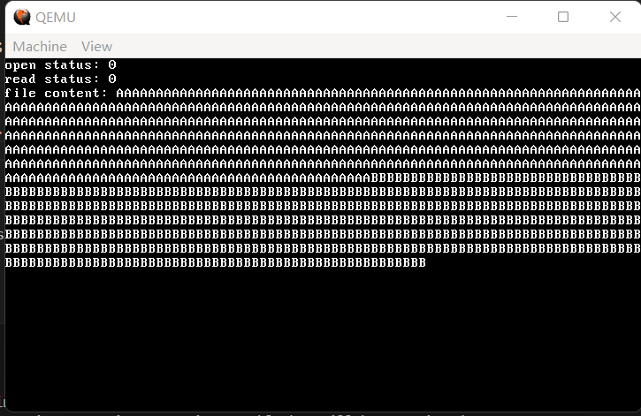
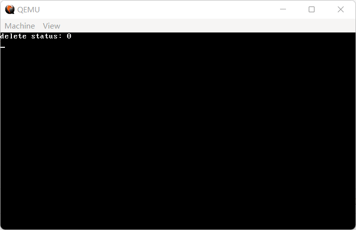
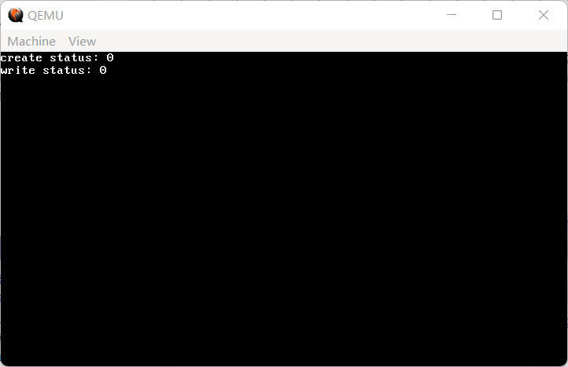
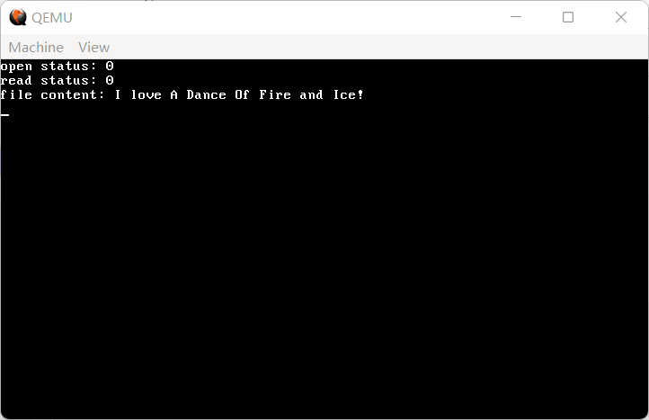

在实现文件的读取、写入和删除之前，首先还需要了解两个在上一节被刻意忽略掉的概念：**FAT 表**以及**簇**。

数据区你远看它是一整块，但是近看它被分割成了一个个的扇区，每一个扇区都还有另一个名字，这就是**簇**。而 **FAT 表**，就是簇的索引，每一个 FAT 项的位置实际上都是一个簇的编号，简称簇号。在 FAT16 文件系统中，一个 FAT 项占据 16 位，这也是这个文件系统名字的由来。

每一个 FAT 项所在的位置都对应着一个簇号，而这个 FAT 项中存放的数据，则是这个文件数据的**下一个簇**的所在位置。这个逻辑有点像链表：首先从文件的 `clustno` 属性获取第一个簇的位置，然后读取第一个簇的簇号所在的 FAT 项获取下一个簇的位置，以此类推。据规定，在 FAT16 文件系统中，若一个簇号对应的 FAT 项的值大于等于 `0xFFF8`，那么说明文件结束。一般而言，大多数实现都采用 `0xffff` 作为文件结束标志。

然而，为了软件识别的需要，微软官方直接把前两个 FAT 项砍了，并规定：数据区的第一个簇的簇号为 2，往后依次类推。这意味着，在读写簇内容的时候还需要手动减 2，才能读到正确的扇区。

那么，我们来写一个读写 FAT 项的函数。虽说没有类，做不到模拟数组操作，但是能接近还是接近一下：

**代码 19-1 读写 FAT 项（fs/fat16.c）**
```c
// 获取第n个FAT项
static uint16_t get_nth_fat(uint16_t n)
{
    uint8_t *fat = (uint8_t *) kmalloc(512); // 分配临时FAT内存
    uint32_t fat_start = FAT1_START_LBA; // 默认从FAT1中读取FAT
    uint32_t fat_offset = n * 2; // FAT项在FAT表内的偏移，FAT16一个FAT是16位，即2个字节，所以乘2
    uint32_t fat_sect = fat_start + (fat_offset / 512); // 该FAT项对应的扇区编号
    uint32_t sect_offset = fat_offset % 512; // 该FAT项在扇区内的偏移
    hd_read(fat_sect, 1, fat); // 读取对应的一个扇区到FAT内（由于*2，FAT项必然不跨扇区）
    uint16_t table_val = *(uint16_t *) &fat[sect_offset]; // 从FAT表中找到对应的FAT项
    kfree(fat); // 临时FAT表就用不上了
    return table_val; // 返回对应的FAT项
}

// 设置第n个FAT项
static void set_nth_fat(uint16_t n, uint16_t val)
{
    int fat_start = FAT1_START_LBA; // FAT1起始扇区
    int second_fat_start = FAT1_START_LBA + FAT1_SECTORS; // FAT2起始扇区
    uint8_t *fat = (uint8_t *) kmalloc(512); // 临时FAT表
    uint32_t fat_offset = n * 2; // FAT项在FAT表内的偏移
    uint32_t fat_sect = fat_start + (fat_offset / 512); // FAT项在FAT1中对应的扇区号
    uint32_t second_fat_sect = second_fat_start + (fat_offset / 512); // FAT项在FAT2中对应的扇区号
    uint32_t sect_offset = fat_offset % 512; // FAT项在扇区内的偏移
    hd_read(fat_sect, 1, fat); // 读入到临时FAT表
    *(uint16_t *) &fat[sect_offset] = val; // 直接设置对应的FAT项即可，FAT16没有那么多弯弯绕
    hd_write(fat_sect, 1, fat); // 写入FAT1
    hd_write(second_fat_sect, 1, fat); // 写入FAT2
    kfree(fat); // 释放临时FAT表
}
```

具体细节仍旧写在了注释里。具体而言，为了节省硬盘 IO 的时间（虽然读取根目录疑似也是 32 个扇区），所以在读取 FAT 项时，只读取要读的 FAT 项所在的那个扇区。由于一个 FAT 项占两个字节，所以第 `n` 个 FAT 项就位于到 FAT 表开始的第 `2n` 个字节，随后就可以计算扇区数和扇区内的偏移量了。

接下来就是给出簇号，读写对应的簇的函数了：

**代码 19-2 读写一个簇（fs/fat16.c）**
```c
// 读取第n个clust
static void read_nth_clust(uint16_t n, void *clust)
{
    hd_read(n + SECTOR_CLUSTER_BALANCE, 1, clust);
}

// 写入第n个clust
static void write_nth_clust(uint16_t n, const void *clust)
{
    hd_write(n + SECTOR_CLUSTER_BALANCE, 1, (void *) clust);
}
```

其中 `SECTOR_CLUSTER_BALANCE` 定义于 `include/file.h`，其值为 `DATA_START_LBA - 2`。具体原因，是因为簇号要减去 2 才是数据区中的扇区编号，所以在把簇号加上数据区以找到对应扇区的同时，还要再减去 2 以找到正确的位置。

有了读取 FAT 项和读取一个簇的手段，实现读取文件几乎是水到渠成的，其具体操作如下：

> 1.根据打开的 fileinfo_t 找到第一个簇号。
> 2.读取第一个簇到缓冲区。
> 3.读取该簇号对应的 FAT 项，找到该文件下一个簇的簇号。
> 4.若该 FAT 项大于等于 `0xfff8`，则文件结束，终止循环。
> 5.假装下一个簇是第一个簇，重复 2~5。

将上面的思路化为代码，就得到了：

**代码 19-3 读取文件（fs/fat16.c）**
```c
// 读取文件，当然要有素质地一次读整个文件啦
int fat16_read_file(fileinfo_t *finfo, void *buf)
{
    uint16_t clustno = finfo->clustno; // finfo中记录的第一个簇号
    char *clust = (char *) kmalloc(512); // 单独给簇分配一个缓冲区，直接往buf里写也行
    do {
        read_nth_clust(clustno, clust); // 将该簇号对应的簇读取进来
        memcpy(buf, clust, 512); // 拷贝入buf
        buf += 512; // buf后推一个扇区
        clustno = get_nth_fat(clustno); // 获取下一个簇号
        if (clustno >= 0xFFF8) break; // 文件结束，退出循环
    } while (1);
    kfree(clust); // 读完了，释放临时缓冲区
    return 0; // 返回
}
```

如你所见，这个读取文件的函数非常之短，甚至比前面的创建和打开还短，只有 15 行，和读写 FAT 的单个函数差不多长。这就是 FAT16 的简单之处。

作为测试，上一节我们写入了文件 `ilovehon.kai`，现在是时候同时对打开文件和读取文件进行一次测试了。替换掉上一节的创建文件测试代码，编写测试代码如下：

**代码 19-4 读取测试（fs/fat16.c）**
```c
    fileinfo_t finfo;
    int status = fat16_open_file(&finfo, "ilovehon.kai"); // 打开文件 ilovehon.kai
    printk("open status: %d\n", status);
    if (status == -1) while (1); // 若打开失败就不用读了
    char *buf = (char *) kmalloc(finfo.size + 5);
    status = fat16_read_file(&finfo, buf);
    printk("read status: %d\nfile content: %s\n", status, buf);
    kfree(buf);
```



（图 19-1 读取成功，这里显示的应当是上一节填充的测试内容）

一刻也没有为读取文件的迅速结束而哀悼，立刻赶到战场的是——删除文件！

想要删除一个文件，并不需要把文件的所有内容都随机 01 啦、设成 0 或 1 啦这些，非常简单，你只需要让这个文件无法被找到就可以了。

这里总算可以填上前面挖的一个坑了：

> 并且在第一个字节为 0xe5 时要自动替换为 0x05

这是为什么呢？正是因为在 FAT 文件系统中，第一个字节为 0xe5 的文件被视为“已经删除”，所以才要特意和谐一下。

那么，既然这样就相当于在根目录区里消失了，数据区的簇又可以赖着，一个文件所剩的资源就只有 FAT 项了。事实上，在删除一个文件时，它所在的 FAT 项也要全部设置为 0。

只要注意这两点，那么实现删除文件也就相当简单：

**代码 19-5 删除文件（fs/fat16.c）**
```c
// 删除文件
int fat16_delete_file(char *filename) // 什么？为什么不传finfo？删除一个已经打开的文件，听上去很别扭不是吗（虽然在Linux下这很正常）
{
    char sfn[20] = {0};
    int ret = lfn2sfn(filename, sfn); // 将文件名转换为8.3文件名
    if (ret) return -1;
    int entries;
    fileinfo_t *root_dir = read_dir_entries(&entries); // 读取根目录
    int file_ind = -1;
    for (int i = 0; i < entries; i++) {
        if (!memcmp(root_dir[i].name, sfn, 8) && !memcmp(root_dir[i].ext, sfn + 8, 3)) {
            file_ind = i; // 找到对应文件了
            break;
        }
    }
    if (file_ind == -1) { // 没有找到
        kfree(root_dir); // 不用删了
        return -1;
    }
    root_dir[file_ind].name[0] = 0xe5; // 标记为已删除
    hd_write(ROOT_DIR_START_LBA, ROOT_DIR_SECTORS, root_dir); // 更新根目录区数据
    kfree(root_dir); // 释放临时缓冲区
    if (root_dir[file_ind].clustno == 0) {
        return 0; // 内容空空，那就到这里就可以了
    }
    unsigned short clustno = root_dir[file_ind].clustno, next_clustno; // 开始清理文件所占有的簇
    while (1) {
        next_clustno = get_nth_fat(clustno); // 找到这个文件下一个簇的簇号
        set_nth_fat(clustno, 0); // 把下一个簇的簇号设为0，这样就找不到下一个簇了
        if (next_clustno >= 0xfff8) break; // 已经删完了，直接返回
        clustno = next_clustno; // 下一个簇设为当前簇
    }
    return 0; // 删除完成
}
```

同样，具体细节参见注释。

下面是测试环节。我们在上一节测试创建文件时创建了一个 `iloveado.fai` 文件，现在我们来删除它。

**代码 19-6 删除文件测试（kernel/main.c）**
```c
    fileinfo_t finfo;
    int status = fat16_delete_file("iloveado.fai");
    printk("delete status: %d\n", status);
```

编译，运行，效果如下图所示：



（图 19-2 删除文件疑似成功）

在命令行中调用 `ftls`，确认删除成功：


（图 19-3 删除成功）

现在，本节最简单的两个操作——读取和删除，已经完成，我们来进攻最后一个据点——写入。只要写入文件完成，后面就都是软件上的事了。

为了简单起见，在写入文件时，只支持将整个文件全部覆盖。相信一些开发经验比较丰富的读者已经要说了：

> 可是我用过 fseek/lseek，可以在任意位置进行写入呀。

为了简单起见，这些东西我们可以用纯软件来实现，就不麻烦 FAT16 的底层实现了。

实现写入文件主要的问题在于要处理的问题太多，包括但不限于：

1. 如果是第一次写入的话，需要分配一个首簇号。
2. 可能会出现簇混乱的情况，这种情况下需要再重新找一个新簇。
3. 如果写入的部分超出原有的，还是要分配新簇。
4. 如果写入的部分少于原有的，需要把原来的簇号释放。
5. 需要重新写入当前日期/时间，以及大小等。

对于上面的几个东西，我们来分步解决。这一部分代码的注释非常重要，请认真阅读（？）

首先，针对第一次写入需要分配首簇号的问题，我们添加了一个判断：

**代码 19-7 写入文件（1）——为第一次写入的空文件分配簇号（fs/fat16.c）**
```c
// 写入文件，为简单起见相当于覆盖了
int fat16_write_file(fileinfo_t *finfo, const void *buf, uint32_t size)
{
    uint16_t clustno = finfo->clustno, next_clustno; // 从已有首簇号开始
    if (finfo->size == 0 && finfo->clustno == 0) { // 没有首簇号
        clustno = 2; // 从第2个簇开始分配
        while (1) {
            if (get_nth_fat(clustno) == 0) { // 当前簇空闲
                finfo->clustno = clustno; // 分配
                break; // 已找到空闲簇号
            }
            clustno++; // 继续寻找下一个簇
        }
    }
    finfo->size = size; // 更新大小
```

再然后，是写入的主体部分，这里要处理的问题比较复杂。

**代码 19-8 写入文件（2）——写入文件主体（fs/fat16.c）**
```c
    int write_sects = (size + 511) / 512; // 确认要写入的扇区总数，这里向上舍入
    while (write_sects) { // 只要还要写
        write_nth_clust(clustno, buf); // 将当前buf的512字节写入对应簇中
        write_sects--; // 要写入扇区总数-1
        buf += 512; // buf后移一个扇区
        next_clustno = get_nth_fat(clustno); // 寻找下一个簇
        if (next_clustno == 0 || next_clustno >= 0xfff8) {
            // 当前簇不可用
            next_clustno = clustno + 1; // 从下一个簇开始
            while (1) {
                if (get_nth_fat(next_clustno) == 0) { // 这个簇是可用的
                    set_nth_fat(clustno, next_clustno); // 将这个簇当成下一个簇链接上去
                    break;
                } else next_clustno++; // 否则，只好继续了
            }
        }
        clustno = next_clustno; // 将下一个簇看做当前簇
    }
```

最后，是收尾的部分。

**代码 19-9 写入文件（3）——扫尾（fs/fat16.c）**
```c
    // 最后修改一下文件属性
    current_time_t ctime;
    get_current_time(&ctime); // 获取当前日期
    // 更新日期和时间
    finfo->date = ((ctime.year - 1980) << 9) | (ctime.month << 5) | ctime.day;
    finfo->time = (ctime.hour << 11) | (ctime.min << 5) | ctime.sec;
    int entries;
    fileinfo_t *root_dir = read_dir_entries(&entries);
    for (int i = 0; i < entries; i++) {
        if (!memcmp(root_dir[i].name, finfo->name, 8) && !memcmp(root_dir[i].ext, finfo->ext, 3)) {
            root_dir[i] = *finfo; // 找到对应的文件，写进根目录
            break;
        }
    }
    hd_write(ROOT_DIR_START_LBA, ROOT_DIR_SECTORS, root_dir); // 同步到硬盘
    kfree(root_dir);
    return 0;
}
```

比较具体的讲解都已经写在注释当中。

好了，最后还是测试环节。

**代码 19-10 写入测试（kernel/main.c）**
```c
    fileinfo_t finfo;
    int status = fat16_create_file(&finfo, "iloveado.fai");
    printk("create status: %d\n", status);
    char *buf = (char *) kmalloc(512);
    strcpy(buf, "I love A Dance Of Fire and Ice!");
    status = fat16_write_file(&finfo, buf, strlen(buf));
    printk("write status: %d\n", status);
```

编译，运行，效果如下：



（图 19-4 写入文件疑似成功）

更换上面的测试代码为：

**代码 19-11 写入测试II（kernel/main.c）**
```c
    fileinfo_t finfo;
    int status = fat16_open_file(&finfo, "iloveado.fai");
    printk("open status: %d\n", status);
    char *buf = (char *) kmalloc(512);
    status = fat16_read_file(&finfo, buf);
    printk("read status: %d\nfile content: %s\n", status, buf);
```

再次编译运行，效果如下：



（图 19-5 写入文件成功）

至此，我们已经彻底完成了 FAT16 的底层实现，下一章，我们来彻底完成文件系统的制作，实现用户可以使用的一套系统调用。
