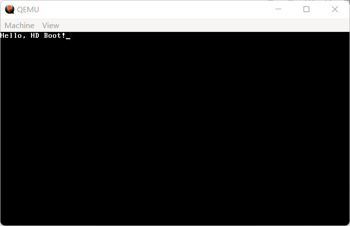
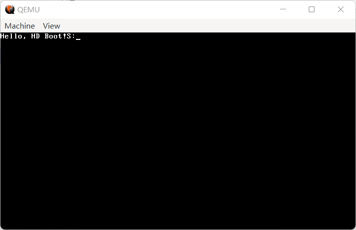
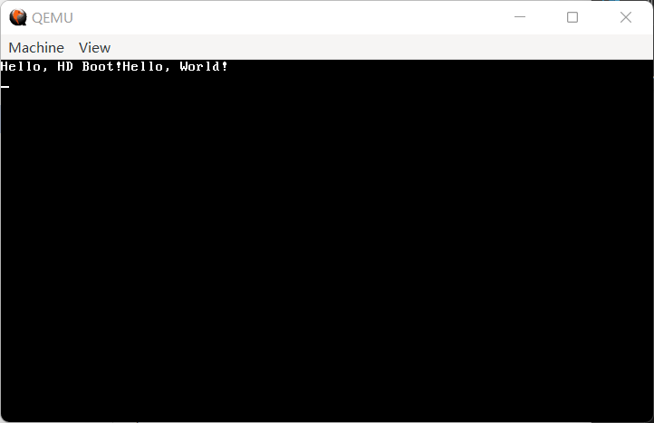

想要加载一个应用程序，实际上是相当简单的，我们迅速来做一个简单的示例。

首先，创建新文件 `test_app.asm`，内容如下：

**代码 22-1 测试应用程序（test_app.asm）**
```asm
ud2
```

这个东西应该是在前面几节讲异常的时候提过的，它可以手动触发一个 6 号异常，到时候只需要看是否触发就行了。

使用 `nasm` 命令将它编译为一个二进制程序：


（图 22-1 编译方法）

生成了仅两个字节的 `test_app.bin`，使用 `ftcopy` 命令将它写入虚拟硬盘 `hd.img`：


（图 22-2 写入硬盘，若完全跟随本教程的话，硬盘根目录应该长这样）

修改 `kernel_main` 中测试代码如下：

**代码 22-2 执行应用程序（kernel/main.c）**
```c
    int fd = sys_open("test_app.bin", O_RDWR); // 打开应用程序文件test_app.bin
    char *buf = (char *) kmalloc(512); // 分配一个扇区当缓冲区
    int ret = sys_read(fd, buf, 512); // 读取512字节的空间
    printk("read status: %d\n", ret); // 返回读取状态
    asm("jmp %0" : : "m"(buf)); // 然后直接跳入buf开始执行里面的代码
    kfree(buf); // 释放缓冲区（虽然如果成了理论上执行不到这）
```

编译，运行，效果如下图所示：


（图 22-3 6 号异常触发，应用程序成功执行）

好了，既然我们的第一个应用程序已经成功执行，已经达到了本节标题的进度，所以本节到此结束，下一节……

乐了，你看这可能吗？那包不可能的，我们本节真正的任务其实总共有两个：

> 1.实现任务创建，现在的应用程序执行会直接把原来的任务顶号，这样的话多任务就跟没实现一样；

> 2.实现基本的保护措施，现在的应用程序随随便便就能惊动 CPU 让它爆异常，这实在是非常脆弱的，哪怕爆也只能爆一般保护性异常让 OS 做处理。

我们从易到难，从实现任务创建开始。在 Linux 中，创建任务通常使用的是 `fork` 函数（当然也有别的函数比如 `vfork`，这里不讨论），作用是复制一个当前的任务，不过由于我们使用 TSS 而非 PCB，`fork` 函数较难实现。那么，就只能选择使用微软风格的 `CreateProcess`，后面写成 `create_process`：

**代码 22-3 应用程序任务创建及执行 API**
```c
int create_process(const char *app_name, const char *cmdline, const char *work_dir); // 返回新任务的 PID
```

由于我们没有实现目录，第三个参数只能填 `/`。

这个系统调用怎么实现呢？希望大家都还没有忘掉第15节创建新系统调用的方法（笑）。首先实现一个对应的 `sys_create_process`，然后从汇编里把参数传过去。

首先来到 `include/syscall.h`，添加 `sys_create_process` 的声明并填入系统调用表：

**代码 22-4 系统调用表（include/syscall.h）**
```c
int sys_create_process(const char *app_name, const char *cmdline, const char *work_dir);

// ...

syscall_func_t syscall_table[] = {
    sys_getpid, sys_write, sys_read, sys_create_process, // 这里新增了一个函数
};
```

由于 `create_process` 共有三个参数，因此和 `read`、`write` 一样，用 `ebx`、`ecx`、`edx` 三个寄存器进行传参，所以抄一遍上面两个系统调用，然后改一下系统调用号即可：

**代码 22-5 `create_process` 的实现（伪）（kernel/syscall_impl.asm）**
```asm
[global create_process]
create_process:
    push ebx
    mov eax, 3
    mov ebx, [esp + 8]
    mov ecx, [esp + 12]
    mov edx, [esp + 16]
    int 80h
    pop ebx
    ret
```

对于 `sys_create_process`，我们需要一个单独的文件，毕竟这算是另一个主题——应用程序执行里面的东西。新建 `kernel/exec.c`，我们来考虑考虑怎么写这个东西。

创建新任务我们是有方法的，直接调用那个 `create_kernel_task` 就行了。但是这个新任务要怎么知道执行哪个应用呢？有没有什么办法让这个任务接收到参数呢？

这个任务在本质上也就是一个函数而已。而函数的传参，依靠的是 `esp + 4`、`esp + 8` 之类的特殊地址。那么，我们只需要先把 `esp` 减去一个特定的值，空出三个参数的量来，然后把三个参数写进那个内存里，这样就可以在新任务中读到了。

由于在任务中自己操作自己比在别的任务中操作这个任务要更为简单，所以在 `sys_create_process` 中我们只进行创建任务的工作。

**代码 22-6 `sys_create_process` 的实现（kernel/exec.c）**
```c
#include "mtask.h"

int sys_create_process(const char *app_name, const char *cmdline, const char *work_dir)
{
    task_t *new_task = create_kernel_task(app_entry);
    new_task->tss.esp -= 12;
    *((int *) (new_task->tss.esp + 4)) = (int) app_name;
    *((int *) (new_task->tss.esp + 8)) = (int) cmdline;
    *((int *) (new_task->tss.esp + 12)) = (int) work_dir;
    task_run(new_task);
    return task_pid(new_task);
}
```

不要忘了在 `mtask.h` 中添加 `create_kernel_task` 的声明。

三个参数一共对应 12 的栈偏移，三个参数就被顺次放在 `esp + 4`、`esp + 8`、`esp + 12` 的地方。最后返回了新任务的 PID，这是因为它肯定会被用到，不能让调用的啥也不知道。

这样，`app_entry` 应该就可以成功接收到参数了：

**代码 22-7 是新任务哦（kernel/exec.c）**
```c
void app_entry(const char *app_name, const char *cmdline, const char *work_dir)
{
    puts(app_name); puts(cmdline); puts(work_dir);
    while (1);
}
```

在 `kernel_main` 中添加一行 `create_process("test_app.bin", "nothing", "/")`，然后编译运行，效果如下：


（图 22-4 接收到参数）

好了，上面两点要求里的第一点——任务创建，就这样做完了。下面该考虑实现保护功能的事了。

intel 的 cpu 一共可分为四个特权级（可以类似理解为权限），按照 0~3 标号为 ring0、ring1、ring2、ring3。其中中间两个不常用，前后两个常简称为 r0 和 r3。r0 是默认的特权级，是给操作系统内核用的；而 r3 则是给用户使用的特权级。为了实现保护，我们需要进入 r3 特权级，然后再考虑执行的事。

怎么进入 r3 特权级呢？这就不得不提到很早以前，大概十几节以前，GDT 描述符及选择子的结构图，再贴一遍（上为描述符，下为选择子）：


这其中的 DPL 和 RPL 就是特权级有关的东西了。把一个段的 DPL 设为 0-3，表示这个段的特权级；而把一个选择子的 RPL 设为 0-3，表示这个选择子的特权级。由于程序执行的是代码段，所以代码段选择子的特权级，就是现在的特权级（CPL）。显然，由于选择子是描述符的代言人，DPL 与其选择子的 RPL 应当一致。想要进入 r3，也就是更改 CPL，只需要先创建一个 DPL=3 的代码段，然后想办法进去就可以了。

这个代码段放在哪呢？GDT 里？那自然不行，应用程序访问应用程序的代码段合情合理，但这个程序访问那个程序的段就不合理了。

intel 自然也考虑到了这个问题，在设计 TSS 时，搞了一个叫做 `ldtr` 的成员。使用联想记忆法，GDTR、IDTR 都对应 GDT、IDT，难道 LDTR 对应一个叫 LDT 的东西吗？

诶，还真是！GDT 全称是 **G**lobal **D**escriptor **T**able，这个 LDT 则与之对应，是 **L**ocal **D**escriptor **T**able。每一个 LDT 的结构，都与 GDT 完全一致，只是表项可以省略。在选择子的结构图中，可以看到有一个 `TI` 位，它为 1 则表示当前段在 LDT 中，否则表示当前段在 GDT 中。

在执行任务切换时，intel 会自动加载 LDT，所以这一部分就不需要我们来管了。现在唯一的问题就是：CPU 怎么知道你这个 LDT 在哪里呢？对此，intel 采取了一套与 TSS 类似的方案，那就是把 LDT 放到 GDT 里（？）。实际上，TSS 的 ldtr 成员对应的正是这个任务的 LDT 在 GDT 中对应的那个段的选择子。

在任务结构体中新增一个成员 `ldt`：

**代码 22-8 LDT 真正存放的位置（include/mtask.h）**
```c
#include "gdtidt.h"

// 省略 tss32_t, exit_retval_t, MAX_FILE_OPEN_PER_PROC

typedef struct TASK {
    uint32_t sel;
    int32_t flags;
    exit_retval_t my_retval;
    int fd_table[MAX_FILE_OPEN_PER_TASK];
    gdt_entry_t ldt[2];
    tss32_t tss;
} task_t;
```

接着在 `task_init` 中，把所有任务的 LDT 注册到 GDT 并初始化 LDTR：

**代码 22-9 初始化 LDT 以及 LDTR（kernel/mtask.c）**
```c
    for (int i = 0; i < MAX_TASKS; i++) {
        taskctl->tasks0[i].flags = 0;
        taskctl->tasks0[i].sel = (TASK_GDT0 + i) * 8;
        taskctl->tasks0[i].tss.ldtr = (TASK_GDT0 + MAX_TASKS + i) * 8;
        gdt_set_gate(TASK_GDT0 + i, (int) &taskctl->tasks0[i].tss, 103, 0x89); // 硬性规定，0x89 代表 TSS，103 是因为 TSS 共 26 个 uint32_t 组成，总计 104 字节，因规程减1变为103
        gdt_set_gate(TASK_GDT0 + MAX_TASKS + i, (int) &taskctl->tasks0[i].ldt, 15, 0x82); // 0x82 代表 LDT，两个 GDT 表项共计 16 字节
    }
```

然后就可以把 `task_alloc` 中设置 `ldtr` 的语句删掉了。

现在有了 LDT，该想办法进入 r3 了。或许有的读者会就此想当然：

> 改变 cs 和 eip？这不是一个 farjmp/farcall 就可以做到了吗？

然而，intel 实际上不允许使用 farjmp/farcall 从 r0 跳到 r3（甚至到 64 位以后直接把这俩玩意 ban 了）。当然，办法总比困难多，还可以用 far-ret 和 `iretd`：系统调用本质上还是中断，而系统调用执行时是 r0 权限，返回时是 r3 权限，所以从中断返回的这一步，intel 是不加限制的。far-ret 同理，可能会有一些比较古早的系统使用 farcall 来进行系统调用。

现在只是初始化了 LDT 这个表，它的表项都还没初始化，保持着一开始的样子。现在执行二进制的应用程序，代码段的大小就是文件大小，因此还需要把文件读进来：

**代码 22-10 读入应用程序（kernel/exec.c）**
```c
#include "file.h"
#include "memory.h"
// ...
void app_entry(const char *app_name, const char *cmdline, const char *work_dir)
{
    int fd = sys_open((char *) app_name, O_RDONLY);
    int size = sys_lseek(fd, -1, SEEK_END) + 1;
    sys_lseek(fd, 0, SEEK_SET);
    char *buf = (char *) kmalloc(size + 5);
    sys_read(fd, buf, size);
    while (1);
}
```

这里使用了一种常见的手法，先调用 `lseek` 把读写指针设置到结尾，利用它返回新位置的特性得到文件大小，再用 `lseek` 把读写指针设置回开头，最后一次读取整个文件。由于在 `lseek` 中对超出 `size - 1` 的位置不予承认，这里需要先把指针指向 `size - 1` 处，最后再把 1 加回来得到文件大小。至于为什么要对文件名进行强转，是因为如果不这样 gcc 会报警告很烦。

由于 LDT 的表项与 GDT 的表项完全一致，所以复制粘贴了一个 `ldt_set_gate`：

**代码 22-11 设置 LDT 表项的函数（kernel/exec.c）**
```c
void ldt_set_gate(int32_t num, uint32_t base, uint32_t limit, uint16_t ar)
{
    task_t *task = task_now();
    if (limit > 0xfffff) { // 段上限超过1MB
        ar |= 0x8000; // ar的第15位（将被当作limit_high中的G位）设为1
        limit /= 0x1000; // 段上限缩小为原来的1/4096，G位表示段上限为实际的4KB
    }
    // base部分没有其他的奇怪东西混杂，很好说
    task->ldt[num].base_low = base & 0xFFFF; // 低16位
    task->ldt[num].base_mid = (base >> 16) & 0xFF; // 中间8位
    task->ldt[num].base_high = (base >> 24) & 0xFF; // 高8位
    // limit部分混了一坨ar进来，略微复杂
    task->ldt[num].limit_low = limit & 0xFFFF; // 低16位
    task->ldt[num].limit_high = ((limit >> 16) & 0x0F) | ((ar >> 8) & 0xF0); // 现在的limit最多为0xfffff，所以最高位只剩4位作为低4位，高4位自然被ar的高12位挤占
 
    task->ldt[num].access_right = ar & 0xFF; // ar部分只能存低4位了
}
```

LDT 的代码段应该是整个文件，那数据段呢？由于纯二进制文件结构的特殊性，我们也认为是整个文件（纯二进制的代码和数据是混在一起的，具体怎么样由程序本身来决定）。

**代码 22-12 设置应用程序代码段、数据段（kernel/exec.c）**
```c
void app_entry(const char *app_name, const char *cmdline, const char *work_dir)
{
    int fd = sys_open((char *) app_name, O_RDONLY);
    int size = sys_lseek(fd, -1, SEEK_END) + 1;
    sys_lseek(fd, 0, SEEK_SET);
    char *buf = (char *) kmalloc(size + 5);
    sys_read(fd, buf, size);
    ldt_set_gate(0, (int) buf, size - 1, 0x409a | 0x60); // here
    ldt_set_gate(1, (int) buf, size - 1, 0x4092 | 0x60); // here
    while (1);
}
```

在最后两处或上 0x60，实际上相当于把 DPL 设置成了 3。

那么最后一步，就是启动了。这启动可不能乱启动，在任务切换的时候，CPU 会观察你要跳到哪个层级，如果你在 r3 而想要跳回 r0，那么它的栈指针 esp 会从这个任务的 TSS 中的 `esp0` 成员来读取，`ss` 堆栈段也是一样。因此在程序中，还需要对这两个东西进行设置。我们使用一个单独的汇编函数 `start_app` 来处理这些事：

**代码 22-13 应用程序启动之前（lib/nasmfunc.asm）**
```asm
[global start_app]
start_app: ; void start_app(int new_eip, int new_cs, int new_esp, int new_ss, int *esp0)
    pushad
    mov eax, [esp + 36] ; new_eip
    mov ecx, [esp + 40] ; new_cs
    mov edx, [esp + 44] ; new_esp
    mov ebx, [esp + 48] ; new_ss
    mov ebp, [esp + 52] ; esp0
    mov [ebp], esp ; *esp0 = esp
    mov [ebp + 4], ss ; *ss0 = ss
; 用新的ss重设各段，实际上并不太合理而应使用ds
    mov es, bx
    mov ds, bx
    mov fs, bx
    mov gs, bx
; 选择子或上3表示要进入r3的段
    or ecx, 3 ; new_cs.RPL=3
    or ebx, 3 ; new_ss.RPL=3
    push ebx ; new_ss
    push edx ; new_esp
    push ecx ; new_cs
    push eax ; new_eip
    retf ; 剩下的弹出的活交给 CPU 来完成
```

在 `app_entry` 中添加一行 `start_app(0, 0 * 8 + 4, 0, 1 * 8 + 4, &(task_now()->tss.esp0));`，同时添加 `start_app` 的声明，现在应该就可以正常启动应用程序了。编译，运行，我们看到效果如图所示：


（图 22-5 再次触发 6 号异常）

运行成功了！我们成功进入了 r3 用户特权级，这意味着现在操作系统已经在保护之下。不信邪的各位可以把测试代码改成 `int 21h`，应该能看到触发了 13 号，也就是一般保护性异常。

需要注意的是，由于每次重新编译都会清空硬盘，所以需要手动写入 `test_app.bin`。

不过，光能运行程序还不够，还有两件事情要办：第一，确认它可以实现系统调用；第二，把这东西接入 shell 当中。

怎么实现系统调用呢？这个好办，我们程序里怎么用的这就怎么用。至于用什么，简单输出一个字符串，用 `write` 系统调用就可以。

> `write` 系统调用：
>
> eax = 1
>
> ebx = fd
>
> ecx = buf
>
> edx = size

**代码 22-14 使用系统调用输出字符（test_app.asm）**
```asm
    mov eax, 1
    mov ebx, 1
    mov ecx, string
    mov edx, strlen
    int 80h

    jmp $

string: db "Hello, World!", 0x0A, 0x00
strlen equ $ - string
```

编译应用程序并用 `ftcopy` 命令写入磁盘，效果如下：



（图 22-6 失败）

唉，你怎么似了？？看来实现应用程序还没有那么简单（苦笑），这一节还有很长的路要走。

我们来仔细阅读现在的系统调用处理程序 `syscall_handler`：

**代码 22-15 现在的 `syscall_handler`**
```asm
[extern syscall_manager]
[global syscall_handler]
syscall_handler:
    sti
    pushad
    pushad

    call syscall_manager

    add esp, 32
    popad
    iretd
```

我们发现，此时所有的段全都是用户时 r3 时期的段，而内核处理系统调用的东西都在 r0，当然读不到。这就引发了一个矛盾：想要让用户程序执行系统调用，必须加载内核 r0 的段，但是这样一来就又把 r3 段中要显示的东西给丢了。

总之，切换到 r0 目前来看更为必要，那么该怎么换呢？由于 cs 已经是 r0 代码段了，所以直接赋值内核数据段选择子就可以了。

**代码 22-16 新版 `syscall_handler`（kernel/interrupt.asm）**
```asm
[extern syscall_manager]
[global syscall_handler]
syscall_handler:
    sti
    push ds
    push es
    pushad
    pushad

    mov ax, 0x10 ; 新增
    mov ds, ax   ; 新增
    mov es, ax   ; 新增

    call syscall_manager

    add esp, 32
    popad
    pop es
    pop ds
    iretd
```

现在再编译运行，并手动更新 `test_app.bin`，效果可能是这样的：



（图 22-7 至少输出了）

虽然说并没有输出 Hello World，但是至少输出了点东西了，这至少说明我们的系统调用已经成功执行。接下来就该处理输出的东西和实际不一样这件事了。

这个问题怎么解决呢？考虑到实际上它访问的地址是这个程序对应的任务 LDT 内的地址，所以只要把 LDT 基址加在这个地址上，大概就没问题了。

由于现在的系统调用采取在数组里找函数的方式，所以没法单独给一个参数加 LDT 基址。测试需要，我们给目前 `write` 在使用的 `ecx` 寄存器加上 LDT 基址。怎么加呢？其实找个地方把 `buf` 存一下就好了（笑）。

鉴于执行系统调用前后其实是同一个任务，所以这个东西放在任务结构体里会比较方便。

**代码 22-17 任务数据段基址（include/mtask.h）**
```c
typedef struct TASK {
    uint32_t sel;
    int32_t flags;
    exit_retval_t my_retval;
    int fd_table[MAX_FILE_OPEN_PER_TASK];
    gdt_entry_t ldt[2];
    int ds_base; // 新增
    tss32_t tss;
} task_t;
```

在 `app_entry` 中更新它：

**代码 22-18 执行应用时更新数据段基址（kernel/exec.c）**
```c
#include "mtask.h" // 放在开头
// 中略
void app_entry(const char *app_name, const char *cmdline, const char *work_dir)
{
    int fd = sys_open((char *) app_name, O_RDONLY);
    int size = sys_lseek(fd, -1, SEEK_END) + 1;
    sys_lseek(fd, 0, SEEK_SET);
    char *buf = (char *) kmalloc(size + 5);
    sys_read(fd, buf, size);
    task_now()->ds_base = (int) buf; // 这里是新增的
    ldt_set_gate(0, (int) buf, size - 1, 0x409a | 0x60);
    ldt_set_gate(1, (int) buf, size - 1, 0x4092 | 0x60);
    start_app(0, 0 * 8 + 4, 0, 1 * 8 + 4, &(task_now()->tss.esp0));
    while (1);
}
```

现在存是存完了，问题是怎么加到地址上？每一个系统调用都是现场从函数表里取的，不能单独处理。这里为了测试需要，不管三七二十一，直接加到 `ecx` 上（目前所有的系统调用都用了 `ecx` 传地址，但是 `create_process` 其实应该都加）：

**代码 22-19 处理地址偏移问题（临时）**
```c
#include "mtask.h"

void syscall_manager(int edi, int esi, int ebp, int esp, int ebx, int edx, int ecx, int eax)
{
    int ds_base = task_now()->ds_base;
    typedef int (*syscall_t)(int, int, int, int, int);
    //(&eax + 1)[7] = ((syscall_t) syscall_table[eax])(ebx, ecx, edx, edi, esi);
    syscall_t syscall_fn = (syscall_t) syscall_table[eax];
    int ret = syscall_fn(ebx, ecx + ds_base, edx, edi, esi);
    int *save_reg = &eax + 1;
    save_reg[7] = ret;
}
```

这下应该处理完成了。再次编译，运行，效果如下：



（图 22-8 总算成功了……？）

至此，纯二进制应用程序应该已经可以完整执行了。没想到单是这样篇幅就已经快要爆炸了，那么集成到 shell 的问题就只好下一节再办了。

还是在下一节，我们会用 C 写一些简单的小程序来跑。

或许有人问了，那么 24 节干什么呢？先卖个关子哦。
