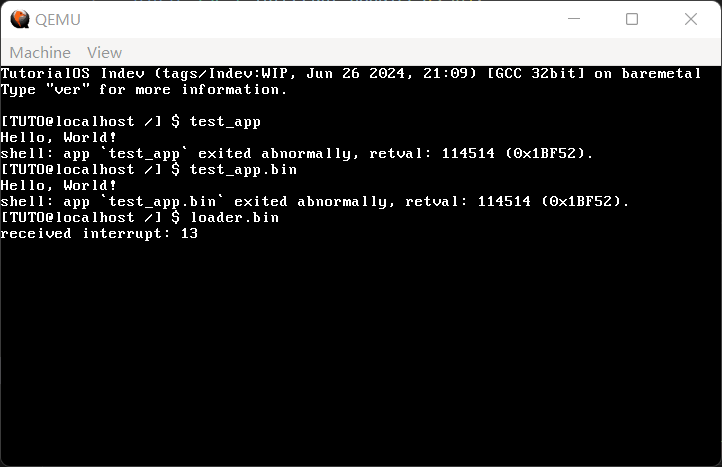
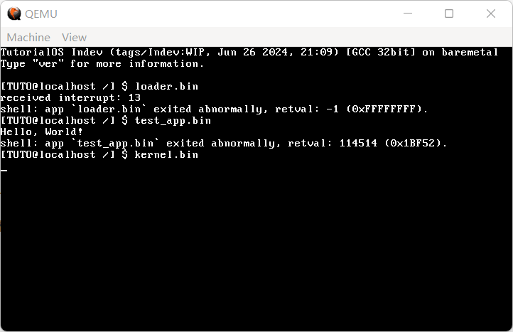
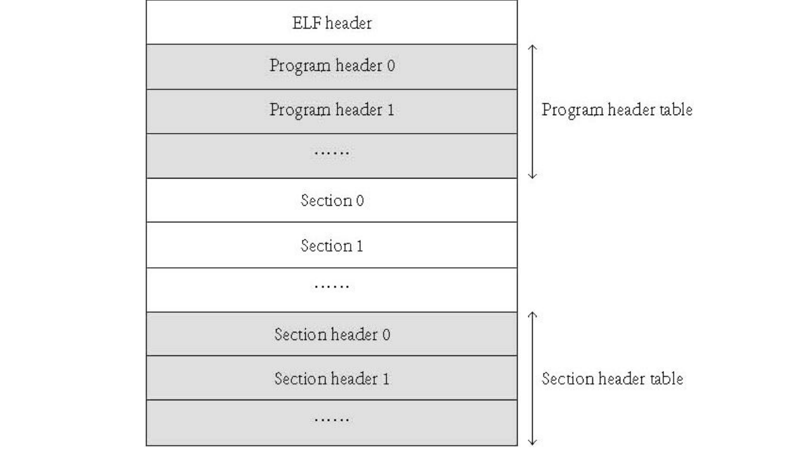

终于要结束啦（超大声）

本节先来处理上一节的历史遗留问题，上一节给我们留下了一个巨大的烂摊子：

> 系统调用中有关应用程序基址偏移的部分需要对不同的系统调用具体问题具体分析，这意味着把那个优美的系统调用表拆成一坨屎一样的 switch-case。
> 执行应用程序还没有集成到 shell。事实上这个功能看上去容易，其实也略有复杂，还有两个系统调用（`waitpid` 和 `exit`）没有实现。

单是解决这两个问题可能就要耗去一半的篇幅了，留给我们的时间不多了呀。

首先我们来把系统调用表拆掉。其实这个东西命不该绝，拆了也会让代码变得很丑，但是为了应用程序的执行，我们也只好挥泪斩马谡，对系统调用表高唱 see you again。现在的 `syscall.h` 长这样：

**代码 23-1 想你了系统调用表（include/syscall.h）**
```c
#ifndef _SYSCALL_H_
#define _SYSCALL_H_

int sys_getpid();
int sys_create_process(const char *app_name, const char *cmdline, const char *work_dir);

// file.h
int sys_open(char *filename, uint32_t flags);
int sys_write(int fd, const void *msg, int len);
int sys_read(int fd, void *buf, int count);
int sys_close(int fd);
int sys_lseek(int fd, int offset, uint8_t whence);
int sys_unlink(const char *filename);

#endif
```

或许在声明中还看不出什么，你看一眼实现就明白了：

**代码 23-2 想你了系统调用表-实现版（kernel/syscall.c）**
```c
void syscall_manager(int edi, int esi, int ebp, int esp, int ebx, int edx, int ecx, int eax)
{
    int ds_base = task_now()->ds_base;
    int ret = 0;
    switch (eax) { // 从这里开始
        case 0:
            ret = sys_getpid();
            break;
        case 1:
            ret = sys_write(ebx, (char *) ecx + ds_base, edx);
            break;
        case 2:
            ret = sys_read(ebx, (char *) ecx + ds_base, edx);
            break;
        case 3:
            ret = sys_create_process((const char *) ebx + ds_base, (const char *) ecx + ds_base, (const char *) edx + ds_base);
            break;
    } // 到这里结束
    int *save_reg = &eax + 1;
    save_reg[7] = ret;
}
```

和原来相比简直丑的不止一点半点。不过对于程序来说最重要的还是能不能跑，这点美学上的牺牲可以不管。

在接入到 shell 之前，我们还得实现点系统调用。首先是文件系统的全套，其次是 `waitpid` 和 `exit`。还好，这些东西的底层实现我们都已经有了：

**代码 23-3 系统调用大爆炸（kernel/syscall.c）**
```c
void syscall_manager(int edi, int esi, int ebp, int esp, int ebx, int edx, int ecx, int eax)
{
    int ds_base = task_now()->ds_base;
    int ret = 0;
    switch (eax) {
        case 0:
            ret = sys_getpid();
            break;
        case 1:
            ret = sys_write(ebx, (char *) ecx + ds_base, edx);
            break;
        case 2:
            ret = sys_read(ebx, (char *) ecx + ds_base, edx);
            break;
        case 3: // 从这里开始
            ret = sys_open((char *) ebx + ds_base, ecx);
            break;
        case 4:
            ret = sys_close(ebx);
            break;
        case 5:
            ret = sys_lseek(ebx, ecx, edx);
            break;
        case 6:
            ret = sys_unlink((char *) ebx + ds_base);
            break;
        case 7:
            ret = sys_create_process((const char *) ebx + ds_base, (const char *) ecx + ds_base, (const char *) edx + ds_base);
            break;
        case 8:
            ret = task_wait(ebx);
            break;
        case 9:
            task_exit(ebx);
            break; // 到这里结束
    }
    int *save_reg = &eax + 1;
    save_reg[7] = ret;
}
```

为了把文件系统相关放到一块，这里把 `create_process` 向后推了一段距离。这些系统调用对应的高级接口如下：

**代码 23-4 系统调用高层实现（kernel/syscall_impl.asm）**
```asm
[global open]
open:
    push ebx
    mov eax, 3
    mov ebx, [esp + 8]
    mov ecx, [esp + 12]
    int 80h
    pop ebx
    ret

[global close]
close:
    push ebx
    mov eax, 4
    mov ebx, [esp + 8]
    int 80h
    pop ebx
    ret

[global lseek]
lseek:
    push ebx
    mov eax, 5
    mov ebx, [esp + 8]
    mov ecx, [esp + 12]
    mov edx, [esp + 16]
    int 80h
    pop ebx
    ret

[global unlink]
unlink:
    push ebx
    mov eax, 6
    mov ebx, [esp + 8]
    int 80h
    pop ebx
    ret

[global create_process]
create_process:
    push ebx
    mov eax, 7
    mov ebx, [esp + 8]
    mov ecx, [esp + 12]
    mov edx, [esp + 16]
    int 80h
    pop ebx
    ret

[global waitpid]
waitpid:
    push ebx
    mov eax, 8
    mov ebx, [esp + 8]
    int 80h
    pop ebx
    ret

[global exit]
exit:
    push ebx
    mov eax, 9
    mov ebx, [esp + 8]
    int 80h
    pop ebx
    ret
```

原来的 `create_process` 就可以删除了。

现在，我们终于具备了把应用程序执行集成到 shell 当中的条件，是时候开搞了。

首先，在 `sys_create_process` 中，我们对应用程序是否存在不加任何判断，如果文件不存在的话，拖到 `app_entry` 再处理就晚了。因此，在创建任务之前，我们先试图打开文件以判断它是否存在：

**代码 23-5 文件存在吗？（kernel/exec.c）**
```c
int sys_create_process(const char *app_name, const char *cmdline, const char *work_dir)
{
    int fd = sys_open((char *) app_name, O_RDONLY);
    if (fd == -1) return -1;
    sys_close(fd);
    // 下略
}
```

当文件不存在时，`sys_create_process` 返回-1。

然后，我们需要在内核主程序中解放 shell，自从第16节起就被封存的 shell 终于派上用场了：

**代码 23-6 内核主程序之终（kernel/main.c）**
```c
void kernel_main() // kernel.asm会跳转到这里
{
    monitor_clear();
    init_gdtidt();
    init_memory();
    init_timer(100);
    init_keyboard();
    asm("sti");

    task_t *task_a = task_init();
    task_t *task_shell = create_kernel_task(shell);
    task_run(task_shell);

    task_exit(0);
}
```

在启动了 shell 任务以后，内核主程序旋即退出，并使用 0 的返回值报告正常。内核主程序以后大概还会再改最后一次，事了拂衣去，深藏身与名（泪目）

实现命令执行的函数位于 `cmd_execute`，因此需要在 `cmd_execute` 中启动应用程序。哪些是应用程序呢？我们认为只要不是内部命令的就都是应用程序（笑）。

**代码 23-7 应用程序执行框架（kernel/shell.c）**
```c
void cmd_execute(int argc, char **argv)
{
    if (!strcmp("ver", argv[0])) {
        cmd_ver(argc, argv);
    } else {
        int exist;
        int ret = try_to_run_external(argv[0], &exist);
        if (!exist) {
            printf("shell: `%s` is not recognized as an internal or external command or executable file.\n", argv[0]);
        } else if (ret) {
            printf("shell: app `%s` exited abnormally, retval: %d (0x%x).\n", argv[0], ret, ret);
        }
    }
}
```

由于应用程序可能返回任何返回值，所以这里必须使用两个返回值，因此使用传统的指针双返回值法，传一个指针进去表示文件是否存在。如果不存在，自然要报错，这个报错是从 Windows cmd 里抄的；否则，如果返回值不为 0，我们也报一个错，说明应用程序异常退出。

接下来的 `try_to_run_external` 自然就是实现应用程序执行的核心逻辑了：

**代码 23-8 应用程序执行（kernel/shell.c）**
```c
int try_to_run_external(char *name, int *exist)
{
    int ret = create_process(name, cmd_line, "/"); // 尝试执行应用程序
    *exist = false; // 文件不存在
    if (ret == -1) { // 哇真的不存在
        char new_name[MAX_CMD_LEN] = {0}; // 由于还没有实现malloc，所以只能这么搞，反正文件最长就是MAX_CMD_LEN这么长
        strcpy(new_name, name); // 复制文件名
        int len = strlen(name); // 文件名结束位置
        new_name[len] = '.'; // 给后
        new_name[len + 1] = 'b'; // 缀加
        new_name[len + 2] = 'i'; // 上个
        new_name[len + 3] = 'n'; // .bin
        new_name[len + 4] = '\0'; // 结束符
        ret = create_process(new_name, cmd_line, "/"); // 第二次尝试执行应用程序
        if (ret == -1) return -1; // 文件还是不存在，那只能不存在了
    }
    *exist = true; // 错怪你了，文件存在
    ret = waitpid(ret); // 等待直到这个pid的进程返回并拿到结果
    return ret; // 把返回值返回回去
}
```

整体逻辑应该挺好理解的。这里使用了一些新的系统调用，我们新建一个 `unistd.h` 存放系统调用声明：

**代码 23-9 TutorialOS 系统调用列表（include/unistd.h）**
```c
#ifndef _UNISTD_H_
#define _UNISTD_H_

int open(char *filename, uint32_t flags);
int write(int fd, const void *msg, int len);
int read(int fd, void *buf, int count);
int close(int fd);
int lseek(int fd, int offset, uint8_t whence);
int unlink(const char *filename);
int waitpid(int pid);
int exit(int ret);

int create_process(const char *app_name, const char *cmdline, const char *work_dir);

#endif
```

在 `shell.h` 中包含 `unistd.h` 即可。

最后就是应用程序这边，要使用新的 `exit` 系统调用退出：

**代码 23-10 应用程序（test_app.asm）**
```asm
    bits 32
    
    mov eax, 1
    mov ebx, 1
    mov ecx, string
    mov edx, strlen
    int 80h

    mov eax, 9
    mov ebx, 114514
    int 80h

    jmp $

string: db "Hello, World!", 0x0A, 0x00
strlen equ $ - string
```

之所以加上 `bits 32`，是因为我们测试用的返回值（114514）超过16位最大值（65536），所以标记一下使用 32 位寄存器，把数字也看成 32 位的。

编译运行，并把 `test_app.bin` 写入硬盘，效果如下：



（图 23-1 在shell中执行应用程序）

可以看到，`loader.bin` 的执行虽然被拦下，但是程序却在异常处理程序中卡死了，没有把控制权交回到 shell。如今已经有了多任务，我们只需在 `isr.c` 中结束当前任务即可：

**代码 23-11 发生异常时强制结束应用程序（kernel/isr.c）**
```c
#include "mtask.h"

// 中略
 
void isr_handler(registers_t regs)
{
    asm("cli");
    monitor_write("received interrupt: ");
    monitor_write_dec(regs.int_no);
    monitor_put('\n');
    task_exit(-1); // 强制退出
}
```

由于在任务结束后会强制切换回 shell，从而重新开启中断，所以最上面的 `asm("cli")` 不用处理。

现在再试图运行 `loader.bin`，应该就会把控制权交还给内核了：



（图 23-2 执行中出现异常时强制结束应用程序）

至此，我们终于解决完了上一节留下的烂摊子。`kernel.bin` 没被拦下是因为它是有格式的，还没来得及执行到指令就已经不知道在执行什么东西了，从而导致了它的卡死。正好我们本节的任务——C语言应用程序还没开始，就顺其自然，解析 `kernel.bin` 的文件格式——ELF。重回第 6 节既视感（

重提一下 ELF 文件的结构：



（图 23-3 `ELF` 文件结构）

**代码 23-12 `Program Header`（include/elf.h）**
```c
typedef struct {
    Elf32_Word p_type;   // 当前header描述的段类型
    Elf32_Off  p_offset; // 段的第一个字节在文件中的偏移
    Elf32_Addr p_vaddr;  // 段在内存中的虚拟地址
    Elf32_Addr p_paddr;  // 段在内存中的物理地址，为兼容不进入保护模式的OS
    Elf32_Word p_filesz; // 段在文件中的长度
    Elf32_Word p_memsz;  // 段在内存中的长度
    Elf32_Word p_flags;  // 与段相关的标志
    Elf32_Word p_align;  // 确定段在文件和内存中如何对齐
} Elf32_Phdr;
```

**代码 23-13 ELF 头（include/elf.h）**
```c
#define EI_NIDENT 16

typedef struct {
    unsigned char e_ident[EI_NIDENT]; // ELF特征标

    Elf32_Half e_type;      // 文件类型
    Elf32_Half e_machine;   // 运行至少需要的体系结构
    Elf32_Word e_version;   // 文件版本
    Elf32_Addr e_entry;     // 程序的入口点
    Elf32_Off  e_phoff;     // Program Header 表的偏移
    Elf32_Off  e_shoff;     // Section Header 表的偏移
    Elf32_Word e_flags;     // 对于32位系统为0
    Elf32_Half e_ehsize;    // ELF Header 的大小，单位字节
    Elf32_Half e_phentsize; // Program Header 的大小
    Elf32_Half e_phnum;     // Program Header 的数量
    Elf32_Half e_shentsize; // Section Header 的大小
    Elf32_Half e_shnum;     // Section Header 的数量
    Elf32_Half e_shstrndx;  // 包含 Section 名称的字符串表位于哪一项
} Elf32_Ehdr;
```

其中数据类型 Elf32_Word、Elf32_Off 和 Elf32_Addr 均为大小为 4、对齐也为 4 的无符号类型，而 Word 为大整数，Off 为偏移，Addr 为地址。Half 则顾名思义，是前面这些类型的一半，也就是 2 个字节这么大。因此，在文件开头添加这样的类型定义：

**代码 23-14 类型定义（include/elf.h）**
```c
#ifndef _ELF_H_
#define _ELF_H_

#include "common.h"

#define PT_LOAD 1

#define EI_NIDENT 16

typedef uint32_t Elf32_Word, Elf32_Off, Elf32_Addr;
typedef uint16_t Elf32_Half;

// ...

#endif
```

与程序执行直接相关的只有 `Program Header`，利用它们头中给定的地址把分割成几个部分的程序依次排列在内存中，ELF 解析工作就完成了，接下来从 ELF 头给定的入口点开始执行即可。

（严格来讲其实要做的远比这个要多，什么动态链接、调试符号之类的都要解析 Section Header，但是我们只做最基本的执行的话就不强求了）

那么，我们就来快速地解析一下 ELF 文件。首先新建一个 `kernel/elf.c`：

**代码 23-15 准备开始解析 ELF（kernel/elf.c）**
```c
#include "elf.h"

#define min(a, b) ((a) < (b) ? (a) : (b))
#define max(a, b) ((a) < (b) ? (b) : (a))
```

这里定义了两个一看就懂的宏 `max` 和 `min`，个人认为不用解释。

接下来我们就开始准备加载 ELF 了。出于简单的需要，我们把可执行程序的入口点定在 0x00 处；由于这个要求完全做不到，链接器就会自己把整个代码段的开始位置定在这里，然后把入口点略微往后推一点点。既然这样，鉴于这个程序如果直接加载到内存，将位于 1MB 以内，而这一块内存我们根本就不想管，所以我们要另行分配一个缓冲区作为 ELF 解析后的存放地。

那么，知道这个 ELF 在被解析后一共多大就尤为重要了。事实上，这个过程可以在被解析之前进行，只需要遍历每一个 Program Header，同时更新加载首地址最小值与末地址最大值，最后减一下就可以了：

**代码 23-16 获取 ELF 被加载后的范围（kernel/elf.c）**
```c
static void calc_load_range(Elf32_Ehdr *ehdr, uint32_t *first, uint32_t *last)
{
    Elf32_Phdr *phdr = (Elf32_Phdr *) ((uint32_t) ehdr + ehdr->e_phoff); // 第一个 program header 地址
    *first = 0xffffffff; // UINT32最大值
    *last = 0; // UINT32最小值

    for (uint16_t i = 0; i < ehdr->e_phnum; i++) { // 遍历每一个 program header
        if (phdr[i].p_type != PT_LOAD) continue; // 只关心LOAD段
        *first = min(*first, phdr[i].p_vaddr);
        *last = max(*last, phdr[i].p_vaddr + phdr[i].p_memsz); // 每一个program header首尾取最值
    }
}
```

在 ELF 头中放着的 `e_phoff` 代表第一个 Program Header 的相对 ELF 头的偏移，加上 ELF 头的地址，就得到了第一个 Program Header 的地址。由前面的结构图可以知道，所有的 Program Header 是连续的，因此可以被视为一个数组，其长度则由 ELF 头的 `e_phnum` 定义。在这么多 Program Header 中，只有类型为 `PT_LOAD`（其值为 1，在 include/elf.h 中定义）才可以加载，因此我们也就只管这些。这里还是使用经典的指针法进行多值返回。

在获取范围以后就可以分配缓冲区了。假设现在已经分配好了缓冲区，我们要把每个 Program Header 所对应的程序复制到正确的位置去，这就需要知道它们的大小和 ~~方向~~ 位置。位置比较容易，Program Header 的 `p_offset` 存的就是相对 ELF 头的位置；大小却有 `p_memsz` 和 `p_filesz` 两个值，采信哪个呢？由于我们是要从文件里加载，所以采用 `p_filesz` 的值，至于可能多出来的部分，那就只能填 0 了。

**代码 23-17 复制 ELF 的各个 Program Header（kernel/elf.c）**
```c
static void copy_load_segments(Elf32_Ehdr *ehdr, char *buf)
{
    Elf32_Phdr *phdr = (Elf32_Phdr *) ((uint32_t) ehdr + ehdr->e_phoff); // 第一个 program header 地址
    for (uint16_t i = 0; i < ehdr->e_phnum; i++) { // 遍历每一个 program header
        if (phdr[i].p_type != PT_LOAD) continue; // 只关心LOAD段

        uint32_t segm_in_file = (uint32_t) ehdr + phdr[i].p_offset; // 段在文件中的位置
        memcpy(buf + phdr[i].p_vaddr, (void *) segm_in_file, phdr[i].p_filesz); // 将文件中大小的部分copy过去
        uint32_t remain_bytes = phdr[i].p_memsz - phdr[i].p_filesz; // 两者之差
        memset(buf + (phdr[i].p_vaddr + phdr[i].p_filesz), 0, remain_bytes); // 赋值为0
    }
}
```

最后便是融合到一起去的整体包装，它会首先检测 ELF 格式是否正确，如果错误会返回 -1，否则返回 ELF 的入口点，也就是开始执行的位置：

**代码 23-18 加载 ELF（kernel/elf.c）**
```c
int load_elf(Elf32_Ehdr *ehdr, char **buf, uint32_t *first, uint32_t *last)
{
    if (memcmp(ehdr->e_ident, "\177ELF\1\1\1", 7)) return -1; // 魔数不对，不予执行
    calc_load_range(ehdr, first, last); // 计算加载位移
    *buf = (char *) kmalloc(*last - *first + 5); // 用算得的大小分配内存
    copy_load_segments(ehdr, *buf); // 把 ELF 
    return ehdr->e_entry;
}
```

ELF 头的作用不必多说，这里之所以用两重指针，是因为我们要修改单重指针 `buf` 的值。在实际使用时只要传一个指针进来就行了，不管这个指针长什么样子。

这样一来，在 buf 中存着的就是二进制一样的机器码了，理论上可以直接启动。事实上也的确如此，在 exec.c 中只需修改几行代码，就可以让一个 ELF 跑起来了：

**代码 23-19 启动 ELF（kernel/exec.c）**
```c
void app_entry(const char *app_name, const char *cmdline, const char *work_dir)
{
    // ...上略...
    char *code; // 存放代码的缓冲区
    int entry = load_elf((Elf32_Ehdr *) buf, &code, &first, &last); // buf是文件读进来的那个缓冲区，code是存实际代码的
    if (entry == -1) task_exit(-1); // 解析失败，直接exit(-1)
    // 注意：以下代码非常不安全，仅供参考；不过目前我也没有找到更优的解
    // 坑比 intel 在访问 [esp + xxx] 的地址时用的是 ds，ss 完全成了摆设，所以栈和数据必须放在一个段里，于是就炸了
    char *ds = (char *) kmalloc(last - first + 4 * 1024 * 1024 + 5); // 新分配一个数据段，为原来大小+4MB+5
    memcpy(ds, code, last - first); // 把代码复制过来，也就包含了必须要用的数据
    task_now()->ds_base = (int) ds; // 数据段基址，与下面一致
    ldt_set_gate(0, (int) code, last - first - 1, 0x409a | 0x60);
    ldt_set_gate(1, (int) ds, last - first + 4 * 1024 * 1024 - 1, 0x4092 | 0x60); // 大小也多了4MB
    start_app(entry, 0 * 8 + 4, last - first + 4 * 1024 * 1024 - 4, 1 * 8 + 4, &(task_now()->tss.esp0)); // 把栈顶设为4MB-4
    while (1);
}
```

坑比 intel 在访问 [esp + xxx] 的地址时用的是 ds，ss 完全成了摆设，所以栈和数据必须放在一个段里，于是就炸了（重复一遍）。

现在已经可以执行 ELF 了，我们就写一个 C 应用作为测试吧。新建 apps 文件夹，我们就写一个最简单的 Hello World：

**代码 23-20 Hello, ELF World!（apps/test_c.c）**
```c
#include <stdio.h>

int main()
{
    printf("Hello, World!");
    return 0;
}
```

不知道看见这样的程序勾起了你什么回忆呢，总之我是有种回到了刚学 C 语言时的感觉……不煽情了，现在仔细回顾一下这个程序，有什么问题吗？

