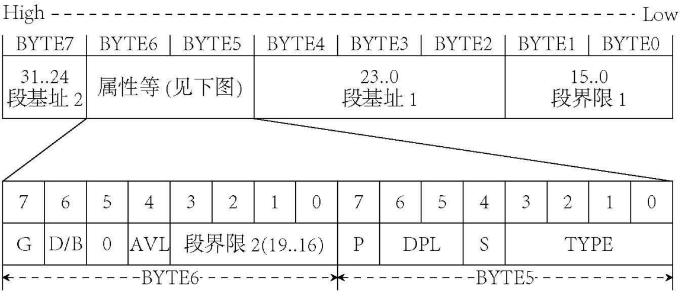

欢迎回来。我们本节的任务十分明确：支持 `malloc`，同时为应用程序传参。

不过，在一开始我们先来点“轻松”的。或许在第 16 节和第 22 节的时候，有的读者会有这样的疑问：

> 你 shell 明明集成在内核当中，为什么还要费事去系统调用呢？

所以我们今天的第一个 surprise，就是把 shell 从内核当中给剥离出去，做成一个单独的 app。没有什么原因，只是因为这样泰裤辣！（逃

上一节已经初步支持了 C 语言应用程序，而我们的 shell 一不用传参，二来在一番微操之下规避了 `malloc`，因此可以直接放在这个框架里。

首先来把现在的 `shell` 改造成一个应用程序一样的东西：

**代码 24-1 现在的 `shell`（apps/shell.c）**
```c
#include <stdio.h>
#include <stddef.h>
#include <stdint.h>
#include <stdbool.h>
#include <unistd.h>

#define MAX_CMD_LEN 100
#define MAX_ARG_NR 30
 
static char cmd_line[MAX_CMD_LEN] = {0}; // 输入命令行的内容
static char *argv[MAX_ARG_NR] = {NULL}; // argv，字面意思
 
static void print_prompt() // 输出提示符
{
    printf("[TUTO@localhost /] $ "); // 这一部分大家随便改，你甚至可以改成>>>
}
 
static void readline(char *buf, int cnt) // 输入一行或cnt个字符
{
    char *pos = buf; // 不想变buf
    while (read(0, pos, 1) != -1 && (pos - buf) < cnt) { // 读字符成功且没到cnt个
        switch (*pos) {
            case '\n':
            case '\r': // 回车或换行，结束
                *pos = 0;
                putchar('\n'); // read不自动回显，需要手动补一个\n
                return; // 返回
            case '\b': // 退格
                if (buf[0] != '\b') { // 如果不在第一个
                    --pos; // 指向上一个位置
                    putchar('\b'); // 手动输出一个退格
                }
                break;
            default:
                putchar(*pos); // 都不是，那就直接输出刚输入进来的东西
                pos++; // 指向下一个位置
        }
    }
}

static int cmd_parse(char *cmd_str, char **argv, char token)
{
    int arg_idx = 0;
    while (arg_idx < MAX_ARG_NR) {
        argv[arg_idx] = NULL;
        arg_idx++;
    } // 开局先把上一个argv抹掉
    char *next = cmd_str; // 下一个字符
    int argc = 0; // 这就是要返回的argc了
    while (*next) { // 循环到结束为止
        if (*next != '"') {
            while (*next == token) *next++; // 多个token就只保留第一个，windows cmd就是这么处理的
            if (*next == 0) break; // 如果跳过完token之后结束了，那就直接退出
            argv[argc] = next; // 将首指针赋值过去，从这里开始就是当前参数
            while (*next && *next != token) next++; // 跳到下一个token
        } else {
            next++; // 跳过引号
            argv[argc] = next; // 这里开始就是当前参数
            while (*next && *next != '"') next++; // 跳到引号
        }
        if (*next) { // 如果这里有token字符
            *next++ = 0; // 将当前token字符设为0（结束符），next后移一个
        }
        if (argc > MAX_ARG_NR) return -1; // 参数太多，超过上限了
        argc++; // argc增一，如果最后一个字符是空格时不提前退出，argc会错误地被多加1
    }
    return argc;
}

void cmd_ver(int argc, char **argv)
{
    puts("TutorialOS Indev");
}

int try_to_run_external(char *name, int *exist)
{
    int ret = create_process(name, cmd_line, "/");
    *exist = false;
    if (ret == -1) {
        char new_name[MAX_CMD_LEN] = {0};
        strcpy(new_name, name);
        int len = strlen(name);
        new_name[len] = '.';
        new_name[len + 1] = 'b';
        new_name[len + 2] = 'i';
        new_name[len + 3] = 'n';
        new_name[len + 4] = '\0';
        ret = create_process(new_name, cmd_line, "/");
        if (ret == -1) return -1;
    }
    *exist = true;
    ret = waitpid(ret);
    return ret;
}

void cmd_execute(int argc, char **argv)
{
    if (!strcmp("ver", argv[0])) {
        cmd_ver(argc, argv);
    } else {
        int exist;
        int ret = try_to_run_external(argv[0], &exist);
        if (!exist) {
            printf("shell: `%s` is not recognized as an internal or external command or executable file.\n", argv[0]);
        } else if (ret) {
            printf("shell: app `%s` exited abnormally, retval: %d (0x%x).\n", argv[0], ret, ret);
        }
    }
}
 
void shell()
{
    puts("TutorialOS Indev (tags/Indev:WIP, Jun 26 2024, 21:09) [GCC 32bit] on baremetal"); // 看着眼熟？这一部分是从 Python 3 里模仿的
    puts("Type \"ver\" for more information.\n"); // 示例，只打算支持这一个
    while (1) { // 无限循环
        print_prompt(); // 输出提示符
        memset(cmd_line, 0, MAX_CMD_LEN);
        readline(cmd_line, MAX_CMD_LEN); // 输入一行命令
        if (cmd_line[0] == 0) continue; // 啥也没有，是换行，直接跳过
        int argc = cmd_parse(cmd_line, argv, ' '); // 解析命令，按照cmd_parse的要求传入，默认分隔符为空格
        cmd_execute(argc, argv); // 执行
    }
    puts("shell: PANIC: WHILE (TRUE) LOOP ENDS! RUNNNNNNN!!!"); // 到不了，不解释
}

int main()
{
    shell();
    return 0;
}
```

从上面的文件名就可以知道，我们已经把 `shell` 挪到了 `apps` 目录下；同时，在最后也加了一个 `int main()`，虽然说可以直接在 `shell()` 上改，但留点遗存也不是不行（？）

下面引入了一堆头文件，其中的 `unistd.h` 是上一节所造，`stdio.h` 早已有之，剩下的 `stdint.h`、 `stdbool.h` 以及 `stddef.h` 是从 `common.h` 里分离出来的产物：

**代码 24-2 三个头文件（include/stdint.h、include/stdbool.h、include/stddef.h）**
```c
#ifndef _STDINT_H_
#define _STDINT_H_

typedef unsigned int   uint32_t;
typedef          int   int32_t;
typedef unsigned short uint16_t;
typedef          short int16_t;
typedef unsigned char  uint8_t;
typedef          char  int8_t;

#endif
```
```c
#ifndef _STDBOOL_H_
#define _STDBOOL_H_

typedef _Bool bool;
#define true 1
#define false 0

#endif
```
```c
#ifndef _STDDEF_H_
#define _STDDEF_H_

#define NULL ((void *) 0)

#endif
```

如你所见，这三个头文件基本上全都很短小，什么安全保护措施也没加，毕竟纯玩玩也用不到，到时候从什么地方copy一个就行了（bushi）。

另外，在 `stdio.h` 中把 `#include "common.h"` 替换成了 `#include "string.h"` 和 `#include "stdint.h"` 两行，在 `unistd.h` 和 `string.h` 的函数声明开始前增加了一行 `#include "stdint.h"`。这样做是为了确保这些标准库文件与操作系统文件无关 ~~其实就是闲的~~。

接下来在 `kernel_main` 启动 `shell` 的部分也要修改：

**代码 24-3 启动 shell（kernel/main.c）**
```c
void kernel_main() // kernel.asm会跳转到这里
{
    monitor_clear();
    init_gdtidt();
    init_memory();
    init_timer(100);
    init_keyboard();
    asm("sti");
    task_init();

    sys_create_process("shell.bin", "", "/");

    task_exit(0);
}
```

`task_a` 变量从头到尾没有被用到，因此就删了。下面的 `sys_create_process` 实质上开启了一个新任务执行 `shell.bin`。最后，调用 `task_exit(0)` 退出当前任务，于是操作系统就进入后台，而主要是 ring3 用户层的 `shell` 在起交互作用了。

在 `Makefile` 的 `APPS` 中加入 `out/shell.bin`，`OBJS` 中删除 `out/shell.o`，生成 `hd.img` 时加一行 `	ftcopy hd.img -srcpath out/shell.bin -to -dstpath /shell.bin`，完成最后的交接。`shell` 的地位甚至因此还提升了（？）

最后当然是编译运行啦：


（图 24-1 效果）

执行内部命令还是应用程序都没问题，不过按理来说也算理所应当吧，到最后也没做多少修改（笑）。

热身完成，筋骨也活动得差不多了，也该回顾一下上一节的两大目标：实现 `malloc` 以及给应用程序传参。

说到底，这其实是同一个问题：如果应用程序能直接访问操作系统的内存不就好了？这样可以直接使用 `kmalloc`、`kfree`，传参随便写个系统调用也就可以做到了。可是应用程序只能访问应用程序段自己的地址，这是出于安全的考虑：如果应用程序能访问操作系统的内存，那不就能随便破坏了吗。

所以，现在的问题就变成了：要由操作系统提供一段位于应用程序数据段内的内存，接下来就可以让应用程序自治，通过系统调用等等手段从这里获取内存。

对 C 语言有些了解的读者应该知道，`malloc` 实际上是从一个叫“堆”的地方获取内存的；它并不是直接的系统调用，真正用于向操作系统申请内存的系统调用是 `brk`、 `sbrk` 和 `mmap`。`mmap` 的本意是将文件内容映射到内存当中，与普通的读取不同的是，对映射后内存的修改会立刻同步到文件；而通过使用一些特殊文件，就可以实现凭空申请内存的效果。

然而，实现一个 `mmap` 对我们来说太过困难，准备一个特殊文件也不在现有的框架之内，因此就算了。接下来的 `brk` 和 `sbrk`，一看名字就知道是一对函数，查阅 linux manual 知道它们操控着一个叫做 `program break` 的玩意。手册上说它是什么数据段的终止，这是什么不知道；不过使用这两个函数可以修改这个位置，从而给数据段里凭空多出内存来，这就是为我们所用的内存了。

`brk` 是直接设置 `program break`，我还得自己维护上一个位置才能申请，相比之下，还是直接使用 `sbrk` 更加直接，它的参数是增量，返回的是旧的 `program break` 的位置，原型如下：

```c
void *sbrk(int incr);
```

和 `malloc` 一对比，是不是看着很接近？更棒的是，`incr` 还可以是负数，相当于在释放用完的内存；也就是说，用 `sbrk` 一个函数就可以实现内存的分配和释放，接下来就只是管理的事了。

那么我们最终的问题，就变成了两个：

1) 如何实现 `sbrk`；

2) 如何通过 `sbrk` 实现 `malloc`。

先从第一个开始吧。既然所谓的 `program break` 表示数据段的终止，我们先来实现一个可以用来扩张数据段的函数。不过说是扩张，到头来其实也还是删掉旧的创建新的。

内核的数据段已经占满了 4GB，给内核实现扩张毫无意义。因此，我们给任务添加一个 `is_user` 标签，表示是不是应用程序：

**代码 24-4 添加新标签（include/mtask.h、kernel/mtask.c、kernel/exec.c）**
```c
typedef struct TASK {
    uint32_t sel;
    int32_t flags;
    exit_retval_t my_retval;
    int fd_table[MAX_FILE_OPEN_PER_TASK];
    gdt_entry_t ldt[2];
    int ds_base;
    bool is_user; // here
    tss32_t tss;
} task_t;
```
```c
            for (int i = 3; i < MAX_FILE_OPEN_PER_TASK; i++) {
                task->fd_table[i] = -1;
            }
            task->is_user = false; // here
            return task;
```
```c
void app_entry(const char *app_name, const char *cmdline, const char *work_dir)
{
    int fd = sys_open((char *) app_name, O_RDONLY);
    int size = sys_lseek(fd, -1, SEEK_END) + 1;
    sys_lseek(fd, 0, SEEK_SET);
    char *buf = (char *) kmalloc(size + 5);
    sys_read(fd, buf, size);
    int first, last;
    char *code;
    int entry = load_elf((Elf32_Ehdr *) buf, &code, &first, &last);
    if (entry == -1) task_exit(-1);
    char *ds = (char *) kmalloc(last - first + 4 * 1024 * 1024 + 5);
    memcpy(ds, code, last - first);
    task_now()->is_user = true; // here
    task_now()->ds_base = (int) ds;
    ldt_set_gate(0, (int) code, last - first - 1, 0x409a | 0x60);
    ldt_set_gate(1, (int) ds, last - first + 4 * 1024 * 1024 + 1 * 1024 * 1024 - 1, 0x4092 | 0x60);
    start_app(entry, 0 * 8 + 4, last - first + 4 * 1024 * 1024 - 4, 1 * 8 + 4, &(task_now()->tss.esp0));
    while (1);
}
```

接下来就可以实现给用户扩张数据段的函数了：

**代码 24-5 扩张数据段（kernel/exec.c）**
```c
static void expand_user_segment(int increment)
{
    task_t *task = task_now();
    if (!task->is_user) return; // 内核都打满4GB了还需要扩容？
    gdt_entry_t *segment = &task->ldt[1];
    // 接下来把base和limit的石块拼出来
    uint32_t base = segment->base_low | (segment->base_mid << 16) | (segment->base_high << 24); // 其实可以不用拼直接用ds_base 但还是拼一下吧当练习
    uint32_t size = segment->limit_low | ((segment->limit_high & 0x0F) << 16);
    if (segment->limit_high & 0x80) size *= 0x1000;
    size++;
    // 分配新的内存
    void *new_base = (void *) kmalloc(size + increment + 5);
    if (increment > 0) return; // expand是扩容你缩水是几个意思
    memcpy(new_base, (void *) base, size); // 原来的内容全复制进去
    // 用户进程的base必然由malloc分配，故用free释放之
    kfree((void *) base);
    // 那么接下来就是把new_base设置成新的段了
    ldt_set_gate(1, (int) new_base, size + increment - 1, 0x4092 | 0x60); // 反正只有数据段允许扩容我也就设置成数据段算了
    task->ds_base = (int) new_base; // 既然ds_base变了task里的应该同步更新
}
```

开头三行显然不需要解释。接下来把应用程序数据段的基址（这样我才知道从哪拿到旧数据）和大小（这样我才知道新的需要多大）拼出来。死去的 GDT 又开始攻击我们了，偷一个小图过来：



（图 24-2 `GDT` 描述符结构）

以及它的代码表示：

```c
struct gdt_entry_struct {
    uint16_t limit_low; // BYTE 0~1
    uint16_t base_low; // BYTE 2~3
    uint8_t base_mid; // BYTE 4
    uint8_t access_right; // BYTE 5, P|DPL|S|TYPE (1|2|1|4)
    uint8_t limit_high; // BYTE 6, G|D/B|0|AVL|limit_high (1|1|1|1|4)
    uint8_t base_high; // BYTE 7
} __attribute__((packed));

typedef struct gdt_entry_struct gdt_entry_t;
```

按照这个结构再去看上面的代码，拼 `base` 是显而易见的，拼 `limit` 则涉及到一个 G 位的问题：G 位位于 `limit_high` 的最高位，当它为 1 时，代表整个 `limit` 代表的是一个以 4KB 为单位的段（说白了就是要给 `limit` 乘上 4096）。拼完以后由于 `limit` 加 1 才是 `size`，所以再把 `1` 给加上。

接下来重新分配一段新的数据段，把旧的东西全都复制过去，唯一的变化就是大小变大了。旧的数据段留着也没有用，既然前面初始化是用 `kmalloc` 初始化的 `ds`，新的段也使用 `kmalloc` 分配，所以可以安全地使用 `kfree` 把内存释放掉。最后调用 `ldt_set_gate` 把数据段换成新的，同时更新 `task` 里的 `ds_base`，这样如假包换，应用程序毫无感知。

接下来就是实现 `sbrk` 了。上面的 `program break` 说是数据段结尾，但如果老是更新数据段的话，内存也吃不消，速度也会慢上一点（不过不仔细看的话，大概是看不出来的）。所以我们先临时开 1MB 缓冲区，这 1MB 用完了再扩展至少 32KB，这样也许会把占用搞小一点（心虚）。

因此，存 `program break` 不仅要存它现在的位置，还要存给它的缓冲区在哪里结束，这样才可以扩展数据段。

**代码 24-6 实现 `sbrk`（1）——创建 `program break`（include/mtask.h）**
```c
typedef struct TASK {
    uint32_t sel;
    int32_t flags;
    exit_retval_t my_retval;
    int fd_table[MAX_FILE_OPEN_PER_TASK];
    gdt_entry_t ldt[2];
    int ds_base;
    bool is_user;
    void *brk_start, *brk_end; // here
    tss32_t tss;
} task_t;
```

接下来在 `app_entry` 中初始化它：

**代码 24-7 实现 `sbrk`（2）——初始化 `program break`（kernel/exec.c）**
```c
void app_entry(const char *app_name, const char *cmdline, const char *work_dir)
{
    int fd = sys_open((char *) app_name, O_RDONLY);
    int size = sys_lseek(fd, -1, SEEK_END) + 1;
    sys_lseek(fd, 0, SEEK_SET);
    char *buf = (char *) kmalloc(size + 5);
    sys_read(fd, buf, size);
    int first, last;
    char *code;
    int entry = load_elf((Elf32_Ehdr *) buf, &code, &first, &last);
    if (entry == -1) task_exit(-1);
    char *ds = (char *) kmalloc(last - first + 4 * 1024 * 1024 + 1 * 1024 * 1024 - 5);
    memcpy(ds, code, last - first);
    task_now()->is_user = true;
    // 这一块就是给用户用的
    task_now()->brk_start = (void *) last - first + 4 * 1024 * 1024;
    task_now()->brk_end = (void *) last - first + 5 * 1024 * 1024 - 1;
    task_now()->ds_base = (int) ds; // 设置ds基址
    ldt_set_gate(0, (int) code, last - first - 1, 0x409a | 0x60);
    ldt_set_gate(1, (int) ds, last - first + 4 * 1024 * 1024 + 1 * 1024 * 1024 - 1, 0x4092 | 0x60);
    start_app(entry, 0 * 8 + 4, last - first + 4 * 1024 * 1024 - 4, 1 * 8 + 4, &(task_now()->tss.esp0));
    while (1);
}
```

最后就是 `sbrk` 的本体了，为了偷懒也放在了 `kernel/exec.c` 下面（虽然放这里好像不大好？）：

**代码 24-8 实现 `sbrk`（3）——操控 `program break`（kernel/exec.c）**
```c
void *sys_sbrk(int incr)
{
    task_t *task = task_now();
    if (task->is_user) { // 是应用程序
        if (task->brk_start + incr > task->brk_end) { // 如果超出已有缓冲区
            expand_user_segment(incr + 32 * 1024); // 再多扩展32KB
            task->brk_end += incr + 32 * 1024; // 由于扩展了32KB，同步将brk_end移到现在的数据段结尾
        }
        void *ret = task->brk_start; // 旧的program break
        task->brk_start += incr; // 直接添加就完事了
        return ret; // 返回之
    }
    return NULL; // 非用户不允许使用sbrk
}
```

到现在为止，就实现了最基本的向内核申请内存的函数。接下来把它搞成一个系统调用，`sbrk` 就可以使用了：

**代码 24-9 实现 `sbrk`（4）——添加系统调用（include/syscall.h、kernel/syscall.c、kernel/syscall_impl.asm）**
```c
#ifndef _SYSCALL_H_
#define _SYSCALL_H_
// 上略...
// exec.c
void *sys_sbrk(int incr);

#endif
```
```c
    switch (eax) {
        // 上略...
        case 10:
            ret = (int) sys_sbrk(ebx);
            break;
    }
    // 下略...
```
```asm
[global sbrk]
sbrk:
    push ebx
    mov eax, 10
    mov ebx, [esp + 8]
    int 80h
    pop ebx
    ret
```

加了十个系统调用了，相信大家也应该大致熟悉了添加系统调用的流程了吧：首先实现系统调用本身，然后在 `syscall.c` 的 `switch-case` 里新加一个分支，最后用汇编仿照格式写一个实现，没有参数（getpid）、一个参数（一堆不列举）、两个参数（open）、三个参数（一堆不列举）的系统调用目前都有了。

下面执行第二步，用 `sbrk` 实现 `malloc`。这个网上教程有一大堆，你干脆直接移植 `ptmalloc` 都行，这里我选择了一种最简单但同时大概也是最不稳定 ??跑在 CoolPotOS 上成功造成了 114514 次异常?? 的一种。 

新建 `lib/malloc.c`，这就是我们 `malloc` 的实现。

我们的堆实质上是一块一块的内存碎片，这些碎片采用链表的方式来组织，以下是每一个链表的节点：

**代码 24-10 串联可用内存的链表节点（lib/malloc.c）**
```c
#include <unistd.h>
#include <stddef.h>

typedef char ALIGN[16];

typedef union header {
    struct {
        uint32_t size;
        uint32_t is_free;
        union header *next;
    } s;
    ALIGN stub;
} header_t;

static header_t *head, *tail;
```

`ALIGN` 纯粹是用来对齐的类型，据传给搞成 16 字节对齐的地址能够使 CPU 更高效。里面的 `s` 成员才是会真正用到的部分，三个成员干什么的一看就明白：`size` 是碎片大小，`is_free` 是可用与否，`next` 是下一个节点。

接下来我们来找一个能够盛下待分配内存的节点。这个过程很简单，顺着链表找下去就完了。

**代码 24-11 寻找能盛下待分配内存的节点（lib/malloc.c）**
```c
// 寻找一个符合条件的指定大小的空闲内存块
static header_t *get_free_block(uint32_t size)
{
    header_t *curr = head; // 从头开始
    while (curr) {
        if (curr->s.is_free && curr->s.size >= size) return curr; // 空闲，并且大小也满足条件，直接返回
        curr = curr->s.next; // 下一位
    }
    return NULL; // 找不到
}
```

然后就可以开始实现 `malloc` 了。先把代码放在这里，后面再慢慢解说。

**代码 24-12 实现 `malloc`（lib/malloc.c）**
```c
void *malloc(uint32_t size)
{
    uint32_t total_size;
    void *block;
    header_t *header;
    if (!size) return NULL; // size == 0，自然不用返回
    header = get_free_block(size);
    if (header) { // 找到了对应的header！
        header->s.is_free = 0;
        return (void *) (header + 1);
        // header + 1，相当于把header的值在指针上后移了一个header_t，从而在返回的内存中不存在覆写header的现象
    }
    // 否则，申请内存
    total_size = sizeof(header_t) + size; // 需要一处放header的空间
    block = sbrk(total_size); // sbrk，申请total_size大小内存
    if (block == (void *) -1) return NULL; // 没有足够的内存，返回NULL
    // 申请成功！
    header = block; // 初始化header
    header->s.size = size;
    header->s.is_free = 0;
    header->s.next = NULL;
    if (!head) head = header; // 第一个还是空的，直接设为header
    if (tail) tail->s.next = header; // 有最后一个，把最后一个的next指向header
    tail = header; // header荣登最后一个
    return (void *) (header + 1); // 同上
}
```

前三行声明变量不用管，紧接着当 `size` 为 0 时自然无需分配，返回 NULL 即可。接下来寻找可用的节点，如果找到了，则直接暴力占用这个节点，同时返回 `header + 1` 这个位置。这个位置是干什么的，想必不用啰嗦。

接下来讨论没找到的情况，这时再去找操作系统使用 `sbrk` 申请内存。由于使用了 `header + 1`，内存块的开头应该是一个 `header_t`，要给加上这一片内存。

接下来 `if (block == (void *) -1)` 是在干什么呢？按照标准规定，当 `sbrk` 失败时应当返回 -1，但我们的 `sbrk` 不会失败，就导致这一行没有用了。

然后就是把这个内存块初始化，连到链表里并返回。由于只能直接知道链表末尾的位置，把它串联到末尾。最后返回 `header + 1` 跳过刚刚构造的 `header_t` 结构。

`malloc` 完了，紧接着实现 `free`，基本上差不多简单：

**代码 24-13 实现 `free`（lib/malloc.c）**
```c
void free(void *block)
{
    header_t *header, *tmp;
    if (!block) return; // free(NULL)，有什么用捏
    header = (header_t *) block - 1; // 减去一个header_t的大小，刚好指向header_t

    if ((char *) block + header->s.size == sbrk(0)) { // 正好在堆末尾
        if (head == tail) head = tail = NULL; // 只有一个内存块，全部清空
        else {
            // 遍历整个内存块链表，找到对应的内存块，并把它从链表中删除
            tmp = head;
            while (tmp) {
                // 如果内存在堆末尾，那这个块肯定也在链表末尾
                if (tmp->s.next == tail) { // 下一个就是原本末尾
                    tmp->s.next = NULL; // 踢掉
                    tail = tmp; // 末尾位置顶替
                }
                tmp = tmp->s.next; // 下一个
            }
        }
        // 释放这一块内存
        sbrk(0 - sizeof(header_t) - header->s.size);
        return;
    }
    // 否则，设置为free
    header->s.is_free = 1;
}
```

首先判断 `block` 是不是 NULL，然后把 `block` 减去一个 `header` 的大小，拿到对应的 `header`。如果这个块正好在堆末尾，那就涉及到把这段内存归还给操作系统的事情；否则，直接把属性设置成 `free` 就可以为前面的 `get_free_block` 所用。

中间的大 `if` 就是在向操作系统归还内存，首先判断能不能归还，只要当前的这个内存正好抵着现在的 `program break`，那就可以把这段内存归还。首先判断是不是只有这一个内存块，如果是的话直接清空整个链表即可；否则，由于链表中的内存块按分配先后顺序排列，那么在堆末尾的内存块，一定也在链表末尾。所以，这里直接遍历整个链表，在即将到达末尾的时候把末尾内存块踢出链表，并同时更新现在的末尾位置。最后，就可以释放掉这个内存块对应大小的内存，以及这个内存块本身占据的内存。以免你忘了，`sbrk` 可以使用正数分配、负数释放。而使用 `sbrk(0)`，则相当于返回现在的 `program break`，因为它的行为相当于给原 `program break` 加 0 再返回旧的。

好了，一个简单的 `malloc/free` 就已经实现了，居然连 100 行都不到，应该很简单吧。把 `out/malloc.o` 添加到 `LIBC_OBJECTS` 当中，就大功告成了。

有了 `malloc` 打底（事实上有 `sbrk` 就够了），给应用程序传参也就不是什么难事，`malloc` 就等着写完应用程序传参再测吧。

既然给应用程序传参是通过函数的参数，我们就操作新应用程序的栈。或许有人就要问了：

> 既然 shell 里解析出了 argc 和 argv，为什么不直接传，反而传的是 cmdline 呢？

这是因为，`argc` 固然好传，但 `argv` 并不好传。相比之下 `cmdline` 好传得多，只需要分配一块内存，把 `cmdline` 复制进去，然后往栈里写一个指向新内存的指针即可。

这也正是我们所要做的，请看下面的代码：

**代码 24-14 向应用程序传入 `cmdline`（kernel/exec.c）**
```c
    // 接下来把cmdline传给app，解析工作由CRT完成
    // 这样我就不用管怎么把一个char **放到栈里了（（（（
    int new_esp = last - first + 4 * 1024 * 1024 - 4;
    int prev_brk = sys_sbrk(strlen(cmdline) + 5); // 分配cmdline这么长的内存，反正也输入不了1MB长的命令
    strcpy((char *) (ds + prev_brk), cmdline); // sys_sbrk使用相对地址，要转换成以ds为基址的绝对地址需要加上ds
    *((int *) (ds + new_esp)) = (int) prev_brk; // 把prev_brk的地址写进栈里，这个位置可以被_start访问
    new_esp -= 4; // esp后移一个dword
    // 中略
    start_app(entry, 0 * 8 + 4, new_esp, 1 * 8 + 4, &(task_now()->tss.esp0));
```

由于使用了 `sys_sbrk`，所以需要放在 `brk_end` 设置完成之后；又由于一些原因，所以应该放在 `ds_base` 设置完成之前。

`sys_sbrk` 返回的是相对 `ds_base` 的地址，所以下面的操作都要手动加上它。接下来手动存了一下新的 `esp`，这是为了化简程序。然后直接调用 `sbrk` 而不是 `malloc` 分配空间，没有中间商赚差价，牢记 `sbrk` 返回的是调用之前的 `program break`，所以此时的 `prev_brk` 正好就是新内存的起点。

接下来调用 `strcpy`，向新内存写入 `cmdline`，为什么加 `ds` 前面已经说了。最后往栈里写入已经指向这片区域的 `prev_brk`，并同时把栈后移 4 位，这样让 `esp + 4` 指向 `prev_brk`，后面就可以从这里读出 `cmdline`。

这边写完了，从 C 里读就更简单了，先从 `shell` 里偷一个 `cmd_parse`，然后如此修改 `_start`：

**代码 24-15 能够接收参数的（apps/start.c）**
```c
#include <unistd.h>
#include <stddef.h>

#define MAX_ARG_NR 30

static char *argv[MAX_ARG_NR] = {NULL}; // argv，字面意思

int main(int argc, char **argv);

static int cmd_parse(char *cmd_str, char **argv, char token)
{
    // shell.c里有自己抄去难道这个还要我给你写吗）））
}

void _start(char *cmdline)
{
    int argc = cmd_parse(cmdline, argv, ' ');
    exit(main(argc, argv));
}
```

看上去复杂了不少，不过没什么需要注意的，基本上都挺直接吧。

哦对了，`cmd_parse` 会修改 `cmd_str` 的内容，所以在 `shell` 里要备份一下 `cmd_line`，然后把备份的传进 `create_process`：

**代码 24-16 `shell` 里杂七杂八的小修改（apps/shell.c）**
```c
static char cmd_line[MAX_CMD_LEN] = {0}; // 输入命令行的内容
static char cmd_line_back[MAX_CMD_LEN] = {0}; // 这一行是新加的
static char *argv[MAX_ARG_NR] = {NULL}; // argv，字面意思
```
```c
int try_to_run_external(char *name, int *exist)
{
    int ret = create_process(name, cmd_line_back, "/"); // 这里经过修改
    *exist = false;
    if (ret == -1) {
        // 略过添加.bin的处理
        ret = create_process(new_name, cmd_line_back, "/"); // 这里经过修改
        if (ret == -1) return -1;
    }
    *exist = true;
    ret = waitpid(ret);
    return ret;
}
```
```c
        if (cmd_line[0] == 0) continue; // 啥也没有，是换行，直接跳过
        strcpy(cmd_line_back, cmd_line); // 这里是新增加的
        int argc = cmd_parse(cmd_line, argv, ' '); // 解析命令，按照cmd_parse的要求传入，默认分隔符为空格
```

现在，应用程序应该就已经可以接收参数了，可是拿什么来测试呢？根据我的经验，自己实现的东西都不能够说明问题，所以我们直接移植一个小程序玩玩吧！

要想规模小、我们目前的系统调用就足够，还得有点实际用途能看出来成果，这条件虽然苛刻，但我还是成功找到了一个项目：[C in four functions](https://github.com/rswier/c4)，只有区区 500 行，且用到的大部分东西都已经实现。唯一需要注意的是 `memory.h` 和 `fcntl.h` 虽然没有，但里面的东西都已经实现，把 `include` 他们俩那两行注释掉即可。

另外 `c4` 里用到了 `stdlib.h`，简单写一个：

**代码 24-17 include/stdlib.h**
```c
#ifndef _STDLIB_H_
#define _STDLIB_H_

void *malloc(int size);
void free(void *buf);

#endif
```

虽然 `exit` 好像也应该放在里面，但由于现在的 `exit` 与标准库行为不同，就先不放了。

添加了新的应用程序，Makefile 也要修改，在 `APPS` 中添加一个 `out/c4.bin`，并在 `hd.img` 里写入：

**代码 24-18 写入 `hd.img` 的内容（Makefile）**
```makefile
hd.img : out/boot.bin out/loader.bin out/kernel.bin $(APPS)
	ftimage hd.img -size 80 -bs out/boot.bin
	ftcopy hd.img -srcpath out/loader.bin -to -dstpath /loader.bin 
	ftcopy hd.img -srcpath out/kernel.bin -to -dstpath /kernel.bin
	ftcopy hd.img -srcpath out/test_c.bin -to -dstpath /test_c.bin
	ftcopy hd.img -srcpath out/test2.bin -to -dstpath /test2.bin
	ftcopy hd.img -srcpath out/shell.bin -to -dstpath /shell.bin
	ftcopy hd.img -srcpath out/c4.bin -to -dstpath /c4.bin
	ftcopy hd.img -srcpath apps/test_c.c -to -dstpath /test_c.c
	ftcopy hd.img -srcpath apps/c4.c -to -dstpath /c4.c
```

我们不仅添加了 `c4.bin`，还添加了 `test_c.c` 和 `c4.c`。因为 `c4` 其实是一个小型的 C 解释器，可以直接执行 C 代码，但它是移植来的，这里不多做讲解。总之，既然能执行 C 代码，就得有 C 代码，`c4.c` 和 `test_c.c` 就是两个规模大和规模小的测试文件。

现在终于可以编译运行，效果应如下图：


（图 24-2 来自 c4 的 Hello, World!）

首先执行了编译的原生 `test_c`，然后用 `c4` 执行源代码 `test_c.c`，都没有问题；后来又先用 `c4` 自己运行自己 `c4.c`，然后再执行 `test_c.c`，再往下甚至又多套了一层，也是毫无问题。当然了，执行速度肯定是顺次往下越来越慢。`c4` 里也用到了 `malloc`，一石二鸟，这说明我们做的工作都成功了！

忽然想起我们分配的资源来，之前在 `exit` 的时候都没有妥善释放，但经过测试，`exit` 的时候释放会出现莫名其妙的问题，所以只能放在 `wait` 里释放了，不知道这算不算一种我们 OS 特有的僵尸进程……（笑）

**代码 24-19 释放任务所占资源（kernel/mtask.c）**
```c
int task_wait(int pid)
{
    task_t *task = &taskctl->tasks0[pid]; // 找出对应的task
    while (task->my_retval.pid == -1); // 若没有返回值就一直等着
    task->flags = 0; // 释放为可用
    // 总算把你等死了，释放该任务所占资源
    for (int i = 3; i < MAX_FILE_OPEN_PER_TASK; i++) {
        if (task->fd_table[i] != -1) sys_close(task->fd_table[i]); // 关闭所有打开的文件
    }
    // 该任务malloc的所有东西都在数据段里，所以释放了数据段就相当于全释放了
    if (task->is_user) kfree((void *) task->ds_base); // 释放数据段
    return task->my_retval.val; // 拿到返回值
}
```

再编译运行一遍，当然是毫无问题啦。这意味着我们的 OS 之旅终于可以暂告一段落了。