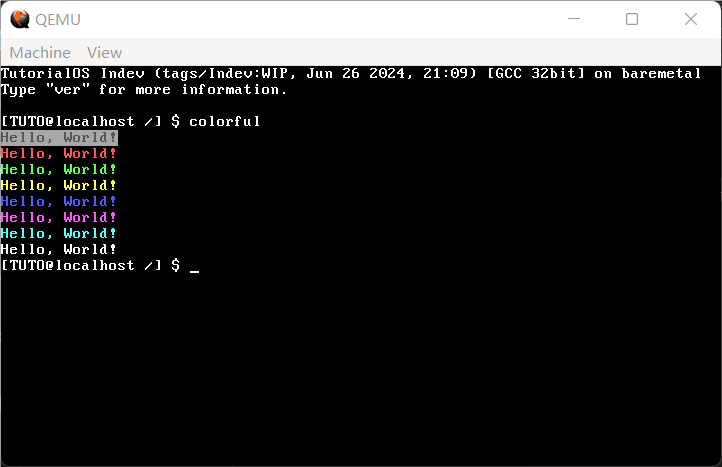
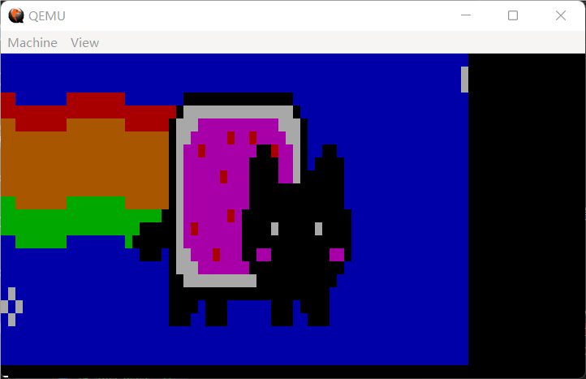
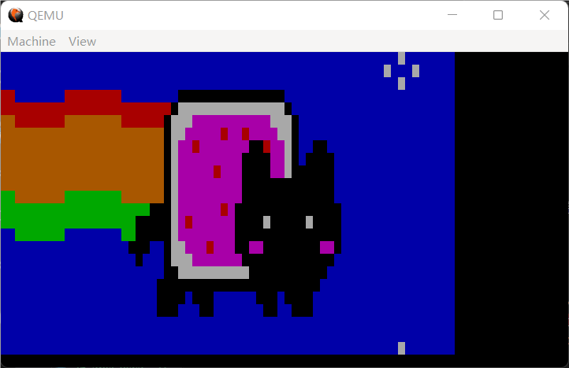
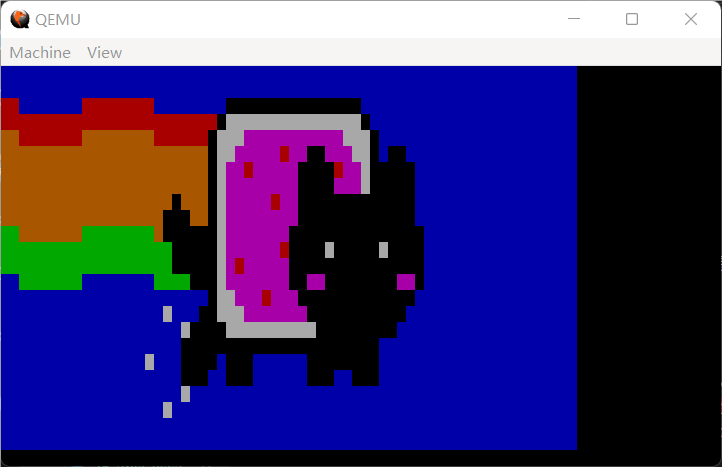

诶，上一节不是都说结束了吗，怎么还有？嘿嘿，这一部分是只给访问这个网站（当然还有备用地址）准备的特殊彩蛋！（逃

想必大家一定都看过各式各样五彩斑斓的控制台吧，无论是规模庞大的 neofetch 还是细节之间的 shell 提示符，基本上没有几个地方是纯黑白的 ??点名表扬 Windows CMD??，这是怎么实现的呢？事实上啊，它们或多或少，都用到了一种叫做**ANSI 转义序列**的技术。这是什么东西？

让我们再次回到计算机科学史（？），在上个世纪七十年代的时候，计算机还是金贵的东西，即使是那种比较高端的实验室，也不可能做到人手一台。于是，在只有一台计算机的情况下，想要多个人共享，只能搞一种类似显示器的设备，它就被称之为**终端**。现在的 cmd 啦、xterm 啦，严格来讲都是一种**终端模拟器**，因为这种设备早已退出历史舞台。

只有黑白两色的终端太过单调，于是各种终端基本上都有自己的一套扩展来实现更多的功能。这一乱象一直持续到 vt100 系列终端的出现，那真可谓是秦王扫六合，虎视何雄哉，自那以后终端控制代码有了 ANSI 搞的统一标准，vt100 上的控制码遂成为通用的 ANSI 控制码，因为其以一个 ESC 开头，需要转义才能打出来，故又有 ANSI 转义序列的称呼。尽管 vt100 随后也没能逃过扫入历史垃圾堆的结局，但它的遗产——ANSI 转义序列，却流传下来，直到现在成为了几乎所有终端模拟器都支持的统一标准。??有个终端模拟器直到 win10 的某次更新才支持 ANSI 转义序列，而且还要用 winapi 打开才能用，是谁呢是谁呢?? ??肯定不会是 windows cmd??

出于对计算机先驱的尊敬 ??装逼需要??，我们 TutorialOS 也将支持 ANSI 转义序列。不过，ANSI 转义序列到底是什么我们还没说呢，完整列表太长而且很多都无法在文本模式下实现，所以在这里仅列举几个可以实现的：

| ANSI 转义序列 | 对应含义 |
| ------------- | ------- |
| ESC [ | 控制序列引导符（**C**ontrol **S**equence **I**ntroducer，**CSI**） |
| ESC c | 完全重置终端 |

ESC 后面直接跟东西的虽然很多，但挑来拣去也居然也就这两个可以实现了。这里的 `ESC <xxx>`，写在字符串里就相当于 `\e<xxx>`，中间并没有这个空格，加上只是为了我们自己看懂方便。

不过，既然 CSI 只是引导符，后面想必一定是会跟东西的吧？没错，不过 CSI 后面跟的东西大部分也无法实现，这里还是简单列举几个（需要注意的是，ANSI 转义序列认为**左上角坐标为 (1, 1)**）：

| ANSI 转义序列 | 对应含义 |
| ------------- | ------- |
| CSI n A | 光标上移 n 格直至移到边缘，如没有 n 则默认 n = 1 |
| CSI n B | 光标下移 n 格直至移到边缘，如没有 n 则默认 n = 1 |
| CSI n C | 光标前移 n 格直至移到边缘，如没有 n 则默认 n = 1 |
| CSI n D | 光标后移 n 格直至移到边缘，如没有 n 则默认 n = 1 |
| CSI n E | 光标移到下面第 n 行的开头，如没有 n 则默认 n = 1 |
| CSI n F | 光标移到上面第 n 行的开头，如没有 n 则默认 n = 1 |
| CSI n G | 光标移动到第 n 列，如没有 n 则默认 n = 1 |
| CSI n;m H | 光标移动到第 n 行第 m 列，如果没有 n、m 则默认 n = m = 1。如果省略的参数为最后一个，则可以连带其前面的分号一并省略 |
| CSI n J | 当 n = 0 或没有 n 时清除光标位置到屏幕末尾，当 n = 1 时清空光标位置到屏幕开头，当 n = 2 或 n = 3 时清空全屏 |
| CSI n K | 当 n = 0 或没有 n 时清除光标位置到本行末尾，当 n = 1 时清空光标位置到本行开头，当 n = 2 或 n = 3 时清空整行 |
| CSI n;m f | 效果同 CSI n;m H |
| CSI n m（这个 m 不是参数而是字母 m 哦） | SGR，后续参数对应新的属性；如不提供参数则认为有一个参数 0 |
| CSI 6n | 以 \e[n;mR 的方式报告光标位置，而这一串字节可以使用 read()、scanf() 等方式读取，就像是在键盘输入的一样。报告字符串中 n 是行，m 是列 |
| CSI s/u | 保存/恢复光标位置 |

CSI 里又有一个 SGR，这就是平常用来修改颜色啦、粗体啦这种东西的转义码了。它的各个参数对应意义如下（当然还是只列举了能够被支持的）：

| SGR 参数 | 对应含义 |
| ------------- | ------- |
| 0 | 恢复原有属性 |
| 7 | 交换前景色与背景色 |
| 30-37 | 设置前景色 |
| 39 | 设置为默认前景色 |
| 40-47 | 设置背景色 |
| 49 | 设置为默认背景色 |
| 90-97 | 设置为更亮的前景色 |

虽然本来还应该有更多，比如 38、48 可以自定义 RGB 或者色号，但它们的功能要么重复要么就是无法实现，所以在这里不列举。而 30-37、40-47 对应的都是同一套颜色，只是在顺序上有区别，它们与真正颜色 RGB 的对应关系如下：

| 颜色色号 | 实际颜色（名称）|
| ---- | ---- |
| 30/40 | 黑 |
| 31/41 | 红 |
| 32/42 | 绿 |
| 33/43 | 黄（红+绿） |
| 34/44 | 蓝 |
| 35/45 | 品红（红+蓝） |
| 36/46 | 青（绿+蓝） |
| 37/47 | 灰（红+绿+蓝） |

而 90~97 其实就是上面这些颜色的增亮版。

既然我们可以实现给终端变色，这到底是怎么个变法？让我们回来看看第 7 节，在滚屏和输出字符的时候，我们都是拿了一个“属性位”或上原本的字符，然后写到一个代表显存的 `uint16_t` 数组当中去。这个属性位我们当时没有过多展开，甚至就是没展开，现在是时候来细说一下了。

文本模式下的显存可以看作一个 `uint16_t` 数组，每一个字符占 2 字节的空间。低 8 位，是这个字符本身的 ASCII 码，大家应该已经熟悉；而高 8 位就是所谓的“属性位”，这八位又可以分成两个 4 位，高 8 位中的低 4 位是前景色，从高往低分别对应 I（是否更亮）、R、G、B。需要注意的是，这里的**RGB位都只有一位，没有任何自定义的空间，一切颜色都是内置的序号**。高 8 位中的高 4 位是背景色，从高往低分别对应 K（是否闪烁）、R、G、B。闪烁顾名思义，就是字符一会出现一会消失，但 QEMU 并不支持这个功能，不知道这一位留着干什么，可能也用来变成亮色了。

现在再看滚屏和打印字符时候用的 `attributeByte`，是 `0 << 4 | (15 & 0x0f)`，现在应该就可以明白为什么了吧：`0 << 4` 是背景色，表示黑色；`15 & 0x0F` 是前景色，表示更亮的灰色，也就是我们看到的白。

至此，总算是把如何修改颜色从具体实现和高层抽象上都讲清楚了。而我们的任务，自然就是实现这一高层抽象。

首先，来到自第 7 节以来便没再动过的 `monitor.c`，我们来添加几个接口。

**代码 26-1 `monitor.c` 的新接口（kernel/monitor.c）**
```c
static uint8_t attributeByte = (0 << 4) | (15 & 0x0F); // 黑底白字

// 省略函数 static void move_cursor() { /* ... */ }

int get_cursor_pos() { return (cursor_x + 1) << 8 | (cursor_y + 1); }

void move_cursor_to(int new_x, int new_y)
{
    cursor_x = new_x - 1;
    cursor_y = new_y - 1;
    move_cursor();
}

void set_color(int fore, int back, int fore_brighten)
{
    fore %= 10; back %= 10;
    int ansicode2vgacode[] = {0, 4, 2, 6, 1, 5, 3, 7};
    fore = ansicode2vgacode[fore];
    back = ansicode2vgacode[back];
    fore |= fore_brighten << 3;
    attributeByte = (back << 4) | (fore & 0x0F);
}

int get_color() { return attributeByte; }

void set_char_at(int x, int y, char ch)
{
    x--, y--;
    uint16_t *location = video_memory + (y * 80 + x);
    *location = ch | (attributeByte << 8);
}

// 省略后面的一系列函数
```

把上面几个函数放在 `move_cursor` 和 `scroll` 之间以后，再在 `monitor.h` 中添加声明。`move_cursor_to` 干的唯一一件事就是把左上角 (1, 1) 的 ANSI 下坐标转换成了左上角为 (0, 0) 的实际坐标，`get_cursor_pos` 是把左上角 (0, 0) 的实际坐标又转换成左上角 (1, 1) 的 ANSI 下坐标，这样编码一下可以省去一次函数调用。`get_color` 只是返回当前的属性位，留着给 SGR 用。`set_char_at` 是留给清除屏幕那俩兄贵用的。而 `set_color` 则需要说一下。

首先第一行代码把 `fore` 和 `back` 的高位去掉，这样就可以直接把 37、47 之类的东西传进去。再往下一个 `ansicode2vgacode` 数组是因为 ANSI 转义序列里的颜色并不能直接对应 VGA 中的颜色，需要进行一个转化，具体的转化方法，就是这个数组的内容。

下面 `fore` 或上一个 `fore_brighten`，这个东西表示前景色是否增亮，这是 SGR 中 90-97 参数带来的可选项。而把它左移 3 位，相当于设置 I 位为 1，再给 `fore` 或上，就得到了真实的前景色。最后把 `fore` 和 `back` 组装到一起，遂形成一个合适的 `attributeByte`。由于现在属性位全局控制，在 `scroll`、`monitor_put`、`monitor_clear` 中的 `attributeByte` 就可以删除了。

这里特意开了个洞，如果 `attributeByte` 并非黑底白字，那么清屏或者滚屏的时候同样会把这个属性应用到新出来的字符上（而不是黑底白字）。

现在已经有了可以控制整个颜色的方法，自然下一步就是来把上面提到的 ANSI 转义序列一一实现。新建 `kernel/ansi.c`，简单进行分步：

1) 解析 ANSI 转义序列当中的参数，把 CSI、参数和结束符分开。

2) 处理这些参数，把它们反映到实际的显示器上。

3) 在 `monitor_write` 中处理带 ESC 的字符串，并适当调用解析 ANSI 转义序列的函数。

如果要支持在 `monitor_put` 中一个一个输出字符也能实现 ANSI 转义序列的话，成本过高，因此就省略了，感兴趣的读者可以自己实现（？

按照不知道见过多少次的三步走流程，我们先从第一步开始：解析 ANSI 转义序列。

**代码 26-2 解析 ANSI 转义序列（kernel/ansi.c）**
```c
#include "monitor.h"

int param_arr[255] = {0}; // 存参数的数组
int param_idx = 0; // 现在这个参数应该被放在什么位置

// 解析ansi控制序列，返回值是开始的esc后一共有多少个字符，不为合法ANSI转义序列返回-1
int parse_ansi(const char *ansi)
{
    param_idx = 0;
    memset(param_arr, 0, sizeof(param_arr)); // 清空参数数组并将当前参数放在第一个
    char *esc_start = (char *) ansi;
    ansi++; // 我们假定ansi的第一个字符总是esc
    if (*ansi == 'c') {
        // \033c，完全重置终端
        // 在这里只能是指把显示器恢复到最初的状态，也就是清屏并恢复黑底白字
        set_color(7, 0, true);
        monitor_clear();
        return 1;
    }
    if (*ansi != '[') {
        return -1; // 除了\033c外只支持CSI
    }
    ansi++; // 跳过中括号
    while (*ansi >= '0' && *ansi <= '9') {
        // 如果是数字，那么统一当做参数处理
        param_arr[param_idx] = param_arr[param_idx] * 10 + *ansi - '0'; // 当前参数结尾增加一位
        ansi++;
        if (*ansi == ';') {
            // 是分号表示当前参数结束
            param_idx++;
            ansi++; // 跳过分号继续进行参数处理
        }
    }
    // 参数解析部分结束，最后一个字符是CSI对应命令
    char cmd = *ansi;
    // 至此已将ansi控制序列拆成param_arr和cmd两部分
    return ansi - esc_start; // 返回esc以后的全部字符数
}
```

这一套流程下来，`param_arr` 中存放各参数，`cmd` 中存放最后的种类，而 `ansi - esc_start` 是返回值，用于在 `monitor_write` 中跳过正确数量的字符。

说到 `monitor_write`，现在其实也是在 `monitor.c` 中插入解析 ANSI 代码的好时候，其实也就是把第三步也给完成了：

**代码 26-3 在遇到 ESC 时解析 ANSI 转义序列（kernel/monitor.c）**
```c
void monitor_write(char *s)
{
    for (; *s; s++) {
        if (*s == 0x1b) {
            // 是esc，则解析ansi转义序列
            int offset = parse_ansi(s);
            // offset不为-1表示有意义的ANSI转义序列
            if (offset != -1) {
                s += offset; // 跳过后续这些字符不二次输出
                continue;
            }
        }
        monitor_put(*s); // 遍历字符串直到结尾，输出每一个字符
    }
}
```

接下来就是执行最为关键的第二步，也就是实际执行 ANSI 转义序列——实际上只剩下 CSI 了。我们把它分成几个部分来做。首先是实现 `A`、`B`、`C` 和 `D`：

**代码 26-4 执行 ANSI 转义序列（1）——`CSI + A、B、C、D`（kernel/ansi.c）**
```c
#include "monitor.h"
// 新增部分从此开始
#include "fifo.h"

extern uint32_t load_eflags();
extern void store_eflags(uint32_t);

extern fifo_t decoded_key;

#define min(a, b) ((a) < (b) ? (a) : (b))
#define max(a, b) ((a) > (b) ? (a) : (b))
// 新增部分到此结束
static int param_arr[255] = {0};
static int param_idx = 0;
static int save_x = 0, save_y = 0; // 这一行也是新增的

int parse_ansi(const char *ansi)
{
    // ...上略
    char cmd = *ansi;
    // 至此已将ansi控制序列拆成param_arr和cmd两部分
    // 以下是新增的
    int cursor_pos = get_cursor_pos();
    int cursor_x = cursor_pos >> 8;
    int cursor_y = cursor_pos & 0xff;
    int color = get_color();
    int fore = color & 0x7;
    int fore_brighten = (color & 0xf) >> 3;
    int back = color >> 4;
    switch (cmd) {
        case 'A': {
            // 上移，y减小
            int arg = param_arr[0] == 0 ? 1 : param_arr[0];
            cursor_y = max(cursor_y - arg, 1);
            move_cursor_to(cursor_x, cursor_y);
            break;
        }
        case 'B': {
            // 下移，y增大
            int arg = param_arr[0] == 0 ? 1 : param_arr[0];
            cursor_y = min(cursor_y + arg, 25);
            move_cursor_to(cursor_x, cursor_y);
            break;
        }
        case 'C': {
            // 左移，x减小
            int arg = param_arr[0] == 0 ? 1 : param_arr[0];
            cursor_x = max(cursor_x - arg, 1);
            move_cursor_to(cursor_x, cursor_y);
            break;
        }
        case 'D': {
            // 右移，x增大
            int arg = param_arr[0] == 0 ? 1 : param_arr[0];
            cursor_x = min(cursor_x + arg, 80);
            move_cursor_to(cursor_x, cursor_y);
            break;
        }
    }
    // 新增部分结束
    return ansi - esc_start; // 返回esc以后的全部字符数
}
```

在上面新增了 `min`、`max` 两个宏，同时声明了一些函数和变量以备后用。

由于 `monitor.c` 暴露出的接口都是以 (1, 1) 为左上角的，与 ANSI 转义序列认为的一致，所以直接以 (1, 1) 为左上角，(80, 25) 为右下角来操作即可。这里的四个函数，操作别无二致。首先判断 `param_arr[0]` 也就是第一个参数是不是 0，如果是 0，那要么真是 0 要么没有，我们这里假定是没有。既然没有，那就好办，把它按标准当成 1 即可。接下来按照不同的方向，更新不同的坐标，同时把范围框死，这一部分在纸上画个坐标系推一推就知道了，因此不再详述。

接下来是 `E`、`F`、`G`、`H`：

**代码 26-5 执行 ANSI 转义序列（2）——`CSI + E、F、G、H`（kernel/ansi.c）**
```c
int parse_ansi(const char *ansi)
{
    // ...上略
    switch (cmd) {
        // 上略
        case 'E': {
            // 移到本行下面第n行开头
            int arg = param_arr[0] == 0 ? 1 : param_arr[0];
            cursor_x = 1; // 第1列
            cursor_y = min(cursor_y + arg, 25); // 下面第n行
            move_cursor_to(cursor_x, cursor_y);
            break;
        }
        case 'F': {
            // 移到本行上面第n行开头
            int arg = param_arr[0] == 0 ? 1 : param_arr[0];
            cursor_x = 1; // 第1列
            cursor_y = max(cursor_y - arg, 1); // 上面第n行
            move_cursor_to(cursor_x, cursor_y);
            break;
        }
        case 'G': {
            // 移到第n列
            int arg = param_arr[0] == 0 ? 1 : param_arr[0];
            cursor_x = min(max(arg, 1), 80);
            move_cursor_to(cursor_x, cursor_y);
            break;
        }
        case 'H':
        case 'f': {
            // 移到坐标 (n, m) 处
            int n = param_arr[0] == 0 ? 1 : param_arr[0];
            int m = param_arr[1] == 0 ? 1 : param_arr[1];
            n = min(max(n, 1), 80);
            m = min(max(m, 1), 25);
            move_cursor_to(n, m);
            break;
        }
    }
    // 下略
}
```

由于 `H` 和 `f` 意思一致，把它们合并在一处。这四个部分只是简单的移动光标，和刚才的 `A`、`B`、`C`、`D` 没什么不同。同样的，坐标变化的问题只需要在纸上画个平面直角坐标系推一推就好了。

再然后是 `J` 和 `K`，这两个部分由于还涉及到模式，比较复杂：

**代码 26-6 执行 ANSI 转义序列（3）——`CSI + J、K`（kernel/ansi.c）**
```c
int parse_ansi(const char *ansi)
{
    // ...上略
    switch (cmd) {
        // 上略
        case 'J': {
            int n = param_arr[0];
            switch (n) {
                case 0: {
                    // 清除光标位置到屏幕末尾
                    // 清除光标所在行以后的位置
                    for (int x = cursor_x; x <= 80; x++) {
                        set_char_at(x, cursor_y, ' ');
                    }
                    // 清理光标后所有行
                    for (int y = cursor_y + 1; y <= 25; y++) {
                        for (int x = 0; x <= 80; x++) {
                            set_char_at(x, y, ' ');
                        }
                    }
                    break;
                }
                case 1: {
                    // 清除光标位置到屏幕开头
                    // 清除光标所在行以前的位置
                    for (int x = 0; x <= cursor_x; x++) {
                        set_char_at(x, cursor_y, ' ');
                    }
                    // 清理光标前所有行
                    for (int y = 0; y < cursor_y; y++) {
                        for (int x = 0; x <= 80; x++) {
                            set_char_at(x, y, ' ');
                        }
                    }
                    break;
                }
                case 2:
                case 3: {
                    // 清空全屏
                    monitor_clear();
                    break;
                }
            }
        }
        case 'K': {
            int n = param_arr[0];
            switch (n) {
                case 0: {
                    // 清除光标位置到行末尾
                    // 清除光标所在行以后的位置
                    for (int x = cursor_x; x <= 80; x++) {
                        set_char_at(x, cursor_y, ' ');
                    }
                    break;
                }
                case 1: {
                    // 清除光标位置到行开头
                    // 清除光标所在行以前的位置
                    for (int x = 0; x <= cursor_x; x++) {
                        set_char_at(x, cursor_y, ' ');
                    }
                    break;
                }
                case 2:
                case 3: {
                    // 清空整行
                    for (int x = 0; x <= 80; x++) {
                        set_char_at(x, cursor_y, ' ');
                    }
                    break;
                }
            }
        }
    }
    // 下略
}
```

这一部分虽然长，但具体内容仍然只需要画一个坐标系就知道是怎么回事了。如果想要清除一行，应该保持 `y` 不变而去改 `x`。

SGR 最长，因此放在最后，接下来实现 `6n`、`s` 和 `u`：

**代码 26-7 执行 ANSI 转义序列（4）——`CSI + 6n、s、u`（kernel/ansi.c）**
```c
#include "monitor.h"
#include "fifo.h"

int parse_ansi(const char *ansi)
{
    // ...上略
    switch (cmd) {
        // 上略
        case 's':
            save_x = cursor_x;
            save_y = cursor_y;
            break;
        case 'u':
            move_cursor_to(save_x, save_y);
            break;
        case 'n': {
            if (param_arr[0] != 6) {
                // 只支持\x1b[6n
                return -1;
            }
            int eflags = load_eflags();
            asm("cli");
            // strlen(\e[80;25R) = 8
            char s[10] = {0};
            int len = sprintf(s, "\x1b[%d;%dR", cursor_x, cursor_y);
            for (int i = 0; i < len; i++) fifo_put(&decoded_key, s[i]);
            store_eflags(eflags);
        }
    }
    // 下略
}
```

`s` 和 `u` 是比较简单的，结合这俩的具体用途（保存、恢复光标位置）看一眼就能明白。`n` 的开头先检测是不是 `6n`，然后关中断，往 `read` 实际会读的 `decoded_key` 缓冲区中放入前面提到的字节串。这是为了防止键盘中断突然闯入给这里头放上不属于 `CSI 6n` 的东西。

最后就是改变终端颜色用的 SGR 了。

**代码 26-7 执行 ANSI 转义序列（5）——`SGR`（kernel/ansi.c）**
```c
int parse_ansi(const char *ansi)
{
    // ...上略
    switch (cmd) {
        // 上略
        case 'm': {
            for (int i = 0; i <= param_idx; i++) {
                switch (param_arr[i]) {
                    case 0:
                        fore = 7; back = 0; fore_brighten = true;
                        break;
                    case 7: {
                        int t = fore; fore = back; back = t;
                        break;
                    }
                    case 30: case 31:
                    case 32: case 33:
                    case 34: case 35:
                    case 36: case 37:
                        fore = param_arr[i]; fore_brighten = false;
                        break;
                    case 39:
                        fore = 7; fore_brighten = true;
                        break;
                    case 40: case 41:
                    case 42: case 43:
                    case 44: case 45:
                    case 46: case 47:
                        back = param_arr[i];
                        break;
                    case 49:
                        back = 0;
                        break;
                    case 90: case 91:
                    case 92: case 93:
                    case 94: case 95:
                    case 96: case 97:
                        fore = param_arr[i]; fore_brighten = true;
                        break;
                }
                set_color(fore, back, fore_brighten);
            }
        }
    }
    // 下略
}
```

SGR 是支持多个参数的，所以对每一个参数都要做这样的考虑。为了支持多个属性的叠加，我们实时更新在 `switch` 前获取的 `fore`、`back` 和 `fore_brighten` 属性。

这几个东西基本是按上面的表来完成的。比如，`case 0` 恢复默认颜色就是把前景色设为浅灰（也就是白色），背景色设置成黑色；`case 7` 反显，也就是交换前景色和背景色（由于我们希望两次反显后回归原色，这里没有对 `fore_brighten` 做处理）。下面的设置颜色，几乎更是简单直接，`30~37` 就是对应的前景色 `fore`，由于不是亮色 `fore_brighten` 设为 `false`，由于 `set_color` 开洞了所以这一部分很简单。包括下面的部分也是一样，这里就不多讲了。

至此，我们已经完整实现了上面提到的所有 ANSI 转义序列。当然，这里全部的 ANSI 转义序列还有点区别，不过也足够了。

对了，现在的 `sys_write` 使用 `monitor_put` 输出，这会导致 ANSI 转义序列在 `printf` 中失效，我们要把它改成使用 `monitor_write` 输出：

**代码 26-8 修改 `sys_write`（fs/file.c）**
```c
int sys_write(int fd, const void *msg, int len)
{
    if (fd <= 0) return -1; // 是无效fd，返回
    if (fd == 1 || fd == 2) { // 往标准输出或标准错误中输出
        char *temp_buf = (char *) kmalloc(len + 5);
        memcpy(temp_buf, msg, len);
        monitor_write(temp_buf);
        kfree(temp_buf);
        return len;
    }
    // 下略
}
```

好了，现在万事俱备，开始测试！

虽然其他的功能也很需要，但我们最需要的无疑还是 SGR。先简单写一个 app 做测试：

**代码 26-9 彩色终端！（apps/colorful.c）**
```c
#include <stdio.h>

int main()
{
    printf("\x1b[47;90mHello, World!\x1b[49m\n");
    printf("\x1b[91mHello, World!\n");
    printf("\x1b[92mHello, World!\n");
    printf("\x1b[93mHello, World!\n");
    printf("\x1b[94mHello, World!\n");
    printf("\x1b[95mHello, World!\n");
    printf("\x1b[96mHello, World!\n");
    printf("\x1b[97mHello, World!\n");
    return 0;
}
```

第一行是灰底黑字的 Hello World，以下几行依次是黑底红、绿、黄、蓝、粉、青、白色的 Hello World。编译运行，效果如下：


（图 26-1 炫彩牛逼 Hello World！）

这样简单的测试实在没有挑战性。通过对群友 [wenxuanjun](https://github.com/wenxuanjun) 的 os-terminal 的某个测试用例稍加修改，得到了下面的程序：[blackcat.c](blackcat.c)（共 394 行，大部分都是动画，因此就省略放在单独的文件里了）。它本来应该是一个彩虹猫来着，但是由于我们不支持亮色背景色，导致更多人估计只会一眼注意到那个纯黑的猫，所以就从 `nyancat` 变成了 `blackcat`。

这个由于是动画就简单放几张截图：


（图 26-2 彩黑猫截图1）

（图 26-3 彩黑猫截图2）

（图 26-4 彩黑猫截图3）

至此，可以说 ANSI 转义序列我们已经完全实现。下一节我们来给残破的 FAT16 文件系统添加目录，把它变得更加丰富一些。