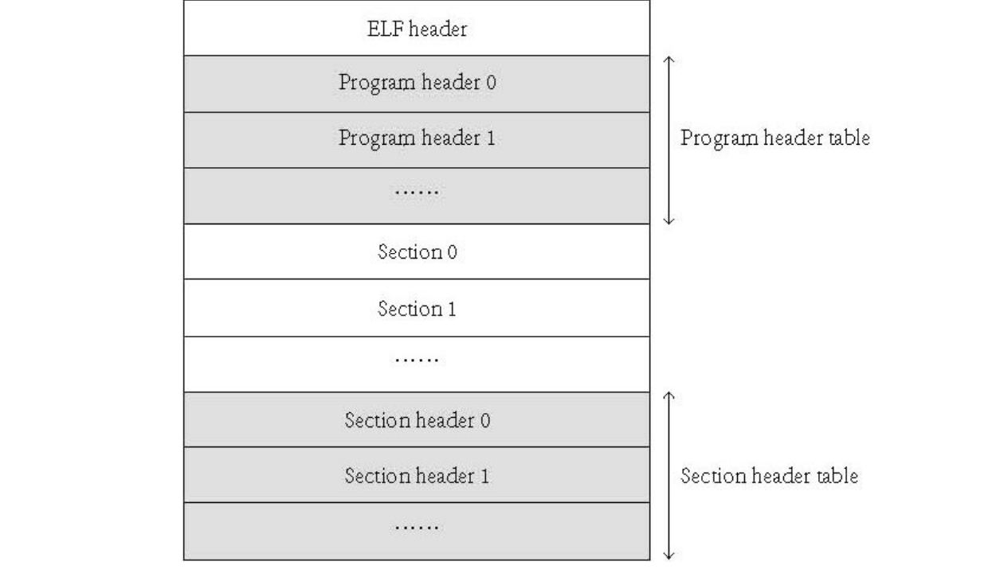

这真可谓是才出虎穴又入狼窝啊，刚干完硬菜 FAT16，又来了一个内核模块。

什么是内核模块？简单来说，一个内核功能太大，内核模块可以把一些功能拆分出去，在运行时动态加载。听上去好像很高级，但我们内核目前的功能少的可怜，所以内核模块也没多大用，就是专门用来玩的 ??谁家好人玩这么大啊??。

Linux 下的内核模块后缀是 `.ko`，这是一个什么格式呢？其实，`.ko` 就是 ELF 的 `.o`，至少用 `readelf` 来看，它们两个的类型都是一样的 `REL`。

`REL` 的意思是 **Rel**ocatable File，意思是需要进行重定位的文件。重定位，啊呀，骇死我力，第 6 节执行内核有重定位，第 23 节执行应用程序也有重定位，怎么重定位还在追我？

既然都讲到这了，那就先来回顾一下 ELF 的文件结构吧！



这一次我们要用的可就不是 `Program Header` 了，而是下面的 `Section` 和 `Section Header`。事实上，在编译出来的 `.o` 文件中，一般是没有 `Program Header` 的；而在可以执行的文件中，则一般是没有 `Section` 和 `Section Header` 的，`Section` 则被另一种叫 `Segment` 的相似但不相同的东西替代。

简单来说，加载一个内核模块可以分为以下几步：

1. 读模块文件。

2. 找到 Section Header，再从中找到 shstrtab （**S**ection **H**eader **Str**ing **Tab**le，也就是放着 Section Header 名字的字符串表）。

3. 根据 shstrtab 中的节名，找到 `.symtab`、`.strtab`。`.symtab` 里放着所有的符号信息，而点 `.strtab` 里放的是符号名。注意它和 shstrtab 的区别。

4. 找到以 `.rel.` 开头的 Section。这些 Section 是需要被重定位的。同样需要找到的还有去掉 `.rel` 后的 Section，比如，找到了 `.rel.text`，还要找到 `.text` 才行。

5. 从 `.rel.` 节中找到需要被重定位的符号。如果是未定义符号，那么就说明是内核里的；否则就是 ELF 里的。然后进行重定位即可，这一部分后面到代码了再细说。

6. 单独开一个 Section 用来指明当加载模块时应当调用哪个函数初始化，以及调用哪个函数清理。这个节会在上面几步里一并被重定位。因此，程序执行到这里后，直接调用初始化函数，这样就把内核模块加载进来了。

看上去很简单，实则并非如此，这里面的坑很多，我们一个一个来。

首先第一步，制备模块文件。或许有人会想：“要单开一个 Section，是不是得让链接器来做这种工作啊？”确实，链接器的确能够输出 `REL` 格式的文件，但是 ~~链接脚本我不会写~~ 这只是一个简单示例而已，gcc 编译器已经提供了这样的功能了哦。“可是要怎么用啊？”来看代码：

**代码 28-1 内核模块文件示例（kernel/hello.c）**
```c
#include "module.h"

static int init_hello()
{
    monitor_write("Hello from hello.ko!\n");
    return 0;
}

static void exit_hello()
{
    monitor_write("Goodbye from hello.ko.\n");
}

module_t this_module
__attribute__((section(".this_module"))) = {
    .init = init_hello,
    .exit = exit_hello
};
```

这里最下面的 `__attribute__((section(".xxx")))` 就是前面提到的编译器扩展，把它放在变量名后面，就会自动把这个变量放到 `.xxx` 这个 Section 里。

文件里出现新的头文件 `module.h` 内容如下：

**代码 28-2 描述内核模块的结构 `module_t`（include/module.h）**
```c
#ifndef _MODULE_H_
#define _MODULE_H_

typedef struct module {
    int (*init)(void);
    void (*exit)(void);
} module_t;

#endif
```

在结构体里放函数指针成员，这种用法应该是第一次见吧。其实把它当成正常成员来看就好了。

接下来，新建 kernel/module.c，我们来分步实现内核模块。

### 第一步：读取任意 Section 下的内容

接下来，就可以在 kernel/module.c 里开始工作了。

**代码 28-4 先导入一些头文件（kernel/module.c）**
```c
#include "module.h"
#include "elf.h"
#include "stdio.h"
#include "monitor.h"
#include "file.h"
#include "memory.h"
```

在工作正式开始之前，先要在 `elf.h` 中增补与内核模块有关的一些数据结构：

**代码 28-5 Section Header、符号信息、重定位信息（include/elf.h）**
```c
#ifndef _ELF_H_
#define _ELF_H_

// 上略

typedef uint32_t Elf32_Word, Elf32_Off, Elf32_Addr, Elf32_Size; // 有修改
typedef int32_t Elf32_Sword; // 新增的
typedef uint16_t Elf32_Half;

// ...中略...

typedef struct {
    Elf32_Word sh_name;
    Elf32_Word sh_type;
    Elf32_Word sh_flags;
    Elf32_Addr sh_addr;
    Elf32_Off  sh_offset;
    Elf32_Size sh_size;
    Elf32_Word sh_link;
    Elf32_Word sh_info;
    Elf32_Size sh_addralign;
    Elf32_Size sh_entsize;
} Elf32_Shdr;

typedef struct {
    Elf32_Word st_name;
    Elf32_Addr st_value;
    Elf32_Size st_size;
    unsigned char st_info;
    unsigned char st_other;
    Elf32_Half st_shndx;
} Elf32_Sym;

typedef struct {
    Elf32_Addr r_offset;
    Elf32_Word r_info;
} Elf32_Rel;

typedef struct {
    Elf32_Addr r_offset;
    Elf32_Word r_info;
    Elf32_Sword r_addend;
} Elf32_Rela;

#define R_386_NONE 0
#define R_386_32 1
#define R_386_PC32 2

// load_elf 函数声明略...

#endif
```

基本上只留下了一些能用得到的，下面正式开始。

首先，由图 28-1 可知，Section Header 最后其实排成了一个数组。这个数组的首项，和 Program Header 一样，记录在 ELF Header 的 `e_shoff` 成员里。而 `shstrtab`，也放在了 ELF Header 中，`e_shstrndx` 成员就是指 Section Header 数组中 `.shstrtab` 的位置。

总结再压缩一下，可以写出这样的代码：

**代码 28-6 获取 Section Header、`shstrtab`（kernel/module.c）**
```c
static Elf32_Shdr *get_section_header(Elf32_Ehdr *ehdr)
{
    return (Elf32_Shdr *) (((char *) ehdr) + ehdr->e_shoff);
}

static char *get_shstrtab(Elf32_Ehdr *ehdr)
{
    Elf32_Shdr *shdr = get_section_header(ehdr);
    return ((char *) ehdr) + shdr[ehdr->e_shstrndx].sh_offset;
}
```

接下来，想要从节名寻找 Section，需要通过 `.shstrtab` 来找。在 Section Header 的定义中，`sh_name` 一节并不是一个字符串，而是一个 `Elf32_Word` 也就是 `unsigned int`。这个数字代表的是本节对应的节名在 `.shstrtab` 当中的偏移。

因此，可以写出如下代码：

**代码 28-7 从节名找 Section（kernel/module.c）**
```c
static Elf32_Shdr *elf_find_section(Elf32_Ehdr *ehdr, const char *section_name)
{
    Elf32_Shdr *shdr = get_section_header(ehdr);
    char *shstrtab = get_shstrtab(ehdr);
    for (int i = 0; i < ehdr->e_shnum; i++) {
        if (!strcmp(section_name, shstrtab + shdr[i].sh_name)) return &shdr[i];
    }
    return 0;
}
```

这段代码就是比着上面的文字说明写的。

之后，想要从 Section Header 找到这个节的具体位置，只需要找到 `sh_offset` 成员，它就是这个节在整个文件中的偏移。这样，如何找到一个节，就完全弄清楚了。

基于前文对加载内核模块过程的描述，我们可以写出如下代码：

**代码 28-8 读取相应的节（kernel/module.c）**
```c
void sys_insmod(const char *filename)
{
    int fd = sys_open(filename, O_RDWR);
    if (fd == -1) {
        printk("%s does not exist\n", filename);
        return;
    }
    int size = sys_lseek(fd, -1, SEEK_END) + 1;
    sys_lseek(fd, 0, SEEK_SET);
    char *modbuf = (char *) kmalloc(size + 5);
    sys_read(fd, modbuf, size);
    sys_close(fd);
    Elf32_Ehdr *ehdr = (Elf32_Ehdr *) modbuf;

    Elf32_Shdr *shdr = get_section_header(ehdr);
    char *shstrtab = get_shstrtab(ehdr);
    int strtab_index = elf_find_section(ehdr, ".strtab") - shdr;
    char *strtab = modbuf + shdr[strtab_index].sh_offset;
    int symtab_index = elf_find_section(ehdr, ".symtab") - shdr;
    Elf32_Sym *symtab = (Elf32_Sym *) (modbuf + shdr[symtab_index].sh_offset);
    int this_module_index = elf_find_section(ehdr, ".this_module") - shdr;
    if (this_module_index == 0) {
        printk(".this_module not found\n");
        kfree(modbuf);
        return;
    }
    module_t *this_module = (module_t *) (modbuf + shdr[this_module_index].sh_offset);
}
```

一共找了 `.symtab`、`.strtab` 和 `.this_module` 这三个节，`.rel` 之类的放到下一节来处理。

注意这里就已经拿到了 `this_module` 了，但现在还不能调用它的 `init`，因为这时的 `init` 还没有经过重定位，一执行就不知道执行到什么地方去了。

### 第二步：重定位

ok，终于是到了这第二步。不管是什么格式的文件，解析的时候都是充满痛苦的，理解理解。

接下来的重定位要找以 `.rel` 为开头的节，然后用它来重定位，不过可还得说说应该怎么拿它来重定位才能写出代码来。

首先来说说 `.symtab` 以及 `.strtab`。这两个节是配合着来用的。`.symtab` 是一个 `Elf32_Sym` 的数组，而每一个符号的名称，都是在 `.strtab` 里找的，这个找的过程和在 `.shstrtab` 里找节名是非常像的。

然后，`.rel` 开头的节里放着的是一个 `Elf32_Rel` 的数组；`Elf32_Rel` 的 `r_info` 里放着两个信息，高 24 位是它对应的符号信息，具体地说，是 `.symtab` 这个数组的索引；低 8 位则涉及到重定位的过程。

正好借此来把重定位的具体过程再说一遍。首先，找到 `.rel` 开头的节，然后把 `.rel` 前缀去掉，找到另一个对应的节。接下来，遍历 `.rel` 节中的数组，对于每一个 `Elf32_Rel`，根据其中的 `r_offset` 可以找到在对应的节中，对应符号的位置，在这个位置里写着 `.o` 刚被编译出来时编译器认为它所处的位置。

所谓重定位，就是要把编译器认为的位置，改成它实际上的位置。因此，需要计算出来这里应该改成什么值。这时就需要 `.symtab` 来帮忙了：先从 `r_info` 中获取符号信息，然后，符号的 `st_shndx` 成员对应这个符号属于哪个节。如果它是 0，那很简单，这就是一个未定义的符号，直接默认它是内核里的符号即可，于是可以直接找到这个符号的地址；否则，就是这个模块内的符号，根据 `st_value` 成员，可以直接找到这个符号相对于文件的偏移，再加上加载位置，不就得到了我们想要的真实位置了么？

那么最后一步，就是把上一步得到的符号实际位置，经过转化，把编译器认为的位置给顶掉。这需要看 `r_info` 的低 8 位，如果对应着的是 `R_386_32`，那直接在原位置基础上加上新位置；否则对应 `R_386_PC32`，要在原位置基础上，加上符号位置相对于原位置的偏移。最后这一步看着比较抽象，到时候看看代码就理解了。

那么，开始重定位。

**代码 28-9 重定位过程（kernel/module.c）**
```c
void sys_insmod(const char *filename)
{
    // ...
    for (int i = 0; i < ehdr->e_shnum; i++) {
        Elf32_Shdr *rel_section = &shdr[i];
        char *rel_section_name = shstrtab + rel_section->sh_name;
        if (!strncmp(".rel.", rel_section_name, 5)) {
            Elf32_Shdr *target = elf_find_section(ehdr, rel_section_name + 4);
            char *target_section_name = shstrtab + target->sh_name;

            Elf32_Rel *rel = (Elf32_Rel *) (modbuf + rel_section->sh_offset);
            for (int j = 0; j < rel_section->sh_size / sizeof(Elf32_Rel); j++) {
                int sym_index = ELF_R_SYM(rel[j].r_info);
                int r_type = ELF_R_TYPE(rel[j].r_info);
                uint32_t *rel_pos = (uint32_t *) (modbuf + target->sh_offset + rel[j].r_offset);
                uint32_t r_value = 0;
                const char *sym_name = strtab + symtab[sym_index].st_name;
            
                if (symtab[sym_index].st_shndx == 0) {
                    if (!strcmp(sym_name, "monitor_write")) {
                        r_value = (uint32_t) &monitor_write;
                    } else {
                        printk("refers to unknown symbol %s\n", sym_name);
                        kfree(modbuf);
                        return;
                    }
                } else {
                    r_value = (uint32_t) modbuf + shdr[symtab[sym_index].st_shndx].sh_offset + symtab[sym_index].st_value;
                }

                //printk("pos 0x%x, val 0x%x\n", rel_pos, r_value);

                switch (r_type) {
                    case R_386_32: *rel_pos += r_value; break;
                    case R_386_PC32: *rel_pos += r_value - (uint32_t) rel_pos; break;
                }
            }
        }
    }
}
```

代码是照着上面的文本写的，由于文本含糊，所以必须依靠代码来重新进一步理解。??实在理解不了的话，直接抄也是没问题的（??

其中的 `strncmp` 内容如下，写在了 `lib/string.c` 中：

**代码 28-10 `strncmp`（lib/string.c）**
```c
int8_t strncmp(const char *a, const char *b, int n)
{
    if (!n) return 0;
    while (--n && (*a && *a == *b)) a++, b++;
    return *a < *b ? -1 : *a > *b;
}
```

至此，内核模块已经实现完成。接下来的工作，就是把 `sys_insmod` 做成系统调用，然后写一个程序或者一些命令之类的来支持内核模块的加载与卸载。不过目前还想不到内核模块有什么用，写着就是为了好玩的 ??不是有你这么为了好玩的吗？?? 所以就放着吧。